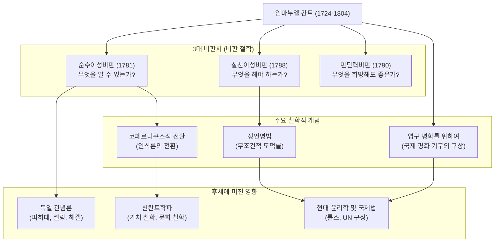

## 머리말: 시계처럼 정확한 삶에서 탄생한 철학의 거대한 패러다임 전환

근대 철학을 논할 때 결코 피해 갈 수 없는 거성. 그가 바로 **임마누엘 칸트(Immanuel Kant, 1724–1804)**입니다. 프로이센 왕국(현재 러시아 연방 칼리닌그라드)의 쾨니히스베르크에서 태어나 평생 그곳을 떠나지 않고 규칙적이고 평온한 나날을 보냈습니다. 그의 산책 시간이 동네 사람들의 시계 대용이 되었다는 일화는 너무나도 유명합니다.

그러나 그의 고요한 삶과는 정반대로, 그의 두뇌는 인류의 사상사를 근본적으로 뒤집을 만큼의 폭발력을 지니고 있었습니다. 칸트의 철학은 당시 대립하던 두 대 철학인 '대륙 합리론'과 '영국 경험론'을 통합하고 철학에 **'코페르니쿠스적 전환'**을 가져왔습니다.

본 기사에서는 이 고고한 사색가가 어떻게 근대 철학의 기초를 다지고 후세에 어떤 영향을 미쳤는지를 그의 생애와 사상의 핵심에서부터 풀어보겠습니다.

## 쾨니히스베르크의 현인: 칸트의 생애

1724년 마구 장인의 넷째 아들로 태어난 칸트는 경건주의의 영향을 강하게 받으며 자랐습니다. 쾨니히스베르크 대학에서 철학, 수학, 자연과학을 공부했고, 졸업 후에는 가정교사로 생계를 유지하며 연구를 계속했습니다.

특히 주목할 만한 것은 그의 '대기만성'과 '경이로운 지속력'입니다. 대학의 정교수(논리학·형이상학)로 취임한 것은 1770년, 그가 46세 때였습니다. 그리고 철학사에 찬란히 빛나는 대표작 『순수이성비판』이 출판된 것은 무려 57세 때(1781년)입니다. 그 후에도 열정적으로 집필을 계속하여 60대에 『실천이성비판』과 『판단력비판』을 완성했습니다.

그는 평생 독신으로 지내며 규칙적인 생활을 했습니다. 매일 아침 5시에 기상하여 강의, 집필, 그리고 오후 3시 반의 산책이라는 루틴을 결코 깨지 않았습니다. 이러한 철저한 규율이야말로 그의 치밀하고 장대한 철학 체계를 구축하는 토대가 되었습니다.

## 칸트 철학의 핵심: 3대 비판서와 '코페르니쿠스적 전환'

칸트의 최대 업적은 인간의 '인식 능력' 자체를 철저하게 음미(비판)한 데 있습니다. 그의 사상의 골격을 이루는 것이 다음의 '3대 비판서'입니다.

### 1. 인식론의 혁명 『순수이성비판』 (인간은 무엇을 알 수 있는가)
칸트 이전의 철학은 '인간의 인식이 대상에 따른다'(우리의 마음이 외계에 있는 그대로의 사물을 모사한다는 생각)고 믿었습니다. 그러나 칸트는 '대상이 인간의 인식에 따른다'고 역전시켰습니다. 우리가 사물을 인식할 수 있는 것은 우리 자신 쪽에 있는 시간·공간이라는 '감성의 형식'과 인과율 등의 '오성의 범주'를 통해 세계를 구성하고 있기 때문이라고 주장한 것입니다. 천동설에서 지동설로의 전환에 빗대어 이를 **'코페르니쿠스적 전환'**이라고 부릅니다. 이를 통해 인간이 인식할 수 있는 것은 '현상'뿐이며 '물자체(진정한 모습)'는 인식할 수 없다고 결론지었습니다.

### 2. 도덕 철학의 확립 『실천이성비판』 (인간은 무엇을 해야 하는가)
인간은 '물자체'를 인식할 수 없지만, 도덕의 세계에서는 우리 스스로가 자율적으로 법칙을 세울 수 있습니다. 칸트는 조건부 명령('~하고 싶다면, ~하라')이 아니라 무조건적인 도덕 법칙('~하라')인 **'정언명법'**을 제창했습니다. "너의 의지의 준칙이 항상 동시에 보편적인 입법의 원리로서 타당하도록 행위하라"는 그의 말은 현대 윤리학에서도 가장 중요한 기초가 되고 있습니다.

### 3. 미와 목적의 철학 『판단력비판』 (인간은 무엇을 희망해도 좋은가)
자연의 기계론적 법칙(순수이성)과 인간의 자유로운 도덕적 의지(실천이성)라는 두 개의 다른 세계를 연결하기 위해 구상된 것이 본 저작입니다. '미'나 '숭고'와 같은 미감적 판단과 자연계에서 목적을 발견하는 목적론적 판단을 탐구했습니다.

## 상관도·업적 흐름

다음 그림은 칸트의 철학 체계와 그 영향의 흐름을 나타낸 것입니다.

## 후세에 미친 절대적인 영향: 칸트를 넘어서, 칸트와 함께

칸트가 세운 철학 체계는 너무나도 거대했습니다. 이후의 철학자들은 칸트에 찬동하든 반발하든 항상 '칸트를 어떻게 극복할 것인가'라는 과제에 직면하게 됩니다.

피히테, 셸링, 헤겔로 이어지는 **독일 관념론**은 칸트가 도달 불가능하다고 한 '물자체'의 영역을 극복하려는 시도에서 태어났습니다. 19세기 후반에는 '칸트로 돌아가라'를 구호로 **신칸트학파**가 흥기하여 현대의 과학 철학이나 문화 철학의 기초를 다졌습니다.

또한 그의 말년의 저작 『영구 평화를 위하여』에서 제창된 '자유로운 국가들의 연합'이라는 구상은 이후의 국제연맹이나 국제연합의 설립에 직접적인 영감을 주었습니다. 그리고 인간의 존엄을 목적 그 자체로 대하는 그의 윤리관은 존 롤스의 정의론 등 현대의 정치 철학이나 인권 사상에 지금도 면면히 살아 숨쉬고 있습니다.

## 맺음말

임마누엘 칸트. 그의 생애는 지리적으로는 지극히 좁은 범위에 머물렀지만, 그 사색의 사정거리는 우주의 진리에서 인간의 도덕적 심연, 그리고 인류의 보편적 평화에까지 미치고 있었습니다.
"내 머리 위로 빛나는 별이 총총한 하늘과 내 마음속의 도덕 법칙". 그의 묘비에 새겨진 이 『실천이성비판』의 한 구절은, 인간 인식의 한계를 냉정하게 판별하면서도 인간의 자유와 존엄을 힘차게 긍정했던 칸트 철학의 정신 그 자체를 상징하고 있습니다. 현대라는 복잡하고 불확실한 시대에 그가 남긴 치밀한 사색의 자취는 우리에게 확실한 나침반이 될 것입니다.
