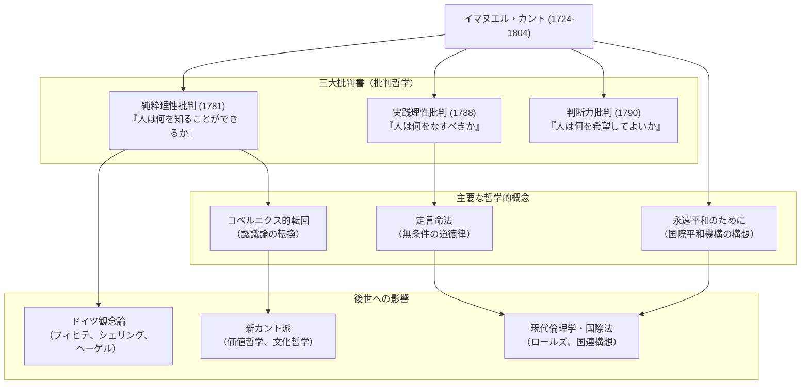

## はじめに：時計のように正確な人生から生まれた、哲学の巨大なパラダイムシフト

近代哲学を語る上で、決して避けて通ることができない巨星。それが**イマヌエル・カント（Immanuel Kant, 1724–1804）**です。プロイセン王国（現在のロシア連邦カリーニングラード）のケーニヒスベルクに生まれ、生涯その地を離れることなく、規則正しく穏やかな日々を送りました。彼の散歩の時間が日々の時計代わりになったという逸話はあまりにも有名です。

しかし、その静寂な生活とは裏腹に、彼の頭脳は人類の思想史を根本から覆すほどの爆発力を持っていました。カントの哲学は「大陸合理論」と「イギリス経験論」という、当時対立していた二大哲学を統合し、哲学に**「コペルニクス的転回」**をもたらしたのです。

本記事では、この孤高の思索者がいかにして近代哲学の基礎を築き、後世にどのような影響を与えたのかを、その生涯と思想の核心から紐解いていきます。

## ケーニヒスベルクの賢人：カントの生涯

1724年、馬具職人の四男として生まれたカントは、敬虔主義の影響を強く受けて育ちました。ケーニヒスベルク大学で哲学、数学、自然科学を学び、卒業後は家庭教師として生計を立てながら研究を続けました。

特筆すべきは、彼の「遅咲き」と「驚異的な持続力」です。大学の正教授（論理学・形而上学）に就任したのは1770年、彼が46歳のときでした。そして、哲学史に燦然と輝く代表作『純粋理性批判』が出版されたのは、なんと57歳のとき（1781年）です。その後も精力的に執筆を続け、60代で『実践理性批判』『判断力批判』を完成させました。

彼は生涯独身を貫き、規則正しい生活を送りました。毎朝5時に起床し、講義、執筆、そして午後3時半からの散歩というルーティンを崩すことはありませんでした。この徹底した規律こそが、彼の緻密で壮大な哲学体系を構築する土台となったのです。

## カント哲学の核心：三大批判書と「コペルニクス的転回」

カントの最大の功績は、人間の「認識能力」そのものを徹底的に吟味（批判）したことにあります。彼の思想の骨格をなすのが、以下の「三大批判書」です。

### 1. 認識論の革命『純粋理性批判』（人は何を知ることができるか）
カント以前の哲学は、「人間の認識が対象に従う」と考えていました（私たちの心が、外界にあるがままの物事を写し取るという考え）。しかしカントは、「対象が人間の認識に従う」と逆転させました。私たちが物事を認識できるのは、私たち自身の側にある時間・空間という「感性の形式」と、因果律などの「悟性のカテゴリー」を通して世界を組み立てているからだ、と主張したのです。天動説から地動説への転換になぞらえ、これを**「コペルニクス的転回」**と呼びます。これにより、人間が認識できるのは「現象」だけであり、「物自体（真の姿）」は認識できないと結論づけました。

### 2. 道徳哲学の確立『実践理性批判』（人は何をなすべきか）
人間は「物自体」を認識できませんが、道徳の世界においては、私たち自身が自律的に法則を打ち立てることができます。カントは、条件付きの命令（「〜したいなら、〜せよ」）ではなく、無条件の道徳法則（「〜せよ」）である**「定言命法」**を提唱しました。「あなたの意志の格率が、常に同時に普遍的な立法の原理として妥当するように行為せよ」という彼の言葉は、現代の倫理学においても最も重要な基礎となっています。

### 3. 美と目的の哲学『判断力批判』（人は何を希望してよいか）
自然の機械論的法則（純粋理性）と、人間の自由な道徳的意志（実践理性）という二つの異なる世界を橋渡しするために構想されたのが本作です。「美」や「崇高」といった美的判断と、自然界に目的を見出す目的論的判断を探求しました。

## 相関図・功績フロー

以下の図は、カントの哲学体系とその影響の流れを示したものです。

## 後世への絶大な影響：カントを超えて、カントと共に

カントが打ち立てた哲学体系は、あまりにも巨大でした。以後の哲学者は、カントに賛同するにせよ反発するにせよ、常に「カントをどう乗り越えるか」という課題に直面することになります。

フィヒテ、シェリング、ヘーゲルへと連なる**ドイツ観念論**は、カントが到達不可能とした「物自体」の領域を克服しようとする試みから生まれました。19世紀後半には「カントに帰れ」を合言葉に**新カント派**が興り、現代の科学哲学や文化哲学の基礎を築きました。

さらに、彼の晩年の著作『永遠平和のために』で提唱された「自由な国家の連合」という構想は、後の国際連盟や国際連合の設立に直接的なインスピレーションを与えました。また、人間の尊厳を目的そのものとして扱う彼の倫理観は、ジョン・ロールズの正義論など、現代の政治哲学や人権思想に今も脈々と息づいています。

## おわりに

イマヌエル・カント。彼の生涯は地理的には極めて狭い範囲に留まりましたが、その思索の射程は宇宙の真理から人間の道徳的深淵、そして人類の普遍的平和にまで及んでいました。
「わが上なる星空と、わが内なる道徳法則」。彼の墓石に刻まれたこの『実践理性批判』の一節は、人間の認識の限界を冷静に見極めながらも、人間の自由と尊厳を力強く肯定し続けた、カント哲学の精神そのものを象徴しています。現代という複雑で不確実な時代にこそ、彼の遺した緻密な思索の道筋は、我々にとっての確かな羅針盤となるはずです。
