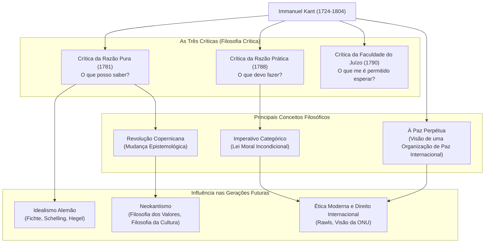

## Introdução: Uma Vida Pontual como um Relógio e a Maior Mudança de Paradigma da Filosofia

Uma estrela gigante que é impossível de ignorar ao discutir a filosofia moderna. Esse é **Immanuel Kant (1724–1804)**. Nascido em Königsberg, no Reino da Prússia (atual Kaliningrado, Rússia), ele viveu uma vida pacífica e regrada, sem nunca deixar sua cidade natal. A anedota de que os moradores locais ajustavam seus relógios com base em suas caminhadas diárias é famosa demais.

No entanto, em contraste com sua vida tranquila, sua mente possuía um poder explosivo suficiente para revolucionar a história do pensamento humano. A filosofia de Kant integrou as duas grandes escolas filosóficas conflitantes da época, o "Racionalismo Continental" e o "Empirismo Britânico", trazendo uma **"Revolução Copernicana"** à filosofia.

Neste artigo, exploraremos como esse pensador solitário construiu os alicerces da filosofia moderna e o impacto que teve nas gerações futuras, desvendando sua vida e o núcleo de seu pensamento.

## O Sábio de Königsberg: A Vida de Kant

Nascido em 1724 como o quarto filho de um fabricante de arreios, Kant cresceu fortemente influenciado pelo Pietismo. Estudou filosofia, matemática e ciências naturais na Universidade de Königsberg, e continuou suas pesquisas enquanto ganhava a vida como tutor particular após a formatura.

O que se destaca é o seu "florescimento tardio" e sua "surpreendente resistência". Ele foi nomeado professor titular (Lógica e Metafísica) na universidade em 1770, aos 46 anos. Sua obra-prima, a *Crítica da Razão Pura*, que brilha intensamente na história da filosofia, foi publicada quando ele tinha nada menos que 57 anos (1781). Mesmo depois disso, continuou a escrever vigorosamente, completando a *Crítica da Razão Prática* e a *Crítica da Faculdade do Juízo* em seus 60 anos.

Ele permaneceu solteiro por toda a vida e levou uma vida altamente disciplinada. Acordava às 5 da manhã todos os dias, e nunca quebrava sua rotina de palestras, escrita e uma caminhada a partir das 15h30. Essa disciplina estrita foi o alicerce sobre o qual ele construiu seu sistema filosófico minucioso e grandioso.

## O Núcleo da Filosofia de Kant: As Três Críticas e a "Revolução Copernicana"

A maior conquista de Kant reside no exame minucioso (crítica) da própria "capacidade de conhecimento" humana. A estrutura de seu pensamento é formada pelas seguintes "Três Críticas".

### 1. A Revolução na Epistemologia, a "Crítica da Razão Pura" (O que posso saber?)
A filosofia anterior a Kant acreditava que "o conhecimento humano se adapta aos objetos" (a ideia de que nossas mentes refletem as coisas no mundo externo como elas são). No entanto, Kant inverteu isso afirmando que "os objetos se adaptam ao conhecimento humano". Ele argumentou que só podemos conhecer as coisas porque construímos o mundo por meio das "formas da sensibilidade" (tempo e espaço) e das "categorias do entendimento" (como causalidade) que residem em nós. Comparando isso com a transição da teoria geocêntrica para a heliocêntrica, isso é chamado de **"Revolução Copernicana"**. Com isso, ele concluiu que os humanos só podem conhecer os "fenômenos" e não a "coisa em si" (a verdadeira natureza).

### 2. O Estabelecimento da Filosofia Moral, a "Crítica da Razão Prática" (O que devo fazer?)
Embora os humanos não possam conhecer a "coisa em si", no mundo moral podemos estabelecer leis autonomamente. Kant propôs o **"Imperativo Categórico"**, que é uma lei moral incondicional ("faça isso"), em oposição a comandos condicionais ("se você quer algo, faça isso"). Suas palavras, "Aja apenas segundo a máxima tal que possas ao mesmo tempo querer que ela se torne lei universal", continuam sendo uma das bases mais importantes da ética contemporânea.

### 3. A Filosofia da Beleza e do Propósito, a "Crítica da Faculdade do Juízo" (O que me é permitido esperar?)
Esta obra foi concebida para fazer a ponte entre dois mundos diferentes: as leis mecanicistas da natureza (razão pura) e a livre vontade moral humana (razão prática). Ela explora julgamentos estéticos, como o "belo" e o "sublime", e julgamentos teleológicos, encontrando propósitos no mundo natural.

## Diagrama de Correlação e Fluxo de Conquistas

O diagrama a seguir mostra o sistema filosófico de Kant e o fluxo de sua influência.

## Influência Imensa nas Gerações Futuras: Além de Kant, Junto com Kant

O sistema filosófico estabelecido por Kant era verdadeiramente colossal. Filósofos subsequentes, quer concordassem com ele ou se rebelassem, enfrentaram constantemente o desafio de "como superar Kant".

O **Idealismo Alemão**, que se estende até Fichte, Schelling e Hegel, nasceu da tentativa de superar o reino da "coisa em si", que Kant considerava inatingível. No final do século XIX, o movimento **Neokantiano** surgiu sob o lema "De volta a Kant!", estabelecendo os fundamentos da filosofia moderna da ciência e da cultura.

Além disso, sua visão de uma "federação de Estados livres", proposta em sua obra tardia *À Paz Perpétua*, inspirou diretamente o estabelecimento da Liga das Nações e das Nações Unidas. Sua ética, que trata a dignidade humana como um fim em si mesma, continua a viver vigorosamente na filosofia política e no pensamento dos direitos humanos de hoje, como na teoria da justiça de John Rawls.

## Conclusão

Immanuel Kant. Embora sua vida tenha sido limitada a uma área geográfica extremamente restrita, o alcance de seu pensamento se estendeu desde as verdades do universo e o profundo abismo moral humano até a paz universal da humanidade.
"O céu estrelado acima de mim e a lei moral dentro de mim." Esta passagem da *Crítica da Razão Prática*, gravada em sua lápide, simboliza o próprio espírito da filosofia kantiana: afirmar fortemente a liberdade e a dignidade humanas enquanto discerne com calma os limites da cognição humana. Em nossos tempos complexos e incertos, o caminho de pensamento rigoroso que ele deixou para trás certamente servirá como uma bússola confiável para nós.
