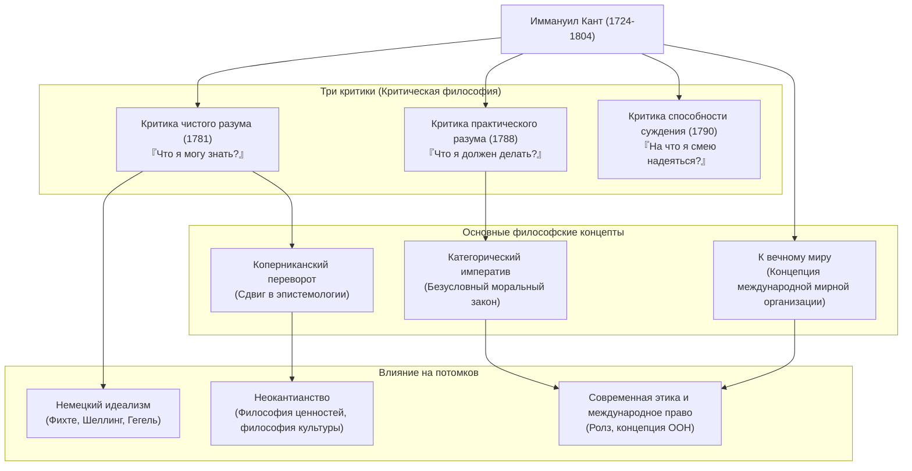

## Введение: Огромный сдвиг парадигмы в философии, родившийся из жизни, точной как часы

Говоря о современной философии, невозможно обойти стороной эту гигантскую звезду. Это **Иммануил Кант (Immanuel Kant, 1724–1804)**. Родившись в Кёнигсберге, Прусское королевство (ныне Калининград, Российская Федерация), он прожил всю жизнь, не покидая этого города, ведя размеренную и спокойную жизнь. Анекдот о том, что время его прогулок заменяло горожанам часы, слишком хорошо известен.

Однако, вопреки этой тихой жизни, его ум обладал взрывной силой, способной в корне перевернуть историю человеческой мысли. Философия Канта объединила две противоборствующие в то время великие философские школы — «континентальный рационализм» и «британский эмпиризм», — и совершила в философии **«коперниканский переворот»**.

В этой статье мы, опираясь на стержень его жизни и мысли, разберем, как этот одинокий мыслитель заложил основы современной философии и какое влияние он оказал на последующие поколения.

## Мудрец из Кёнигсберга: Жизнь Канта

Родившийся в 1724 году четвертым сыном шорника, Кант вырос под сильным влиянием пиетизма. Он изучал философию, математику и естественные науки в Кёнигсбергском университете, а после его окончания продолжал исследования, зарабатывая на жизнь домашним учителем.

Особого упоминания заслуживают его «позднее расцветание» и «поразительная выносливость». Он стал ординарным профессором университета (по логике и метафизике) в 1770 году, когда ему было 46 лет. А его главный труд «Критика чистого разума», ярко сияющий в истории философии, был опубликован, когда ему было 57 лет (в 1781 году). После этого он продолжал энергично писать, завершив в возрасте за 60 лет «Критику практического разума» и «Критику способности суждения».

Всю жизнь он оставался холостяком и вел размеренную жизнь. Каждое утро он вставал в 5 часов, и никогда не нарушал свою рутину: лекции, писательство и прогулка с 15:30. Именно эта строгая дисциплина стала фундаментом для построения его точной и грандиозной философской системы.

## Суть философии Канта: Три критики и «Коперниканский переворот»

Величайшая заслуга Канта заключается в том, что он тщательно исследовал (подверг критике) саму «способность познания» человека. Скелетом его мысли являются следующие «Три критики».

### 1. Революция в эпистемологии «Критика чистого разума» (Что я могу знать?)
Философия до Канта считала, что «человеческое познание сообразуется с предметом» (идея о том, что наш разум просто копирует вещи внешнего мира такими, какие они есть). Однако Кант перевернул это положение: «предметы сообразуются с нашим познанием». Он утверждал, что мы можем познавать вещи потому, что конструируем мир через присущие нам «формы чувственности» (время и пространство) и «категории рассудка» (такие как причинность). По аналогии с переходом от геоцентрической системы к гелиоцентрической, это называют **«коперниканским переворотом»**. Из этого он сделал вывод, что человек может познавать только «явления», но не «вещи в себе» (их истинную сущность).

### 2. Утверждение моральной философии «Критика практического разума» (Что я должен делать?)
Хотя человек не может познать «вещь в себе», в мире морали мы сами можем автономно устанавливать законы. Кант предложил не условные повеления («если хочешь того-то, делай так-то»), а безусловный моральный закон («делай так-то») — **«категорический императив»**. Его слова «Поступай так, чтобы максима твоей воли могла в то же время иметь силу принципа всеобщего законодательства» остаются важнейшей основой и в современной этике.

### 3. Философия красоты и цели «Критика способности суждения» (На что я смею надеяться?)
Это произведение было задумано для того, чтобы перекинуть мост между двумя разными мирами: механистическими законами природы (чистый разум) и свободной моральной волей человека (практический разум). В нем исследуются эстетические суждения, такие как «прекрасное» и «возвышенное», и телеологические суждения, находящие цель в мире природы.

## Диаграмма связей и достижений

На диаграмме ниже показана философская система Канта и поток её влияния.

## Огромное влияние на последующие поколения: За пределы Канта, вместе с Кантом

Философская система, воздвигнутая Кантом, была слишком огромной. Последующие философы, соглашались они с ним или бунтовали, всегда сталкивались с задачей: «как преодолеть Канта?».

**Немецкий идеализм**, протянувшийся к Фихте, Шеллингу и Гегелю, родился из попытки преодолеть область «вещи в себе», которую Кант считал недостижимой. Во второй половине 19 века под лозунгом «Назад к Канту» возникло **неокантианство**, заложившее основы современной философии науки и философии культуры.

Более того, концепция «федерации свободных государств», выдвинутая в его позднем труде «К вечному миру», послужила прямым источником вдохновения для создания Лиги Наций и Организации Объединенных Наций. А его этика, относящаяся к человеческому достоинству как к самоцели, до сих пор живо пульсирует в современной политической философии и идее прав человека, например, в теории справедливости Джона Ролза.

## Заключение

Иммануил Кант. Хотя географически его жизнь ограничивалась крайне узкими рамками, дальность его мысли простиралась от истин вселенной до моральных глубин человека и всеобщего мира человечества.
«Звездное небо надо мной и моральный закон во мне». Этот отрывок из «Критики практического разума», высеченный на его надгробии, символизирует сам дух философии Канта, который, хладнокровно оценив пределы человеческого познания, продолжал решительно утверждать свободу и достоинство человека. Именно в нашу сложную и неопределенную эпоху маршрут его точных размышлений, оставленный нам в наследство, должен стать для нас надежным компасом.
