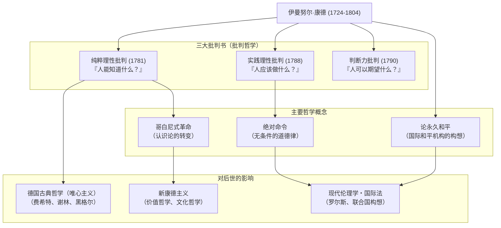

## 引言：源于如钟表般精准的人生的哲学巨大范式转变

谈及近代哲学，有一位绝对无法避开的巨星。那就是**伊曼努尔·康德（Immanuel Kant, 1724–1804）**。他出生于普鲁士王国（现俄罗斯联邦加里宁格勒）的柯尼斯堡，一生未曾离开故乡，过着规律而平静的日子。关于他每天散步的时间精准得可以让人对表的轶事，早已为人熟知。

然而，与这平静的生活截然相反，他的大脑却拥有着足以从根本上颠覆人类思想史的爆发力。康德的哲学统合了当时相互对立的“大陆唯理论”与“英国经验论”这两大流派，为哲学界带来了一场**“哥白尼式革命（哥白尼式转变）”**。

本文将从这位孤高的思想家的一生及其思想核心出发，为你剖析他是如何奠定近代哲学的基础，并对后世产生了怎样的深远影响。

## 柯尼斯堡的哲人：康德的生平

1724年，康德作为马具匠的第四个儿子出生，在虔敬主义的强烈影响下长大。他在柯尼斯堡大学学习了哲学、数学和自然科学，毕业后一边担任家庭教师维持生计，一边继续他的研究。

值得一提的是他的“大器晚成”与“惊人的持久力”。他正式就任大学正教授（逻辑学与形而上学）是在1770年，当时他已经46岁了。而他在哲学史上闪耀着璀璨光芒的代表作《纯粹理性批判》出版时，更是已经57岁高龄（1781年）。此后他依然精力充沛地持续写作，在60多岁时完成了《实践理性批判》和《判断力批判》。

他终身未婚，过着极其规律的生活。每天清晨5点起床，授课、写作，以及下午3点半准时散步，这一日常惯例从未被打破。正是这种彻底的自律，成为了他构建缜密而宏大哲学体系的基石。

## 康德哲学的核心：三大批判与“哥白尼式革命”

康德最大的功绩，在于对人类的“认识能力”本身进行了彻底的考察（批判）。构成其思想骨架的，便是以下的“三大批判书”。

### 1. 认识论的革命《纯粹理性批判》（人能知道什么？）
在康德之前的哲学认为，“人类的认识服从于对象”（即我们的心灵是对外界事物的如实反映）。然而康德将其反转为“对象服从于人类的认识”。他主张，我们之所以能够认识事物，是因为我们通过自身的时间、空间这些“感性形式”，以及因果律等“知性范畴”来构建世界。他将其比喻为从地心说到日心说的转变，故称之为**“哥白尼式革命”**。由此他得出结论：人类所能认识的仅仅是“现象”，而无法认识“物自体（事物的真实面貌）”。

### 2. 道德哲学的确立《实践理性批判》（人应该做什么？）
虽然人类无法认识“物自体”，但在道德的世界里，我们自身可以自律地建立法则。康德提出，道德法则不应是带有条件的命令（“如果想……，就必须……”），而应是无条件的道德法则（“必须……”），即**“绝对命令（定言命令）”**。“要只按照你同时认为也能成为普遍规律的准则去行动”，他的这一名言，至今仍是现代伦理学中最重要的基础。

### 3. 美与目的的哲学《判断力批判》（人可以期望什么？）
本书旨在为自然界的机械论法则（纯粹理性）与人类自由的道德意志（实践理性）这两个截然不同的世界搭建桥梁。书中探讨了关于“美”与“崇高”的审美判断，以及在自然界中寻找目的的目的论判断。

## 关联图与功绩流程

下图展示了康德的哲学体系及其影响的脉络。

## 对后世的巨大影响：超越康德，与康德同行

康德所建立的哲学体系极其宏大。后世的哲学家们，无论赞同还是反对他，都不可避免地要面对一个课题：“如何超越康德”。

绵延至费希特、谢林和黑格尔的**德国古典唯心主义**，正是诞生于试图克服康德认为无法触及的“物自体”领域的尝试。到了19世纪后半叶，伴随着“回到康德去”的口号，**新康德主义**兴起，为现代科学哲学和文化哲学奠定了基础。

此外，他在晚年著作《论永久和平》中所倡导的“自由国家联盟”的构想，为后来国际联盟和联合国的建立提供了直接的灵感。而他将人类的尊严作为目的本身的伦理观，也依然在约翰·罗尔斯的《正义论》等现代政治哲学与人权思想中脉脉流传。

## 结语

伊曼努尔·康德。虽然他一生的地理轨迹仅局限在极小的范围内，但他思想的射程却涵盖了从宇宙的真理到人类的道德深渊，乃至人类的普遍和平。
“位我上者，灿烂星空；道德律令，在我心中。”刻在他墓碑上的这段出自《实践理性批判》的名言，正是康德哲学精神的象征：在冷静地审视人类认识极限的同时，坚定地肯定着人类的自由与尊严。正是在当今这个复杂且充满不确定性的时代，他所留下的缜密的思想轨迹，必将成为我们最可靠的指南针。
