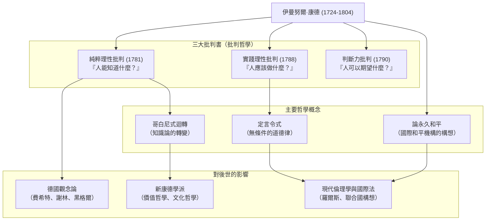

## 簡介：從如時鐘般精準的人生中誕生的哲學巨大典範轉移

在談論近代哲學時，有一位絕對無法避而不談的巨星，那便是**伊曼努爾·康德（Immanuel Kant, 1724–1804）**。他出生於普魯士王國的柯尼斯堡（現俄羅斯聯邦加里寧格勒），終生未曾離開過該地，過著規律且平靜的日子。他每天散步的時間甚至能被當地居民當作時鐘來對時，這段軼事可說是無人不知。

然而，與其平靜生活相反的是，他的頭腦擁有足以從根本上顛覆人類思想史的爆發力。康德的哲學將當時相互對立的兩大哲學陣營——「大陸理性主義」與「英國經驗主義」加以整合，為哲學界帶來了**「哥白尼式迴轉（哥白尼式革命）」**。

本文將從這位孤高的思想家之生平與思想核心出發，探討他究竟是如何奠定近代哲學的基礎，並對後世產生了什麼樣的影響。

## 柯尼斯堡的智者：康德的生平

1724年，身為馬具工匠第四個兒子的康德誕生了。他在虔敬主義的強烈影響下長大，隨後在柯尼斯堡大學學習哲學、數學與自然科學。畢業後，他一邊以擔任家庭教師維持生計，一邊持續進行研究。

值得一提的是他的「大器晚成」以及「驚人的持續力」。當他於1770年就任大學正教授（邏輯學與形上學）時，已經46歲了。而他在哲學史上閃耀著璀璨光芒的代表作《純粹理性批判》，竟然是在他57歲（1781年）時才出版。此後，他依然精力充沛地持續寫作，並在60多歲時完成了《實踐理性批判》與《判斷力批判》。

他終生未娶，過著極度規律的生活。每天早上5點起床，講課、寫作，然後在下午3點半準時散步——這樣的日常作息從未被打破。正是這種徹底的紀律，成為了他構築出縝密且宏大哲學體系的基石。

## 康德哲學的核心：三大批判與「哥白尼式迴轉」

康德最大的功績在於，他對人類的「認知能力」本身進行了徹底的審視（批判）。構成他思想骨架的，便是以下的「三大批判書」。

### 1. 知識論的革命《純粹理性批判》（人能知道什麼？）
在康德之前的哲學認為，「人類的認知必須符合對象」（也就是我們的心靈會如實地映照出外界事物的樣貌）。然而，康德卻將其反轉為「對象必須符合人類的認知」。他主張，我們之所以能夠認知事物，是因為我們透過自身具備的時間與空間這類「感性形式」，以及因果律等「知性範疇」來建構這個世界。他將這種類似於從「地心說」轉向「日心說」的轉變，稱為**「哥白尼式迴轉」**。由此，他得出結論：人類所能認知的只有「現象」，而無法認知「物自身（事物的真實面貌）」。

### 2. 道德哲學的確立《實踐理性批判》（人應該做什麼？）
雖然人類無法認知「物自身」，但在道德的世界裡，我們自己卻能夠自律地建立法則。康德提倡的不是有條件的命令（「如果你想…，你就應該…」），而是無條件的道德法則（「你應當…」）——即**「定言令式（無上命令）」**。「請這樣行動：使你的意志準則始終能夠同時作為普遍立法的原則」，他的這句名言，至今仍是現代倫理學中最重要的基礎。

### 3. 美與目的之哲學《判斷力批判》（人可以期望什麼？）
本書的構想，是為了在自然界的機械論法則（純粹理性）與人類自由的道德意志（實踐理性）這兩個截然不同的世界之間，搭建起一座橋樑。他探討了「美」與「崇高」等審美判斷，以及在自然界中尋找目的的目的論判斷。

## 關聯圖與功績流程圖

下圖展示了康德的哲學體系及其影響的脈絡。

## 對後世的深遠影響：超越康德，與康德同在

康德所建立的哲學體系實在過於龐大。此後的哲學家們，無論是贊同還是反對康德，都無可避免地必須面對「如何超越康德」這個課題。

一脈相承至費希特、謝林與黑格爾的**德國觀念論**，正是誕生於試圖克服康德所認為無法觸及的「物自身」領域的嘗試。到了19世紀後半葉，以「回到康德」為口號的**新康德學派**興起，並奠定了現代科學哲學與文化哲學的基礎。

此外，他在晚年著作《論永久和平》中所提倡的「自由國家聯盟」構想，也為後來國際聯盟與聯合國的成立提供了直接的靈感。而他將人類尊嚴視為目的本身的倫理觀，至今依然在羅爾斯的《正義論》等現代政治哲學與人權思想中生生不息。

## 結語

伊曼努爾·康德。雖然他在地理上終生只侷限在一個極為狹小的範圍內，但其思想的射程卻涵蓋了宇宙的真理、人類道德的深淵，乃至於全人類的普遍和平。

「我頭頂上的星空，與我內心中的道德法則」。刻在他墓碑上的這段《實踐理性批判》名言，象徵著康德哲學的精神本身：在冷靜地看清人類認知極限的同時，依然強而有力地持續肯定人類的自由與尊嚴。正是在現代這個複雜且充滿不確定性的時代，他所留下的縝密思考軌跡，必將成為指引我們的可靠羅盤。
