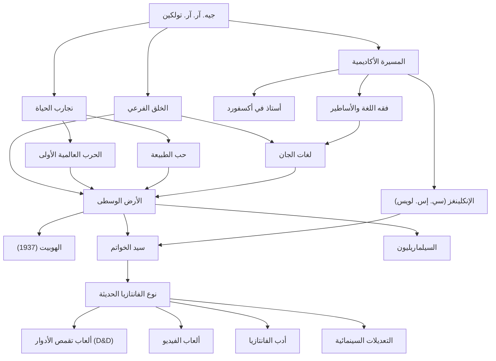

# جيه. آر. آر. تولكين: مسيرة أب الفانتازيا الحديثة وخلق الأساطير

## مقدمة

عند سماع اسم جون رونالد رويل تولكين (J.R.R. Tolkien)، يتبادر إلى ذهن معظم الناس فورًا عالم "الأرض الوسطى" (Middle-earth) الشاسع حيث تدور أحداث "سيد الخواتم" و"الهوبيت". أصبحت عناصر مثل الجان، والأقزام، والسحرة، والخاتم الذي يهز العالم، نماذج أصلية لعدد لا يحصى من أعمال الفانتازيا التي تلت ذلك. ومع ذلك، لم يكن تولكين مجرد روائي، بل كان لغويًا بارزًا في جامعة أكسفورد، يمتلك فهمًا عميقًا للغة الإنجليزية القديمة والأساطير الإسكندنافية. دعونا نستكشف حياته وفلسفته والتأثير الهائل الذي تركه على العصر الحديث.

## الشغف باللغويات وظل الحرب العالمية الأولى

وُلد تولكين في بلومفونتين، جنوب أفريقيا في عام 1892، لكنه فقد والده في سن مبكرة وانتقل مع والدته إلى مكان قريب من برمنغهام في إنجلترا. أصبحت المناظر الريفية الخضراء لاحقًا المشهد الأصلي الذي استوحى منه "المقاطعة" (The Shire). وفي سن الثانية عشرة، فقد والدته أيضًا ونشأ تحت رعاية كاهن كاثوليكي. وسط هذه الظروف، ازدهرت موهبته الاستثنائية في اللغات. فبالإضافة إلى اليونانية واللاتينية، شغف باللغات الإسكندنافية القديمة، والقوطية، والفنلندية، وانغمس في ابتكار لغاته الاصطناعية الخاصة.

ومع ذلك، تمزقت فترة شبابه باندلاع الحرب العالمية الأولى. في عام 1916، خدم تولكين على الجبهة في معركة السوم المروعة. في هذه الحرب، فقد العديد من أصدقائه المقربين، وأصيب هو نفسه بحمى الخنادق وتم إعادته إلى وطنه. إن الموت واليأس اللذين واجههما في خنادق المعركة، بالإضافة إلى الشجاعة والصداقة التي أظهرها جنود مجهولون في ظروف قاسية، ألقت بظلالها العميقة لاحقًا على رحلة فرودو وسام القاسية في "سيد الخواتم" وعلى تصوير الأشخاص العاديين الذين يواجهون الشر المطلق.

## الأكاديمية و"الإنكلينغز"

بعد الحرب، سلك تولكين المسار الأكاديمي، حيث قام بتدريس اللغة الإنجليزية القديمة والأدب في العصور الوسطى كأستاذ في جامعة أكسفورد. وتُعد أبحاثه ومحاضراته حول ملحمة "بيوولف" (Beowulf) على وجه الخصوص نقطة تحول أعادت تقييم العمل كقطعة أدبية بدلاً من مجرد وثيقة تاريخية.

خلال فترة وجوده في أكسفورد، شكل أيضًا دائرة أدبية تُعرف باسم "الإنكلينغز" (The Inklings) مع سي. إس. لويس (مؤلف سلسلة 'سجلات نارنيا') وآخرين. كانوا يجتمعون في حانة محلية، ويقرأون مسودات كتاباتهم لبعضهم البعض، وينخرطون في نقاشات حية. كان هذا التبادل الفكري والصداقات العميقة قوة دافعة لا غنى عنها لعمل تولكين الإبداعي. حتى أنه يقال لولا التشجيع القوي من لويس، لربما لم يرَ "سيد الخواتم" النور أبدًا.

## خلق الأساطير وفلسفة "اليوكاتاستروفي"

في صميم إبداع تولكين كان هناك طموح هائل لخلق "أساطير لإنجلترا". تم إنشاء قصصه كمسرح للشعوب التي تتحدث لغات الجان المعقدة التي ابتكرها بنفسه (مثل الكوينيا والسندارين). وكما قال: "اللغة جاءت أولاً، والقصة تبعتها"، حيث يتميز بناء عالمه بدرجة غير عادية من الكمال تشمل اللغات والتاريخ والأنساب والجغرافيا.

من أبرز المفاهيم في فلسفته الأدبية مفهوم "اليوكاتاستروفي" (Eucatastrophe). وهو مصطلح صاغه بدمج الكلمتين اليونانيتين "eu" (جيد) و "catastrophe" (كارثة)، ويعني التحول المفاجئ والسعيد الذي ينبثق من أعماق اليأس. كان تولكين يعتقد أن الإنجيل المسيحي هو أعظم يوكاتاستروفي في التاريخ، وجادل بأن الفانتازيا الحقيقية يجب أن تجلب هذا الفرح الأسمى والعزاء للقراء.

بالإضافة إلى ذلك، تحمل أعماله رسالة قوية تعبر عن "حب الطبيعة والتحذير من الحضارة الآلية". كان تدمير غابة آيزنغارد وتحولها إلى مصنع من التروس والدخان تعبيرًا عن حزنه على الثورة الصناعية التي كانت تدمر الريف الإنجليزي الذي أحبه.

## الفانتازيا الحديثة والتأثير على الأجيال القادمة

مع نشر "الهوبيت" عام 1937، ثم "سيد الخواتم" بين عامي 1954 و1955، أثارت هذه الأعمال حماسًا عالميًا تدريجيًا. وفي أمريكا في الستينيات بشكل خاص، تمت قراءتها ككتاب مقدس بين شباب الثقافة المضادة.

اليوم، ليس من المبالغة القول إن النوع الذي نطلق عليه "الفانتازيا" - ذلك العالم حيث يطلق الجان السهام ويحمل الأقزام الفؤوس - قد أسسه تولكين إلى حد كبير. من ألعاب تقمص الأدوار على الطاولة مثل (Dungeons & Dragons)، وألعاب الفيديو مثل (Dragon Quest)، إلى الكتاب المعاصرين مثل جورج آر. آر. مارتن وجيه. كيه. رولينغ، لا يكاد يوجد أحد لم يتأثر به. كما أن النجاح الهائل للتعديلات السينمائية التي أخرجها بيتر جاكسون في العقد الأول من القرن الحادي والعشرين لا يزال حاضرًا في الأذهان.

## مخطط الإنجازات

تم تلخيص حياة تولكين ومدى تأثيره في المخطط التالي.

## الخاتمة

لم يكتب جيه. آر. آر. تولكين مجرد قصص خيالية. لقد سكب معرفته الأكاديمية العميقة، وصدمات الحرب التي عاشها، وحبه للطبيعة، وإيمانه لإنشاء "خلق فرعي" (Sub-creation) يُدعى "الأرض الوسطى"، والذي يمكن تسميته حقيقة بديلة. عندما نرغب في الهروب من حياتنا اليومية ولمس غُموض ضوء النجوم والغابات القديمة، تستمر الكلمات التي نسجها تولكين في دعوة القراء الجدد إلى مغامرات بعيدة.
