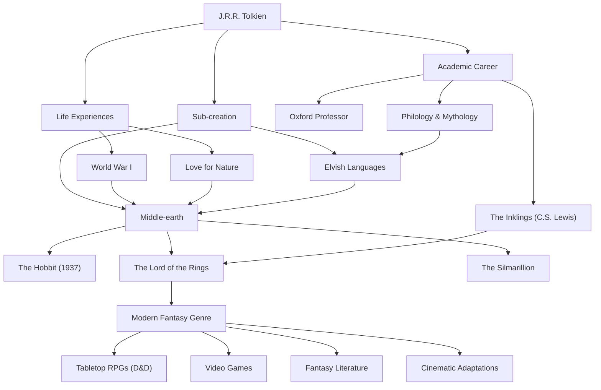

# J.R.R. Tolkien: Der Weg des Vaters der modernen Fantasy und die Erschaffung von Mythen

## Einführung

Wenn man den Namen John Ronald Reuel Tolkien (J.R.R. Tolkien) hört, denken die meisten Menschen zuerst an die epische Welt von "Mittelerde" (Middle-earth), in der "Der Herr der Ringe" und "Der Hobbit" spielen. Elemente wie Elben, Zwerge, Zauberer und ein Ring, der die Welt erschüttert, wurden zur Vorlage für unzählige nachfolgende Fantasy-Werke. Tolkien selbst war jedoch nicht nur ein Romanschriftsteller, sondern auch ein renommierter Linguist an der Universität Oxford mit einem tiefen Verständnis für Altenglisch und die nordische Mythologie. Lassen Sie uns sein Leben, seine Philosophie und das unermessliche Erbe, das er der modernen Welt hinterlassen hat, erkunden.

## Die Leidenschaft für Linguistik und der Schatten des Ersten Weltkriegs

Tolkien wurde 1892 im südafrikanischen Bloemfontein geboren, verlor jedoch früh seinen Vater und zog mit seiner Mutter in die Nähe des englischen Birmingham. Die grüne, ländliche Landschaft sollte später zur Inspiration für das Auenland (The Shire) werden. Da er mit 12 Jahren auch seine Mutter verlor, wuchs er unter der Obhut eines katholischen Priesters auf. Unter diesen Umständen entfaltete sich sein außergewöhnliches Talent für Sprachen. Neben Griechisch und Latein widmete er sich auch dem Altnordischen, Gotischen und Finnischen und vertiefte sich spielerisch in die Erschaffung eigener Kunstsprachen.

Seine Jugend wurde jedoch durch den Ausbruch des Ersten Weltkriegs zerrissen. 1916 diente Tolkien an der brutalen Front der Somme-Schlacht. In diesem Krieg verlor er viele enge Freunde, erkrankte selbst an Grabenfieber und wurde in die Heimat zurückgeschickt. Der Tod und die Verzweiflung, die er in den Schützengräben erlebte, sowie der Mut und die Freundschaft der namenlosen Soldaten in diesen Extremsituationen warfen später einen tiefen Schatten auf die beschwerliche Reise von Frodo und Sam in "Der Herr der Ringe" und die Darstellung gewöhnlicher Menschen, die sich dem absoluten Bösen entgegenstellen.

## Die akademische Welt und "Die Inklings"

Nach dem Krieg verfolgte Tolkien eine akademische Laufbahn und lehrte als Professor an der Universität Oxford Altenglisch und mittelalterliche Literatur. Insbesondere seine Forschungen und Vorlesungen über "Beowulf" waren bahnbrechend, da sie das Werk als Literatur neu bewerteten, das bis dahin lediglich als historisches Dokument betrachtet worden war.

Während seiner Zeit in Oxford gründete er zusammen mit C.S. Lewis (dem Autor der "Chroniken von Narnia") und anderen den literarischen Zirkel "Die Inklings" (The Inklings). Sie trafen sich in einem lokalen Pub, lasen sich gegenseitig aus ihren Manuskripten vor und diskutierten lebhaft. Dieser intellektuelle Austausch und die tiefe Freundschaft waren ein unverzichtbarer Antrieb für Tolkiens kreatives Schaffen. Man sagt sogar, dass "Der Herr der Ringe" ohne die starke Ermutigung von Lewis vielleicht nie veröffentlicht worden wäre.

## Die Erschaffung von Mythen und die Philosophie der "Eukatastrophe"

An der Wurzel von Tolkiens Schaffen lag der ehrgeizige Wunsch, eine "Mythologie für England" zu erschaffen. Seine Geschichten entstanden als Bühne für die Völker, die die kunstvollen elbischen Sprachen (wie Quenya und Sindarin) sprachen, die er selbst konstruiert hatte. Wie er selbst sagte: "Die Sprache kam zuerst, und die Geschichte folgte nach", weist seine Welt eine außergewöhnliche Vollständigkeit auf, die sich über Sprache, Geschichte, Genealogie und Geografie erstreckt.

Ein Konzept, das seine literarische Philosophie symbolisiert, ist die "Eukatastrophe" (Eucatastrophe). Dies ist ein von ihm geprägter Begriff, der das griechische "eu" (gut) und "catastrophe" (Zerstörung) kombiniert und eine plötzliche, freudige Wendung aus den Tiefen der Verzweiflung bedeutet. Tolkien glaubte, dass das christliche Evangelium die größte Eukatastrophe der Geschichte sei, und argumentierte, dass wahre Fantasy dem Leser ebenfalls diese höchste Freude und diesen Trost bringen sollte.

Darüber hinaus enthalten seine Werke eine starke "Liebe zur Natur und eine Warnung vor der Zivilisation der Maschinen". Die Abholzung des Waldes von Isengart und seine Verwandlung in eine Fabrik aus Zahnrädern und Rauch war ein Ausdruck seiner Trauer über die industrielle Revolution, die die englische Landschaft, die er liebte, zerstörte.

## Moderne Fantasy und ihr Einfluss auf die Nachwelt

Als "Der Hobbit" 1937 und "Der Herr der Ringe" zwischen 1954 und 1955 veröffentlicht wurden, lösten sie allmählich eine weltweite Begeisterung aus. Besonders in den USA der 1960er Jahre wurden sie von der Jugend der Gegenkultur wie eine Bibel gelesen.

Heute ist es keine Übertreibung zu sagen, dass das Genre, das wir "Fantasy" nennen – eine Welt, in der Elben Bogen schießen und Zwerge Äxte schwingen – größtenteils von Tolkien begründet wurde. Von Tabletop-RPGs wie "Dungeons & Dragons" über Videospiele wie "Dragon Quest" bis hin zu modernen Autoren wie George R.R. Martin und J.K. Rowling gibt es kaum jemanden, der sich seinem Einfluss entziehen konnte. Der gewaltige Erfolg der Verfilmungen von Regisseur Peter Jackson in den 2000er Jahren ist uns allen noch in lebhafter Erinnerung.

## Flussdiagramm der Errungenschaften

Tolkiens Leben und die Reichweite seines Erbes sind in der folgenden Grafik zusammengefasst.

## Fazit

J.R.R. Tolkien hat nicht einfach nur eine fiktive Geschichte geschrieben. Er ließ sein tiefes Wissen, das Trauma des Krieges, seine Ehrfurcht vor der Natur und seinen Glauben einfließen, um eine Sub-Kreation (Sub-creation) namens "Mittelerde" zu erschaffen, die man geradezu als eine andere Realität bezeichnen könnte. Wenn wir uns wünschen, dem Alltag zu entfliehen und das Geheimnis des Sternenlichts und der alten Wälder zu berühren, laden die von Tolkien gewobenen Worte auch heute noch neue Leser zu fernen Abenteuern ein.
