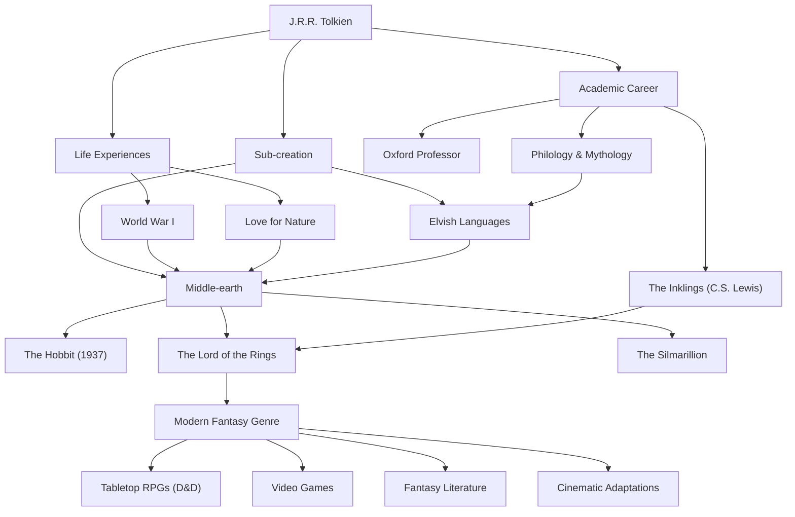

# J.R.R. Tolkien: The Trajectory of the Father of Modern Fantasy and the Creation of a Myth

## Introduction

When hearing the name John Ronald Reuel Tolkien (J.R.R. Tolkien), the first thing that comes to mind for many people is the epic world of "Middle-earth," where *The Lord of the Rings* and *The Hobbit* unfold. Elements such as elves, dwarves, wizards, and world-shaking rings became the template for countless fantasy works that followed. However, Tolkien himself was not merely a novelist; he was a prominent linguist at the University of Oxford, with a deep understanding of Old English and Norse mythology. Let us unravel his life, his philosophy, and the immeasurable impact he left on the modern world.

## Passion for Linguistics and the Shadow of World War I

Born in Bloemfontein, South Africa, in 1892, Tolkien lost his father at a young age and moved with his mother to the suburbs of Birmingham, England. The lush countryside scenery would later become the original landscape for the Shire, home of the Hobbits. Losing his mother at the age of 12, he was raised under the guardianship of a Catholic priest. Amidst this upbringing, his extraordinary talent for languages blossomed. He devoted himself not only to Greek and Latin but also to Old Norse, Gothic, and Finnish, immersing himself in the play of creating his own artificial languages.

However, his youth was torn apart by the outbreak of World War I. In 1916, Tolkien served on the gruesome front lines of the Battle of the Somme. He lost many close friends in this war and was sent back home after contracting trench fever. The death and despair he faced in the trenches of the battlefield, along with the courage and friendship shown by nameless soldiers in extreme conditions, later cast a deep shadow on the grueling journey of Frodo and Sam in *The Lord of the Rings* and his depiction of ordinary people standing up to absolute evil.

## Academia and "The Inklings"

After the war, Tolkien pursued an academic path, lecturing on Old English and medieval literature as a professor at Oxford University. In particular, his research and lectures on *Beowulf* were groundbreaking, re-evaluating the work as literature rather than merely a historical document.

During his time at Oxford, he also formed a literary circle called "The Inklings" with C.S. Lewis (author of *The Chronicles of Narnia*) and others. They gathered at a local pub to read their manuscripts in progress and engaged in lively discussions. This intellectual exchange and deep friendship became an essential driving force for Tolkien's creative activities. It is even said that without Lewis's strong encouragement, *The Lord of the Rings* might never have been published.

## The Creation of a Myth and the Philosophy of "Eucatastrophe"

At the root of Tolkien's creations was his grand ambition to create a "mythology for England." His stories were born as a stage for the people who spoke the intricate Elvish languages (such as Quenya and Sindarin) that he had constructed. As he stated, "The invention of languages is the foundation. The 'stories' were made rather to provide a world for the languages than the reverse," the world-building boasted an extraordinary degree of completeness, from language and history to genealogy and geography.

A concept that symbolizes his literary philosophy is "Eucatastrophe." This is his coined word, combining the Greek "eu" (good) and "catastrophe" (sudden turn), meaning a sudden and joyous turn of events from the depths of despair. Tolkien believed that the Christian Gospel was the greatest Eucatastrophe in history, and argued that true fantasy should also bring this supreme joy and consolation to the reader.

Furthermore, his works reflect a strong "love for nature and a warning against mechanical civilization." The clear-cutting of the forest of Isengard and its transformation into a factory of gears and smoke was an expression of his grief over the Industrial Revolution destroying the English countryside he loved.

## Modern Fantasy and Influence on Future Generations

When *The Hobbit* was published in 1937, followed by *The Lord of the Rings* between 1954 and 1955, they gradually sparked a global craze. In the 1960s United States in particular, they were read like a bible among young people in the counterculture movement.

Today, it is no exaggeration to say that Tolkien established most of the genre we call "fantasy"—a world where elves shoot bows and dwarves swing axes. From tabletop RPGs like *Dungeons & Dragons* and video games like *Dragon Quest*, to modern authors such as George R.R. Martin and J.K. Rowling, almost no one has escaped his influence. The massive success of the film adaptations directed by Peter Jackson in the 2000s is also fresh in our memories.

## Flowchart of Achievements

The span of Tolkien's life and the influence he left behind are summarized in the diagram below.

## Conclusion

J.R.R. Tolkien did not merely write fictional stories. Pouring in his deep erudition, the trauma of war, his reverence for nature, and his faith, he accomplished a sub-creation named "Middle-earth" that could be called another reality. Whenever we wish to leave our everyday lives and touch the starlight or the mystery of ancient forests, the words woven by Tolkien continue to invite new readers on a distant adventure.
