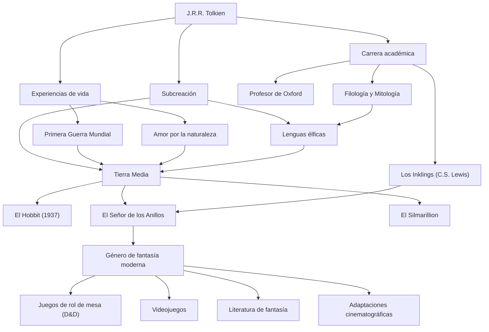

# J.R.R. Tolkien: La trayectoria del padre de la fantasía moderna y la creación de un mito

## Introducción

Al escuchar el nombre de John Ronald Reuel Tolkien (J.R.R. Tolkien), lo primero que le viene a la mente a mucha gente es el épico mundo de la "Tierra Media" (Middle-earth), donde se desarrollan *El Señor de los Anillos* y *El Hobbit*. Elementos como elfos, enanos, magos y un anillo que sacude al mundo se convirtieron en el molde de innumerables obras de fantasía posteriores. Sin embargo, Tolkien no fue simplemente un novelista; fue un destacado lingüista de la Universidad de Oxford, con una profunda comprensión del inglés antiguo y la mitología nórdica. Desentrañemos su vida, su filosofía y el impacto incalculable que dejó en el mundo moderno.

## Pasión por la lingüística y la sombra de la Primera Guerra Mundial

Nacido en Bloemfontein, Sudáfrica, en 1892, Tolkien perdió a su padre a una edad temprana y se mudó con su madre a los suburbios de Birmingham, Inglaterra. El exuberante paisaje rural se convertiría más tarde en el paisaje original de la Comarca (the Shire), el hogar de los hobbits. Al perder a su madre a los 12 años, fue criado bajo la tutela de un sacerdote católico. En medio de este entorno, floreció su extraordinario talento para los idiomas. No solo se dedicó al griego y al latín, sino también al nórdico antiguo, al gótico y al finlandés, sumergiéndose en el juego de crear sus propias lenguas artificiales.

Sin embargo, su juventud fue desgarrada por el estallido de la Primera Guerra Mundial. En 1916, Tolkien sirvió en las espantosas líneas del frente de la Batalla del Somme. Perdió a muchos amigos cercanos en esta guerra y fue enviado de regreso a casa después de contraer la fiebre de las trincheras. La muerte y la desesperación a las que se enfrentó en las trincheras del campo de batalla, junto con el coraje y la amistad mostrados por soldados anónimos en condiciones extremas, proyectaron más tarde una profunda sombra en el agotador viaje de Frodo y Sam en *El Señor de los Anillos* y en su descripción de personas comunes enfrentándose al mal absoluto.

## El mundo académico y "Los Inklings"

Después de la guerra, Tolkien siguió un camino académico, dando conferencias sobre inglés antiguo y literatura medieval como profesor en la Universidad de Oxford. En particular, su investigación y sus conferencias sobre *Beowulf* fueron innovadoras, reevaluando la obra como literatura en lugar de considerarla un mero documento histórico.

Durante su tiempo en Oxford, también formó un círculo literario llamado "Los Inklings" (The Inklings) con C.S. Lewis (autor de *Las Crónicas de Narnia*) y otros. Se reunían en un pub local para leer sus manuscritos en progreso y participaban en animados debates. Este intercambio intelectual y profunda amistad se convirtieron en una fuerza impulsora esencial para las actividades creativas de Tolkien. Incluso se dice que sin el fuerte estímulo de Lewis, *El Señor de los Anillos* podría no haberse publicado nunca.

## La creación de un mito y la filosofía de la "Eucatástrofe"

En la raíz de las creaciones de Tolkien estaba su gran ambición de crear una "mitología para Inglaterra". Sus historias nacieron como un escenario para las personas que hablaban las intrincadas lenguas élficas (como el Quenya y el Sindarin) que él había construido. Como él mismo dijo: "La invención de los idiomas es la base. Las 'historias' se hicieron más bien para proporcionar un mundo a los idiomas que a la inversa", la construcción del mundo presumía de un grado extraordinario de integridad, desde el idioma y la historia hasta la genealogía y la geografía.

Un concepto que simboliza su filosofía literaria es la "Eucatástrofe". Esta es una palabra acuñada por él, combinando el griego "eu" (bueno) y "catastrophe" (giro brusco), lo que significa un giro repentino y alegre de los acontecimientos desde las profundidades de la desesperación. Tolkien creía que el Evangelio cristiano era la mayor Eucatástrofe de la historia, y argumentó que la verdadera fantasía también debería brindar esta suprema alegría y consuelo al lector.

Además, sus obras reflejan un fuerte "amor por la naturaleza y una advertencia contra la civilización mecánica". La tala del bosque de Isengard y su transformación en una fábrica de engranajes y humo fue una expresión de su dolor por la Revolución Industrial que destruía el campo inglés que amaba.

## La fantasía moderna y su influencia en las generaciones futuras

Cuando se publicó *El Hobbit* en 1937, seguido de *El Señor de los Anillos* entre 1954 y 1955, poco a poco desataron una locura mundial. En los Estados Unidos en la década de 1960 en particular, fueron leídos como una biblia entre los jóvenes del movimiento de la contracultura.

Hoy en día, no es exagerado decir que Tolkien estableció la mayor parte del género que llamamos "fantasía", un mundo donde los elfos disparan arcos y los enanos blanden hachas. Desde juegos de rol de mesa como *Dungeons & Dragons* y videojuegos como *Dragon Quest*, hasta autores modernos como George R.R. Martin y J.K. Rowling, casi nadie ha escapado a su influencia. El éxito masivo de las adaptaciones cinematográficas dirigidas por Peter Jackson en la década del 2000 también está fresco en nuestras memorias.

## Diagrama de flujo de logros

La vida de Tolkien y la influencia que dejó se resumen en el siguiente diagrama.

## Conclusión

J.R.R. Tolkien no se limitó a escribir historias de ficción. Volcando su profunda erudición, el trauma de la guerra, su reverencia por la naturaleza y su fe, logró una subcreación llamada "Tierra Media" que podría llamarse otra realidad. Siempre que deseamos dejar atrás nuestra vida cotidiana y tocar la luz de las estrellas o el misterio de los bosques antiguos, las palabras tejidas por Tolkien continúan invitando a nuevos lectores a una aventura lejana.
