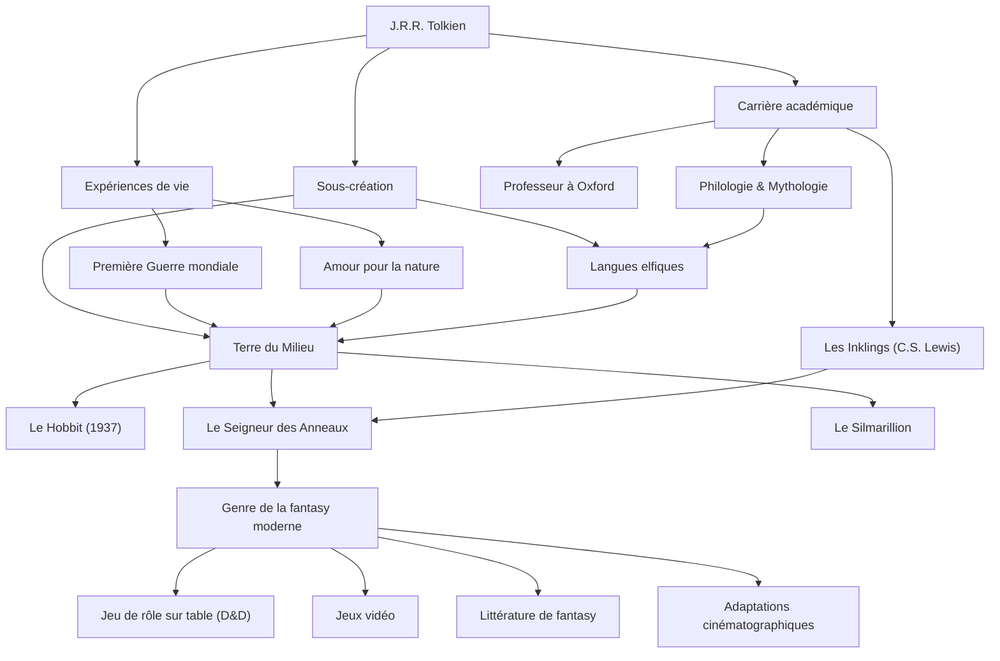

# J.R.R. Tolkien : La trajectoire du père de la fantasy moderne et la création d'un mythe

## Introduction

En entendant le nom de John Ronald Reuel Tolkien (J.R.R. Tolkien), la plupart des gens pensent d'abord au vaste monde de la « Terre du Milieu » (Middle-earth) où se déroulent *Le Seigneur des Anneaux* et *Le Hobbit*. Les elfes, les nains, les sorciers et les anneaux capables de bouleverser le monde sont devenus les archétypes d'innombrables œuvres de fantasy qui ont suivi. Cependant, Tolkien n'était pas seulement un romancier, mais un éminent linguiste de l'Université d'Oxford, ayant une profonde compréhension du vieil anglais et de la mythologie nordique. Penchons-nous sur sa vie, sa philosophie et l'influence incommensurable qu'il a laissée sur notre époque moderne.

## La passion pour la linguistique et l'ombre de la Première Guerre mondiale

Né en 1892 à Bloemfontein, en Afrique du Sud, Tolkien perd son père très jeune et s'installe avec sa mère près de Birmingham, en Angleterre. Les paysages ruraux verdoyants deviendront plus tard la source d'inspiration de la Comté (The Shire) qu'il décrira. À l'âge de 12 ans, il perd également sa mère et grandit sous la tutelle d'un prêtre catholique. Dans ce contexte, son talent exceptionnel pour les langues s'épanouit. Outre le grec et le latin, il se passionne pour le vieux norrois, le gotique et le finnois, et s'immerge dans la création de ses propres langues artificielles.

Cependant, sa jeunesse est brisée par le déclenchement de la Première Guerre mondiale. En 1916, Tolkien sert sur le front lors de la meurtrière bataille de la Somme. Il y perd beaucoup de ses amis proches et, atteint de la fièvre des tranchées, est rapatrié. La mort et le désespoir affrontés dans les tranchées, ainsi que le courage et l'amitié des soldats anonymes dont il a été témoin dans des conditions extrêmes, projetteront plus tard une ombre profonde sur la rude quête de Frodon et Sam dans *Le Seigneur des Anneaux* et sur la description de gens ordinaires luttant contre le mal absolu.

## L'académisme et les « Inklings »

Après la guerre, Tolkien poursuit une carrière académique et enseigne le vieil anglais et la littérature médiévale en tant que professeur à l'Université d'Oxford. Ses recherches et ses conférences sur *Beowulf*, en particulier, ont été révolutionnaires, permettant de réévaluer cette œuvre comme une création littéraire et non plus comme un simple document historique.

Pendant sa période à Oxford, il forme également le cercle littéraire des « Inklings » avec, entre autres, C.S. Lewis (auteur des *Chroniques de Narnia*). Ils se réunissaient dans un pub local, lisaient leurs manuscrits en cours d'écriture et engageaient de vifs débats. Cet échange intellectuel et ces amitiés profondes ont été une force motrice indispensable pour le travail créatif de Tolkien. On dit même que sans les vifs encouragements de Lewis, *Le Seigneur des Anneaux* n'aurait peut-être jamais vu le jour.

## La création de mythes et la philosophie de l'« Eucatastrophe »

À la base de la création de Tolkien se trouvait l'ambition monumentale de créer une « mythologie pour l'Angleterre ». Ses récits ont été conçus comme une scène pour les peuples parlant les langues elfiques complexes qu'il avait lui-même construites (comme le quenya et le sindarin). Comme il l'a dit lui-même : « La langue est venue en premier, et l'histoire a suivi », et cette vision du monde possède un degré de perfection presque obsessionnel, englobant les langues, l'histoire, la généalogie et la géographie.

Un concept emblématique de sa philosophie littéraire est l'« Eucatastrophe ». Il s'agit d'un néologisme qu'il a créé en combinant le grec « eu » (bon) et « catastrophe » (désastre), signifiant un revirement joyeux et soudain survenant du fond du désespoir. Tolkien considérait l'Évangile chrétien comme la plus grande eucatastrophe de l'histoire, et soutenait que la véritable fantasy devait également apporter cette joie et cette consolation suprêmes aux lecteurs.

De plus, son œuvre porte un puissant message d'« amour pour la nature et d'avertissement contre la civilisation mécanique ». La déforestation de la forêt d'Isengard et sa transformation en une usine d'engrenages et de fumée étaient l'expression de son chagrin face à la révolution industrielle, qui détruisait les paysages ruraux anglais qu'il aimait.

## La fantasy moderne et l'influence sur les générations futures

Avec la publication du *Hobbit* en 1937, puis du *Seigneur des Anneaux* entre 1954 et 1955, ces œuvres ont progressivement suscité un engouement mondial. Dans l'Amérique des années 1960 en particulier, elles étaient lues comme une bible par les jeunes de la contreculture.

Aujourd'hui, il n'est pas exagéré de dire que le genre que nous appelons « fantasy » — un monde où les elfes tirent à l'arc et les nains manient la hache — a été en grande partie établi par Tolkien. Des jeux de rôle sur table comme « Donjons et Dragons », aux jeux vidéo comme *Dragon Quest*, jusqu'aux auteurs contemporains comme George R.R. Martin et J.K. Rowling, presque personne n'échappe à son influence. Le succès retentissant des adaptations cinématographiques par le réalisateur Peter Jackson dans les années 2000 est également encore frais dans les mémoires.

## Diagramme des accomplissements

Le parcours de Tolkien et l'étendue de son influence sont résumés dans le diagramme suivant.

## Conclusion

J.R.R. Tolkien n'a pas simplement écrit des histoires fictives. Il a insufflé ses profondes connaissances académiques, ses traumatismes de guerre, son amour pour la nature et sa foi pour réaliser une « sous-création » nommée la Terre du Milieu, que l'on pourrait qualifier de réalité alternative. Lorsque nous souhaitons échapper à notre quotidien et toucher au mystère de la lumière des étoiles et des forêts anciennes, les mots tissés par Tolkien continuent aujourd'hui encore d'inviter de nouveaux lecteurs vers de lointaines aventures.
