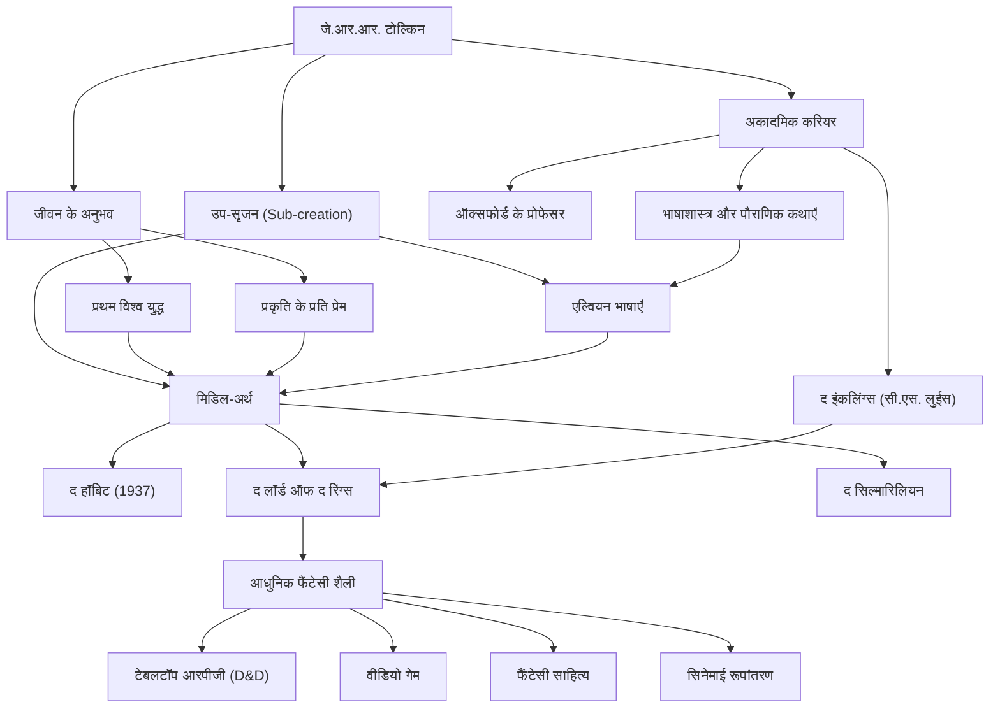

# जे.आर.आर. टोल्किन: आधुनिक फैंटेसी के पिता की यात्रा और मिथक का निर्माण

## परिचय

जॉन रोनाल्ड रूएल टोल्किन (जे.आर.आर. टोल्किन) का नाम सुनते ही, अधिकांश लोगों के मन में सबसे पहले "मिडिल-अर्थ" (Middle-earth) की वह विशाल दुनिया आती है, जहाँ "द लॉर्ड ऑफ द रिंग्स" और "द हॉबिट" की कहानियां घटित होती हैं। कल्पित बौने (एल्व्स), बौने (ड्वार्फ्स), जादूगर, और दुनिया को हिला देने वाली अंगूठी जैसी बातें बाद में आने वाली अनगिनत फैंटेसी कृतियों का आधार बन गईं। हालाँकि, टोल्किन केवल एक उपन्यासकार नहीं थे, बल्कि ऑक्सफोर्ड विश्वविद्यालय के एक प्रसिद्ध भाषाविद् थे, जिन्हें पुरानी अंग्रेजी और नॉर्स पौराणिक कथाओं की गहरी समझ थी। आइए उनके जीवन, उनके दर्शन और आधुनिक युग पर उनके द्वारा छोड़े गए अथाह प्रभाव पर नज़र डालें।

## भाषा विज्ञान के प्रति जुनून और प्रथम विश्व युद्ध की छाया

1892 में, टोल्किन का जन्म दक्षिण अफ्रीका के ब्लोमफ़ोन्टेन में हुआ था, लेकिन छोटी उम्र में ही उन्होंने अपने पिता को खो दिया और अपनी माँ के साथ इंग्लैंड में बर्मिंघम के पास रहने चले गए। वहाँ के हरे-भरे ग्रामीण दृश्य बाद में "द शायर" (The Shire) के लिए प्रेरणा बने। 12 साल की उम्र में उन्होंने अपनी माँ को भी खो दिया और एक कैथोलिक पादरी के संरक्षण में पले-बढ़े। इस पृष्ठभूमि में, भाषाओं के लिए उनकी असाधारण प्रतिभा खिल उठी। ग्रीक और लैटिन के अलावा, उन्होंने पुरानी नॉर्स, गॉथिक और फ़िनिश भाषाओं में भी गहरी रुचि दिखाई और अपनी खुद की कृत्रिम भाषाएँ बनाने में मग्न हो गए।

हालाँकि, प्रथम विश्व युद्ध के छिड़ने से उनकी जवानी में बाधा आ गई। 1916 में, टोल्किन ने सोमे (Somme) के विनाशकारी युद्ध में भाग लिया। इस युद्ध में उन्होंने अपने कई करीबी दोस्तों को खो दिया, और ट्रेंच फीवर से पीड़ित होने के बाद उन्हें स्वदेश भेज दिया गया। खाइयों में मौत और निराशा का सामना, और चरम परिस्थितियों में गुमनाम सैनिकों द्वारा दिखाया गया साहस और दोस्ती, बाद में "द लॉर्ड ऑफ द रिंग्स" में फ्रोडो और सैम की कठिन यात्रा और परम बुराई के खिलाफ लड़ने वाले आम लोगों के चित्रण में गहराई से परिलक्षित हुए।

## शिक्षा जगत और "द इंकलिंग्स"

युद्ध के बाद, टोल्किन ने अकादमिक मार्ग अपनाया और ऑक्सफोर्ड विश्वविद्यालय में प्रोफेसर के रूप में पुरानी अंग्रेजी और मध्यकालीन साहित्य पढ़ाया। विशेष रूप से "बियोवुल्फ़" (Beowulf) पर उनके शोध और व्याख्यानों ने इसे केवल एक ऐतिहासिक दस्तावेज़ के बजाय एक साहित्यिक कृति के रूप में पुनर्मूल्यांकन करने में महत्वपूर्ण भूमिका निभाई।

ऑक्सफोर्ड में अपने समय के दौरान, उन्होंने सी.एस. लुईस (जिन्होंने 'द क्रॉनिकल्स ऑफ नार्निया' लिखी) और अन्य लोगों के साथ मिलकर "द इंकलिंग्स" (The Inklings) नामक एक साहित्यिक समूह का गठन किया। वे स्थानीय पब में मिलते थे, अपनी पांडुलिपियाँ पढ़ते थे और गरमागरम बहस करते थे। यह बौद्धिक आदान-प्रदान और गहरी दोस्ती टोल्किन के रचनात्मक कार्य के लिए एक आवश्यक प्रेरक शक्ति बन गई। यह भी कहा जाता है कि अगर लुईस का मजबूत प्रोत्साहन न होता, तो "द लॉर्ड ऑफ द रिंग्स" शायद कभी दुनिया के सामने नहीं आ पाता।

## मिथक का निर्माण और "यूकैटस्ट्रोफी" का दर्शन

टोल्किन की रचनाओं के मूल में "इंग्लैंड के लिए एक पौराणिक कथा" बनाने की उनकी महान महत्वाकांक्षा थी। उनकी कहानियाँ उन लोगों के लिए एक मंच के रूप में बनाई गई थीं जो उनके द्वारा बनाई गई जटिल एल्वियन भाषाएँ (जैसे क्वान्या और सिंडारिन) बोलते थे। जैसा कि उन्होंने कहा था, "भाषा पहले आई, और कहानी बाद में," उनका विश्व निर्माण भाषाओं, इतिहास, वंशावली और भूगोल के मामले में पूर्णता के असाधारण स्तर को दर्शाता है।

उनके साहित्यिक दर्शन का एक प्रमुख सिद्धांत "यूकैटस्ट्रोफी" (Eucatastrophe) है। यह ग्रीक शब्द "eu" (अच्छा) और "catastrophe" (तबाही) को मिलाकर उनके द्वारा गढ़ा गया शब्द है, जिसका अर्थ है निराशा की गहराइयों से अचानक आने वाला खुशी का मोड़। टोल्किन मानते थे कि ईसाई सुसमाचार इतिहास का सबसे बड़ा यूकैटस्ट्रोफी था, और उनका तर्क था कि सच्ची फैंटेसी को पाठकों को भी वह परम आनंद और सांत्वना देनी चाहिए।

इसके अलावा, उनके कार्यों में "प्रकृति के प्रति प्रेम और मशीनी सभ्यता के प्रति चेतावनी" का एक मजबूत संदेश है। आइजेंगार्ड के जंगल का कटना और उसका धुएं और गियर के कारखाने में बदलना, औद्योगिक क्रांति के प्रति उनके दुख की अभिव्यक्ति थी, जो उनके प्यारे अंग्रेजी ग्रामीण इलाकों को नष्ट कर रही थी।

## आधुनिक फैंटेसी और भावी पीढ़ियों पर प्रभाव

1937 में "द हॉबिट", और 1954 से 1955 के बीच "द लॉर्ड ऑफ द रिंग्स" के प्रकाशन के साथ, इन कृतियों ने धीरे-धीरे दुनिया भर में उत्साह पैदा कर दिया। विशेष रूप से 1960 के दशक के अमेरिका में, इन्हें प्रतिसंस्कृति (counterculture) के युवाओं द्वारा एक बाइबिल की तरह पढ़ा गया।

आज, हम जिस शैली को "फैंटेसी" कहते हैं - एक ऐसी दुनिया जहाँ एल्व्स तीर चलाते हैं और ड्वार्फ्स कुल्हाड़ी चलाते हैं - यह कहना अतिशयोक्ति नहीं होगी कि इसका अधिकांश हिस्सा टोल्किन द्वारा स्थापित किया गया था। "डंगऑन एंड ड्रेगन्स" (D&D) जैसे टेबलटॉप आरपीजी और "ड्रैगन क्वेस्ट" जैसे वीडियो गेम से लेकर जॉर्ज आर.आर. मार्टिन और जे.के. राउलिंग जैसे आधुनिक लेखकों तक, लगभग हर कोई उनके प्रभाव से अछूता नहीं है। 2000 के दशक में निर्देशक पीटर जैक्सन द्वारा बनाए गए सिनेमाई रूपांतरणों की अपार सफलता भी अभी लोगों की यादों में ताज़ा है।

## उपलब्धियों का आरेख

टोल्किन का जीवन और उनके प्रभाव का दायरा नीचे दिए गए आरेख में संक्षेपित किया गया है।

## निष्कर्ष

जे.आर.आर. टोल्किन ने केवल काल्पनिक कहानियाँ नहीं लिखीं। उन्होंने अपने गहरे ज्ञान, युद्ध के आघात, प्रकृति के प्रति प्रेम और अपने विश्वास को मिलाकर "मिडिल-अर्थ" नामक एक उप-सृजन किया, जिसे एक वैकल्पिक वास्तविकता कहा जा सकता है। जब भी हम अपनी दिनचर्या से दूर जाकर तारों की रोशनी और प्राचीन जंगलों के रहस्य को महसूस करना चाहते हैं, टोल्किन के बुने हुए शब्द आज भी नए पाठकों को एक दूर की साहसिक यात्रा पर आमंत्रित करते रहते हैं।
