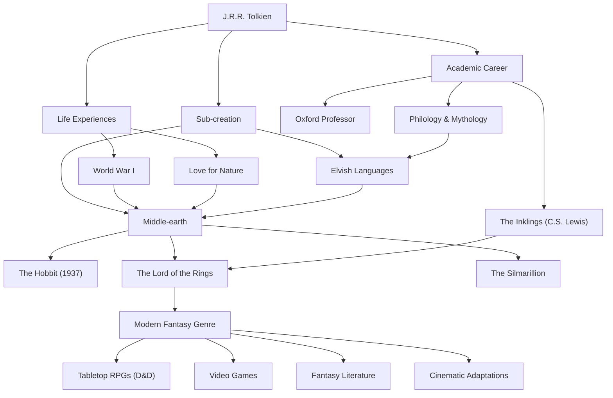

# J.R.R. Tolkien: Jejak Bapak Fantasi Modern dan Penciptaan Mitos

## Pendahuluan

Ketika mendengar nama John Ronald Reuel Tolkien (J.R.R. Tolkien), hal pertama yang terlintas di benak banyak orang adalah dunia epik "Dunia Tengah" (Middle-earth) tempat "The Lord of the Rings" dan "The Hobbit" berlangsung. Elemen-elemen seperti peri, kurcaci, penyihir, dan cincin yang mengguncang dunia menjadi cetak biru bagi karya-karya fantasi tak terhitung jumlahnya setelahnya. Namun, Tolkien sendiri bukan sekadar novelis, melainkan seorang ahli bahasa (linguis) terkemuka di Universitas Oxford, yang memiliki pemahaman mendalam tentang bahasa Inggris Kuno dan mitologi Nordik. Mari kita telusuri kehidupannya, filosofinya, serta pengaruh luar biasa yang ia wariskan ke dunia modern.

## Gairah terhadap Linguistik dan Bayang-bayang Perang Dunia I

Pada tahun 1892, Tolkien lahir di Bloemfontein, Afrika Selatan, tetapi ia kehilangan ayahnya di usia muda dan pindah bersama ibunya ke dekat Birmingham di Inggris. Pemandangan pedesaan yang hijau kelak akan menjadi inspirasi bagi Shire (The Shire) yang ia gambarkan. Kehilangan ibunya juga pada usia 12 tahun, ia dibesarkan di bawah asuhan seorang pendeta Katolik. Dalam lingkungan inilah bakat luar biasanya dalam bahasa mulai berkembang. Ia tidak hanya mempelajari bahasa Yunani dan Latin, tetapi juga bahasa Nordik Kuno, Gotik, Finlandia, dll., dan tenggelam dalam kesenangan menciptakan bahasa buatan sendiri.

Namun, masa mudanya terkoyak oleh pecahnya Perang Dunia I. Pada tahun 1916, Tolkien bertugas di garis depan Pertempuran Somme yang brutal. Dalam perang ini, ia kehilangan banyak sahabat dan menderita demam parit, yang membuatnya dipulangkan. Kematian dan keputusasaan yang ia hadapi di parit-parit medan perang, serta keberanian dan persahabatan para prajurit tanpa nama dalam kondisi ekstrem tersebut, kelak memberikan bayang-bayang yang dalam pada perjalanan berat Frodo dan Sam dalam "The Lord of the Rings" dan penggambaran orang-orang biasa yang melawan kejahatan absolut.

## Dunia Akademis dan "The Inklings"

Setelah perang, Tolkien menempuh jalur akademis, mengajar bahasa Inggris Kuno dan sastra abad pertengahan sebagai profesor di Universitas Oxford. Penelitian dan ceramahnya tentang "Beowulf", khususnya, merupakan terobosan yang mengevaluasi kembali karya yang sebelumnya hanya dianggap sebagai dokumen sejarah menjadi sebuah karya sastra.

Selama di Oxford, ia juga membentuk kelompok sastra bernama "The Inklings" bersama C.S. Lewis (penulis "The Chronicles of Narnia") dan lainnya. Mereka berkumpul di pub lokal, saling membacakan naskah yang sedang dikerjakan, dan berdiskusi secara aktif. Pertukaran intelektual dan persahabatan yang mendalam ini menjadi dorongan penting bagi aktivitas kreatif Tolkien. Bahkan dikatakan bahwa tanpa dorongan kuat dari Lewis, "The Lord of the Rings" mungkin tidak akan pernah diterbitkan.

## Penciptaan Mitos dan Filosofi "Eukatastrofi"

Di akar kreativitas Tolkien terdapat ambisi besar untuk menciptakan "sebuah mitologi bagi Inggris". Kisah-kisahnya lahir sebagai panggung bagi orang-orang yang menuturkan bahasa peri (Elvish) yang rumit (seperti Quenya dan Sindarin) yang ia bangun sendiri. Seperti yang ia katakan bahwa "bahasa datang lebih dulu, dan cerita mengikuti kemudian", dunia itu memiliki tingkat kelengkapan yang luar biasa, mencakup bahasa, sejarah, silsilah, dan geografi.

Konsep yang melambangkan filosofi sastranya adalah "Eukatastrofi" (Eucatastrophe). Ini adalah istilah yang ia ciptakan dengan menggabungkan kata Yunani "eu" (baik) dan "catastrophe" (kehancuran), yang berarti pembalikan kegembiraan yang tiba-tiba dari jurang keputusasaan. Tolkien percaya bahwa Injil Kristen adalah eukatastrofi terbesar dalam sejarah, dan berpendapat bahwa fantasi yang sebenarnya juga harus membawa sukacita dan penghiburan tertinggi ini kepada pembaca.

Selain itu, karya-karyanya memuat "kecintaan pada alam dan peringatan terhadap peradaban mesin" yang kuat. Penebangan hutan Isengard dan perubahannya menjadi pabrik penuh roda gigi dan asap merupakan ekspresi kesedihannya atas Revolusi Industri yang menghancurkan lanskap pedesaan Inggris yang ia cintai.

## Fantasi Modern dan Pengaruhnya bagi Generasi Mendatang

Ketika "The Hobbit" diterbitkan pada tahun 1937, dan "The Lord of the Rings" antara tahun 1954 dan 1955, karya-karya ini perlahan-lahan memicu antusiasme global. Khususnya di Amerika Serikat pada tahun 1960-an, buku-buku ini dibaca seperti alkitab oleh para pemuda penganut budaya tandingan (counterculture).

Saat ini, tidak berlebihan untuk mengatakan bahwa sebagian besar genre yang kita sebut "fantasi" — dunia di mana peri memanah dan kurcaci mengayunkan kapak — dibangun oleh Tolkien. Dari RPG meja seperti "Dungeons & Dragons", video game seperti "Dragon Quest", hingga penulis modern seperti George R.R. Martin dan J.K. Rowling, hampir tidak ada yang luput dari pengaruhnya. Kesuksesan besar adaptasi film yang disutradarai oleh Peter Jackson pada tahun 2000-an juga masih segar dalam ingatan kita.

## Diagram Alir Pencapaian

Kehidupan Tolkien dan jangkauan pengaruh yang ia wariskan dirangkum dalam diagram di bawah ini.

## Penutup

J.R.R. Tolkien tidak sekadar menulis cerita fiksi. Ia menuangkan pengetahuan mendalamnya, trauma perangnya, penghormatannya terhadap alam, dan imannya untuk mencapai sub-penciptaan (sub-creation) bernama "Dunia Tengah", yang bahkan bisa disebut sebagai realitas lain. Ketika kita ingin sejenak melepaskan diri dari keseharian dan menyentuh misteri cahaya bintang serta hutan-hutan kuno, kata-kata yang ditenun oleh Tolkien masih terus mengundang pembaca baru menuju petualangan yang jauh.
