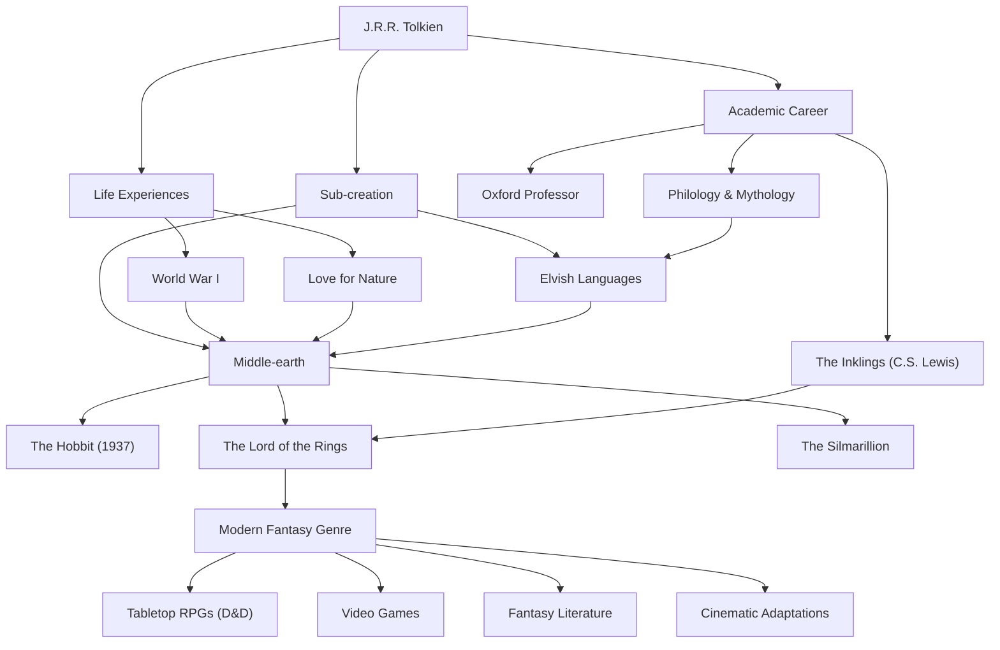

# J.R.R. 톨킨: 현대 판타지의 아버지의 발자취와 신화의 창조

## 머리말

존 로널드 루엘 톨킨(J.R.R. Tolkien)의 이름을 들으면 가장 먼저 떠오르는 것은 『반지의 제왕』이나 『호빗』이 펼쳐지는 장대한 "가운데땅(Middle-earth)"의 세계일 것입니다. 엘프와 드워프, 마법사, 그리고 세상을 뒤흔드는 반지와 같은 요소들은 그 후 수많은 판타지 작품들의 원형이 되었습니다. 하지만 톨킨 자신은 단순한 소설가가 아니라 옥스퍼드 대학의 저명한 언어학자이자 고대 영어 및 북유럽 신화에 대한 깊은 이해자였습니다. 그의 삶과 철학, 그리고 그가 현대에 남긴 헤아릴 수 없는 영향에 대해 알아보겠습니다.

## 언어학에 대한 열정과 제1차 세계 대전의 그림자

1892년 톨킨은 남아프리카공화국 블룸폰테인에서 태어났지만, 어려서 아버지를 여의고 어머니와 함께 영국 버밍엄 근교로 이주했습니다. 녹음이 우거진 전원 풍경은 훗날 그가 묘사하는 샤이어(The Shire)의 원풍경이 됩니다. 12살 때 어머니마저 여의고 가톨릭 신부의 보호 아래 자랐습니다. 이런 성장 배경 속에서 그는 언어에 대한 비범한 재능을 꽃피우게 됩니다. 그리스어와 라틴어뿐만 아니라 고대 노르드어, 고트어, 핀란드어 등에 심취하여 스스로 인공 언어를 창조하는 놀이에 몰두하게 되었습니다.

그러나 그의 청춘 시대는 제1차 세계 대전의 발발로 산산조각이 납니다. 1916년, 톨킨은 솜 전투라는 참혹한 전선에 참전했습니다. 이 전쟁에서 그는 많은 절친한 친구들을 잃고, 자신도 참호열에 걸려 본국으로 송환됩니다. 전장의 참호에서 직면한 죽음과 절망, 그리고 극한 상황 속에서 보여준 이름 없는 병사들의 용기와 우정은 훗날 『반지의 제왕』에서 프로도와 샘의 가혹한 여정이나, 절대 악에 맞서는 평범한 사람들의 묘사에 짙은 그림자를 드리우고 있습니다.

## 학계와 "잉클링스"

전후 톨킨은 학문의 길로 나아가 옥스퍼드 대학의 교수로 고대 영어와 중세 문학을 강의했습니다. 특히 그가 진행한 『베오울프』에 대한 연구와 강연은 그때까지 단순한 역사적 문헌으로 취급되던 이 작품을 문학 작품으로 재평가하게 만든 획기적인 것이었습니다.

또한 옥스퍼드 시절에는 C.S. 루이스(『나니아 연대기』의 저자) 등과 함께 "잉클링스(The Inklings)"라는 문학 서클을 결성합니다. 이들은 동네 펍에 모여 집필 중인 원고를 서로 읽어주고 활발한 토론을 벌였습니다. 이 지적인 교류와 깊은 우정은 톨킨의 창작 활동에 필수적인 원동력이 되었습니다. 루이스의 강력한 격려가 없었다면 『반지의 제왕』은 세상에 빛을 보지 못했을지도 모른다고까지 이야기됩니다.

## 신화의 창조와 "유카타스트로피" 철학

톨킨의 창작의 근본에는 "잉글랜드를 위한 신화"를 만들어내겠다는 장대한 야심이 있었습니다. 그의 이야기는 그 자신이 구축한 정교한 요정어(엘프어, 퀜야나 신다린 등)를 사용하는 사람들을 위한 무대로 탄생했습니다. "언어가 먼저였고 이야기는 그 뒤를 따랐다"는 그의 말처럼, 그 세계관은 언어, 역사, 계보, 지리에 이르기까지 비정상적일 정도의 완성도를 자랑합니다.

그의 문학적 철학을 상징하는 개념에 "유카타스트로피(Eucatastrophe)"가 있습니다. 이는 그리스어의 "eu(좋은)"와 "catastrophe(파국)"를 결합한 그의 신조어로, 절망의 구렁텅이에서 갑자기 찾아오는 기쁨의 반전을 의미합니다. 톨킨은 기독교의 복음이야말로 역사상 최대의 유카타스트로피라고 생각했으며, 진정한 판타지 또한 독자에게 이 지고의 기쁨과 위안을 가져다주는 것이어야 한다고 주장했습니다.

또한 그의 작품에는 강렬한 "자연에 대한 사랑과 기계 문명에 대한 경고"가 담겨 있습니다. 아이센가드의 숲이 벌목되고 톱니바퀴와 연기 나는 공장으로 변모하는 모습은, 그가 사랑했던 영국의 전원 풍경을 파괴해 가는 산업 혁명에 대한 비탄의 표현이었습니다.

## 현대 판타지와 후세에 미친 영향

1937년 『호빗』이, 그리고 1954년부터 1955년에 걸쳐 『반지의 제왕』이 출판되자 이것들은 서서히 세계적인 열광을 불러일으켰습니다. 특히 1960년대 미국에서는 카운터컬처(대항문화) 청년들 사이에서 바이블처럼 읽혔습니다.

오늘날 우리가 "판타지"라고 부르는 장르――엘프가 활을 쏘고 드워프가 도끼를 휘두르는 세계――의 대부분은 톨킨이 확립했다고 해도 과언이 아닙니다. "던전 앤 드래곤"과 같은 테이블토크 RPG나 『드래곤 퀘스트』 등의 비디오 게임, 그리고 조지 R.R. 마틴이나 J.K. 롤링 같은 현대 작가에 이르기까지 그의 영향을 받지 않은 자는 전무하다고 할 수 있습니다. 2000년대 피터 잭슨 감독에 의한 영화화의 대성공도 아직 우리 기억에 생생합니다.

## 공적 흐름도

톨킨의 삶과 그가 남긴 영향의 확장을 아래 그림에 정리했습니다.

## 맺음말

J.R.R. 톨킨은 단순히 가상의 이야기를 쓴 것이 아닙니다. 그는 자신의 깊은 학식, 전쟁의 트라우마, 자연에 대한 경애, 그리고 신앙을 쏟아부어 또 하나의 현실이라고도 부를 수 있는 "가운데땅"이라는 이름의 서브 크리에이션(이차 창조)을 이룩해 냈습니다. 우리가 일상을 떠나 별빛이나 오래된 숲의 신비에 닿고 싶을 때, 톨킨이 자아낸 언어는 지금도 여전히 새로운 독자들을 아득한 모험으로 계속해서 초대하고 있습니다.
