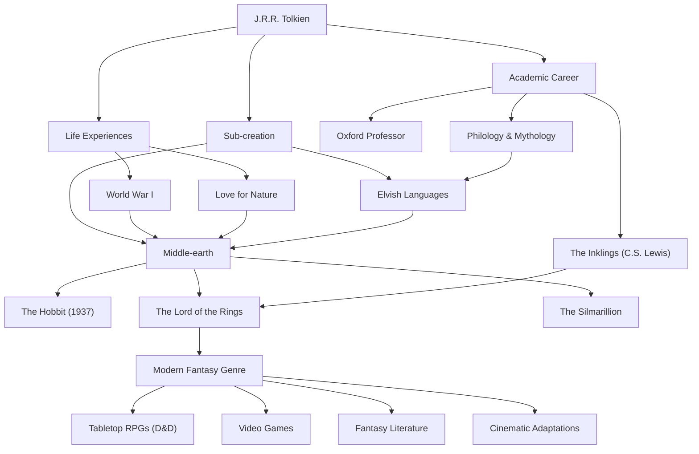

# J.R.R. トールキン：現代ファンタジーの父の軌跡と神話の創造

## はじめに

ジョン・ロナルド・ロウエル・トールキン（J.R.R. Tolkien）の名前を聞いて、多くの人が真っ先に思い浮かべるのは『指輪物語』や『ホビットの冒険』が展開される壮大な「中つ国（Middle-earth）」の世界でしょう。エルフやドワーフ、魔法使い、そして世界を揺るがす指輪といった要素は、その後の数え切れないほどのファンタジー作品の雛形となりました。しかし、トールキン自身は単なる小説家ではなく、オックスフォード大学の著名な言語学者であり、古英語や北欧神話の深い理解者でした。彼の人生と哲学、そして彼が現代に遺した計り知れない影響について紐解いていきましょう。

## 言語学への情熱と第一次世界大戦の影

1892年、トールキンは南アフリカのブルームフォンテーンで生まれましたが、幼くして父を亡くし、母と共にイギリスのバーミンガム近郊へと移住しました。緑豊かな田園風景は、後に彼が描くホビット庄（シャイア）の原風景となります。さらに12歳の時に母をも喪い、カトリックの神父の庇護下で育ちました。こうした生い立ちの中で、彼は言語への非凡な才能を開花させていきます。ギリシャ語やラテン語にとどまらず、古ノルド語、ゴート語、フィンランド語などに傾倒し、自ら人工言語を創り出す遊びに没頭するようになりました。

しかし、彼の青春時代は第一次世界大戦の勃発によって引き裂かれます。1916年、トールキンはソンムの戦いという凄惨な戦線に従軍しました。この戦争で彼は多くの親友を失い、自身も塹壕熱に罹患して本国へ送還されます。戦場の塹壕で直面した死と絶望、そして極限状態の中で見せた名もなき兵士たちの勇気と友情は、のちに『指輪物語』におけるフロドとサムの過酷な旅路や、絶対悪に立ち向かう普通の人々の描写に深い影を落としています。

## アカデミズムと「インクリングズ」

戦後、トールキンは学問の道へ進み、オックスフォード大学の教授として古英語や中世文学を講じました。特に彼が行った『ベーオウルフ』の研究と講演は、それまで単なる歴史的文献として扱われていた同作を文学作品として再評価させる画期的なものでした。

また、オックスフォード時代には、C.S.ルイス（『ナルニア国物語』の著者）らと共に「インクリングズ（The Inklings）」という文学サークルを結成します。彼らは地元のパブに集まり、執筆中の原稿を読み合い、活発な議論を交わしました。この知的な交流と深い友情は、トールキンの創作活動にとって不可欠な推進力となりました。ルイスの強い励ましがなければ、『指輪物語』は世に出ることはなかったかもしれないとさえ言われています。

## 神話の創造と「ユーカタストロフ」の哲学

トールキンの創作の根本には、「イングランドのための神話」を創り上げたいという壮大な野心がありました。彼の物語は、彼自身が構築した精緻なエルフ語（クウェンヤやシンダール語など）を話す人々のための舞台として生み出されました。「言語が先であり、物語は後からついてきた」と彼が語る通り、その世界観は言語、歴史、系譜、地理に至るまで異常なまでの完成度を誇っています。

彼の文学的哲学を象徴する概念に「ユーカタストロフ（Eucatastrophe）」があります。これはギリシャ語の「eu（良い）」と「catastrophe（破局）」を組み合わせた彼の造語で、絶望の淵から突然もたらされる喜びの転回を意味します。トールキンは、キリスト教の福音こそが歴史上最大のユーカタストロフであると考え、真のファンタジーもまた、読者にこの至高の喜びと慰めをもたらすものであるべきだと主張しました。

また、彼の作品には強烈な「自然への愛と機械文明への警鐘」が込められています。アイゼンガルドの森が伐採され、歯車と煙の工場に変貌する様は、彼が愛したイギリスの田園風景を破壊していく産業革命への悲嘆の表れでした。

## 現代ファンタジーと後世への影響

1937年に『ホビットの冒険』が、そして1954年から1955年にかけて『指輪物語』が出版されると、これらは徐々に世界的な熱狂を巻き起こしました。特に1960年代のアメリカでは、カウンターカルチャーの若者たちの間でバイブルのように読まれました。

今日、私たちが「ファンタジー」と呼ぶジャンル――エルフが弓を射り、ドワーフが斧を振るう世界――の大部分は、トールキンが確立したと言っても過言ではありません。「ダンジョンズ＆ドラゴンズ」のようなテーブルトークRPGや、『ドラゴンクエスト』などのビデオゲーム、そしてジョージ・R・R・マーティンやJ.K.ローリングら現代の作家に至るまで、彼の影響を免れている者は皆無に等しいのです。2000年代のピーター・ジャクソン監督による映画化の大成功も記憶に新しいところです。

## 功績のフロー図

トールキンの人生と彼が遺した影響の広がりを、以下の図にまとめました。

## 結び

J.R.R. トールキンは、単なる架空の物語を書いたのではありません。彼は自身の深い学識、戦争のトラウマ、自然への敬愛、そして信仰を注ぎ込み、もう一つの現実とも呼べる「中つ国」という名のサブ・クリエイション（二次創造）を成し遂げました。私たちが日常を離れ、星の光や古の森の神秘に触れたいと願うとき、トールキンの紡いだ言葉は今もなお、新たな読者をはるかなる冒険へと誘い続けています。
