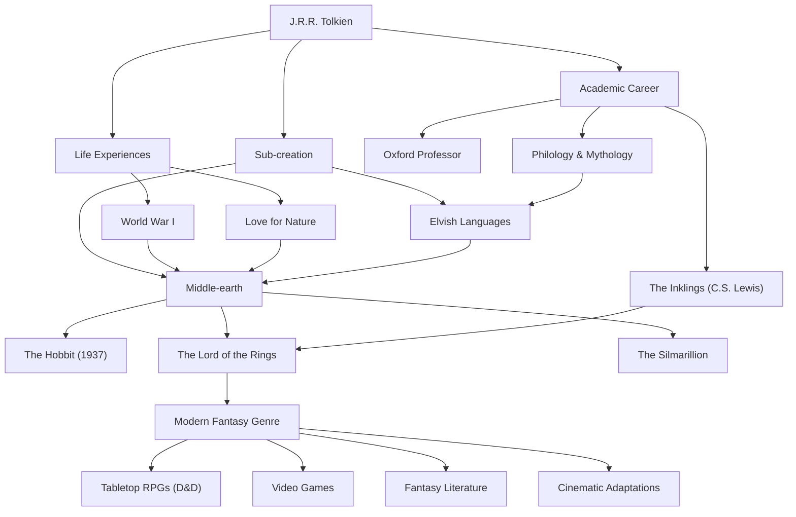

# J.R.R. Tolkien: A Trajetória do Pai da Fantasia Moderna e a Criação de Mitos

## Introdução

Ao ouvir o nome de John Ronald Reuel Tolkien (J.R.R. Tolkien), a primeira coisa que vem à mente da maioria das pessoas é o épico mundo da "Terra-média" (Middle-earth), onde se desenrolam "O Senhor dos Anéis" e "O Hobbit". Elementos como elfos, anões, magos e anéis que abalam o mundo tornaram-se o modelo para incontáveis obras de fantasia desde então. No entanto, o próprio Tolkien não era apenas um romancista, mas também um renomado linguista da Universidade de Oxford, com um profundo conhecimento do inglês antigo e da mitologia nórdica. Vamos explorar sua vida, sua filosofia e o imensurável legado que ele deixou para o mundo moderno.

## A Paixão pela Linguística e a Sombra da Primeira Guerra Mundial

Em 1892, Tolkien nasceu em Bloemfontein, África do Sul, mas perdeu seu pai ainda jovem e mudou-se com sua mãe para perto de Birmingham, na Inglaterra. A paisagem rural verdejante mais tarde se tornaria a inspiração para o Condado (The Shire) que ele descreveu. Ao perder também sua mãe aos 12 anos, ele foi criado sob a tutela de um padre católico. Durante essa criação, floresceu seu talento extraordinário para línguas. Além do grego e latim, ele se dedicou ao nórdico antigo, gótico, finlandês, etc., mergulhando na brincadeira de criar suas próprias línguas artificiais.

Contudo, sua juventude foi interrompida pela eclosão da Primeira Guerra Mundial. Em 1916, Tolkien serviu na brutal Batalha do Somme. Nesta guerra, ele perdeu muitos amigos próximos e contraiu febre das trincheiras, sendo enviado de volta para casa. A morte e o desespero enfrentados nas trincheiras do campo de batalha, junto com a coragem e a amizade dos soldados anônimos naquelas condições extremas, lançaram uma sombra profunda em suas obras posteriores, como a árdua jornada de Frodo e Sam em "O Senhor dos Anéis" e a representação de pessoas comuns enfrentando o mal absoluto.

## Academia e "Os Inklings"

Após a guerra, Tolkien seguiu a carreira acadêmica, ensinando inglês antigo e literatura medieval como professor na Universidade de Oxford. Suas pesquisas e palestras sobre "Beowulf", em particular, foram inovadoras, reavaliando a obra como literatura e não apenas como um documento histórico.

Durante seu tempo em Oxford, ele também formou um círculo literário chamado "Os Inklings" (The Inklings) com C.S. Lewis (autor de "As Crônicas de Nárnia") e outros. Eles se reuniam em um pub local para ler seus manuscritos em andamento e debater ativamente. Esse intercâmbio intelectual e amizade profunda foram motores essenciais para o trabalho criativo de Tolkien. Chega-se a dizer que, sem o forte encorajamento de Lewis, "O Senhor dos Anéis" poderia nunca ter sido publicado.

## A Criação de Mitos e a Filosofia da "Eucatástrofe"

No cerne da criatividade de Tolkien havia uma ambição grandiosa de criar "uma mitologia para a Inglaterra". Suas histórias nasceram como um palco para os povos que falavam os elaborados idiomas élficos (como Quenya e Sindarin) que ele próprio construiu. Como ele mesmo disse, "a língua veio primeiro e a história se seguiu", seu mundo ostenta um nível extraordinário de completude, abrangendo linguagem, história, genealogia e geografia.

Um conceito que simboliza sua filosofia literária é a "Eucatástrofe" (Eucatastrophe). Este é um termo que ele cunhou combinando o grego "eu" (bom) e "catastrophe" (destruição/desastre), significando uma reviravolta repentina e alegre das profundezas do desespero. Tolkien acreditava que o evangelho cristão era a maior eucatástrofe da história, e argumentava que a verdadeira fantasia também deveria trazer essa suprema alegria e consolo ao leitor.

Além disso, suas obras carregam um forte "amor pela natureza e um aviso contra a civilização das máquinas". A derrubada da floresta de Isengard e sua transformação em uma fábrica de fumaça e engrenagens eram a expressão de sua tristeza pela Revolução Industrial destruindo a paisagem rural inglesa que ele amava.

## Fantasia Moderna e Legado

Quando "O Hobbit" foi publicado em 1937, e "O Senhor dos Anéis" entre 1954 e 1955, eles gradualmente despertaram um entusiasmo global. Nos Estados Unidos, durante a década de 1960, eles foram lidos como bíblias pelos jovens da contracultura.

Hoje, não é exagero dizer que o gênero que chamamos de "fantasia" - um mundo onde elfos atiram flechas e anões empunham machados - foi em grande parte estabelecido por Tolkien. De RPGs de mesa como "Dungeons & Dragons", videogames como "Dragon Quest", a autores modernos como George R.R. Martin e J.K. Rowling, quase ninguém está imune à sua influência. O grande sucesso das adaptações cinematográficas dirigidas por Peter Jackson nos anos 2000 também está fresco em nossa memória.

## Diagrama de Influência e Realizações

A vida de Tolkien e a extensão de seu legado estão resumidas no diagrama abaixo.

## Conclusão

J.R.R. Tolkien não escreveu apenas histórias fictícias. Ele derramou seu profundo conhecimento, o trauma da guerra, a reverência pela natureza e sua fé para realizar uma sub-criação chamada "Terra-média", que poderia até ser chamada de uma outra realidade. Quando desejamos escapar do cotidiano e tocar o mistério da luz das estrelas e das florestas antigas, as palavras tecidas por Tolkien continuam a convidar novos leitores a aventuras distantes, hoje e sempre.
