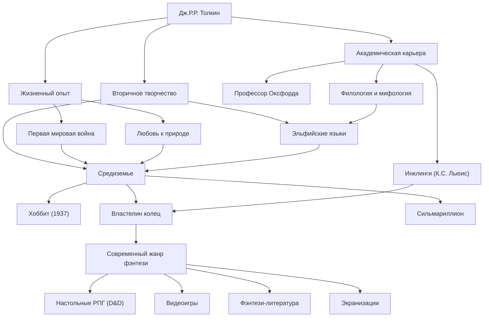

# Дж.Р.Р. Толкин: Путь отца современного фэнтези и создание мифа

## Введение

При упоминании имени Джона Рональда Руэла Толкина (J.R.R. Tolkien) большинству людей в первую очередь приходит на ум обширный мир «Средиземья» (Middle-earth), где разворачиваются события «Властелина колец» и «Хоббита». Эльфы, гномы, волшебники и кольцо, способное потрясти мир, стали прообразами бесчисленных произведений фэнтези, последовавших за ними. Однако Толкин был не просто писателем, но и выдающимся лингвистом Оксфордского университета, глубоко понимавшим древнеанглийский язык и скандинавскую мифологию. Давайте рассмотрим его жизнь, философию и неизмеримое влияние, которое он оказал на современность.

## Страсть к лингвистике и тень Первой мировой войны

Толкин родился в 1892 году в Блумфонтейне, Южная Африка. Рано потеряв отца, он вместе с матерью переехал в Англию, в окрестности Бирмингема. Зеленые сельские пейзажи позже стали прототипом Шира (The Shire). В возрасте 12 лет он потерял и мать, после чего воспитывался под опекой католического священника. В таких условиях раскрылся его выдающийся талант к языкам. Помимо греческого и латыни, он увлекся древнескандинавским, готским и финским языками и погрузился в создание собственных искусственных языков.

Однако его юность была прервана началом Первой мировой войны. В 1916 году Толкин служил на фронте во время кровопролитной битвы на Сомме. На этой войне он потерял многих близких друзей и, заболев окопной лихорадкой, был отправлен на родину. Смерть и отчаяние, с которыми он столкнулся в окопах, а также мужество и дружба безымянных солдат в экстремальных условиях позже наложили глубокий отпечаток на описание тяжелого пути Фродо и Сэма во «Властелине колец» и на образ простых людей, противостоящих абсолютному злу.

## Академическая среда и «Инклинги»

После войны Толкин пошел по академическому пути, преподавая древнеанглийский язык и средневековую литературу в качестве профессора Оксфордского университета. В частности, его исследования и лекции, посвященные «Беовульфу», стали новаторскими: они позволили переоценить это произведение как литературное творение, а не просто как исторический документ.

В оксфордские годы он также основал литературный кружок «Инклинги» (The Inklings) вместе с К.С. Льюисом (автором «Хроник Нарнии») и другими. Они собирались в местном пабе, читали друг другу свои рукописи и вели горячие дискуссии. Этот интеллектуальный обмен и глубокая дружба стали незаменимой движущей силой для творчества Толкина. Говорят даже, что без сильной поддержки Льюиса «Властелин колец», возможно, никогда бы не увидел свет.

## Создание мифа и философия «Эвкатастрофы»

В основе творчества Толкина лежали грандиозные амбиции по создания «мифологии для Англии». Его истории создавались как сцена для народов, говорящих на разработанных им сложных эльфийских языках (таких как квенья и синдарин). Как он сам говорил: «Сначала были языки, а истории последовали за ними», и этот мир отличается невероятной степенью проработки, охватывающей языки, историю, генеалогию и географию.

Символом его литературной философии является понятие «Эвкатастрофа» (Eucatastrophe). Это неологизм, созданный им из сочетания греческого «eu» (хороший) и «catastrophe» (катастрофа), означающий внезапный, радостный поворот, приходящий из глубин отчаяния. Толкин считал христианское Евангелие величайшей эвкатастрофой в истории и утверждал, что истинное фэнтези также должно приносить читателям эту высшую радость и утешение.

Кроме того, в его произведениях заложены сильные мотивы «любви к природе и предупреждения против машинной цивилизации». Вырубка леса Изенгарда и его превращение в фабрику из шестеренок и дыма отражали его скорбь по поводу промышленной революции, уничтожавшей любимые им английские сельские пейзажи.

## Современное фэнтези и влияние на потомков

С публикацией «Хоббита» в 1937 году и «Властелина колец» в 1954-1955 годах эти произведения постепенно вызвали мировой энтузиазм. В Америке 1960-х годов они даже стали своего рода библией для молодежи контркультуры.

Сегодня без преувеличения можно сказать, что жанр, который мы называем «фэнтези» — мир, где эльфы стреляют из лука, а гномы орудуют топорами — был в значительной степени основан Толкином. От настольных ролевых игр, таких как Dungeons & Dragons, и видеоигр вроде Dragon Quest до современных писателей, таких как Джордж Р.Р. Мартин и Дж.К. Роулинг — почти никто не избежал его влияния. Огромный успех экранизаций режиссера Питера Джексона в 2000-х годах также свеж в памяти.

## Схема достижений

Жизнь Толкина и масштабы его влияния обобщены на следующей схеме.

## Заключение

Дж.Р.Р. Толкин не просто писал вымышленные истории. Он вложил свои глубокие академические знания, военные травмы, любовь к природе и веру, чтобы создать «Средиземье» — суб-творение, которое можно назвать альтернативной реальностью. Когда мы хотим убежать от повседневности и прикоснуться к тайнам звездного света и древних лесов, слова, сотканные Толкином, продолжают звать новых читателей в далекие приключения.
