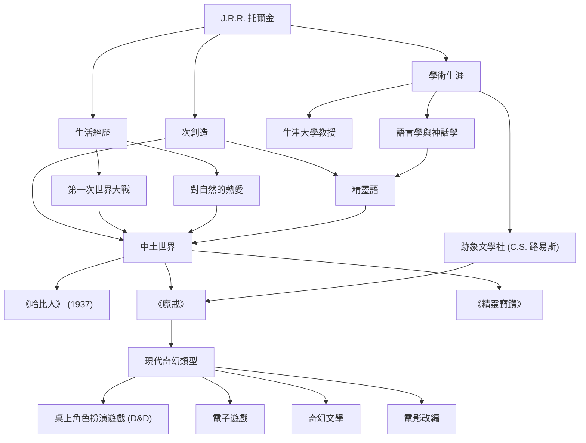

# J.R.R. 托爾金：現代奇幻之父的足跡與神話的創造

## 簡介

一聽到約翰·羅納德·魯埃爾·托爾金（J.R.R. 托爾金）的名字，許多人腦海中首先浮現的，便是《魔戒》與《哈比人》故事展開的那個宏大的「中土世界」（Middle-earth）。精靈、矮人、巫師，以及那枚震撼世界的戒指等元素，成為了後來無數奇幻作品的雛形。然而，托爾金本人不僅僅是一位小說家，他還是牛津大學著名的語言學家，對古英語和北歐神話有著深刻的理解。讓我們一同探尋他的人生、哲學，以及他給現代留下的不可估量的影響。

## 對語言學的熱情與第一次世界大戰的陰影

1892年，托爾金出生在南非的布隆泉。他在年幼時喪父，隨後與母親一起移居到英國伯明罕郊區。那裡綠意盎然的田園風光，成為了後來他筆下哈比人故鄉（夏爾）的原型。12歲時，他再次失去了母親，此後在一位天主教神父的庇護下長大。在這樣的成長環境中，他展現出了非凡的語言天賦。他不僅沉迷於希臘語和拉丁語，還傾心於古諾斯語、哥德語和芬蘭語等，甚至熱衷於創造屬於自己的「人工語言」。

然而，他的青春歲月被第一次世界大戰的爆發撕裂了。1916年，托爾金奔赴索姆河戰役那慘烈的戰線。在這場戰爭中，他失去了許多摯友，自己也因感染戰壕熱而被送回國。在戰場戰壕中直面的死亡與絕望，以及無名士兵在極端狀態下展現出的勇氣與友誼，都深深地影響了後來《魔戒》中佛羅多與山姆那段艱辛的旅程，以及對普通人奮起反抗絕對邪惡的描寫。

## 學術界與「跡象文學社」

戰後，托爾金踏上了學術之路，在牛津大學擔任教授，講授古英語和中世紀文學。特別值得一提的是他對《貝奧武夫》的研究與演講，打破了以往僅僅將其視為歷史文獻的觀點，成功地讓它作為一部文學作品重新獲得評價，具有劃時代的意義。

此外，在牛津大學期間，他與C.S. 路易斯（《納尼亞傳奇》的作者）等人共同成立了一個名為「跡象文學社」（The Inklings）的文學社團。他們聚集在當地的酒吧裡，互相閱讀正在創作的手稿，並進行熱烈的討論。這種思想上的交流與深厚的友誼，成為了托爾金創作活動不可或缺的動力。甚至有人說，如果沒有路易斯的強烈鼓勵，《魔戒》可能永遠不會問世。

## 神話的創造與「尤卡塔斯特羅夫」的哲學

托爾金創作的根本，在於他懷抱著一個宏大的野心——為英格蘭創造一個神話。他的故事，原本是為了那些說著他自己構建的精緻精靈語（如昆雅語和辛達林語）的人們而誕生的舞台。正如他所說：「語言在先，故事在後」，他構建的世界觀在語言、歷史、譜系乃至地理方面都達到了令人驚嘆的完整度。

象徵其文學哲學的一個概念是「尤卡塔斯特羅夫」（Eucatastrophe，大團圓結局/善的劇變）。這是他將希臘語「eu（好）」與「catastrophe（災難/劇變）」結合而成的自創詞，意指在絕望的深渊中突然迎來的喜悅轉折。托爾金認為，基督教的福音正是歷史上最大的「尤卡塔斯特羅夫」，並主張真正的奇幻文學也應當給讀者帶來這種至高的喜悅與慰藉。

此外，他的作品中蘊含著強烈的「對自然的熱愛與對機械文明的警示」。艾辛格的森林被砍伐，淪為充滿齒輪與濃煙的工廠，這一景象正是他對於工業革命破壞了他所熱愛的英國田園風光而感到的悲嘆。

## 現代奇幻與對後世的影響

1937年《哈比人》出版，隨後在1954年至1955年間《魔戒》相繼問世，它們逐漸在全世界掀起了狂熱。特別是在20世紀60年代的美國，它們被反主流文化運動中的年輕人們當作聖經般閱讀。

今天，我們稱之為「奇幻」的類型——精靈射箭、矮人揮斧的世界——說其大部分是由托爾金奠定的也毫不為過。從《龍與地下城》這樣的桌上角色扮演遊戲，到《勇者鬥惡龍》等電子遊戲，再到喬治·R·R·馬丁、J.K. 羅琳等當代作家，幾乎沒有人能免受他的影響。21世紀初由彼得·傑克森執導的電影改編所取得的巨大成功，也依然令人記憶猶新。

## 成就流程圖

下面的圖表總結了托爾金的一生及其留下的深遠影響。

## 結語

J.R.R. 托爾金並非僅僅寫了一個虛構的故事。他傾注了自己淵博的學識、戰爭的創傷、對自然的敬畏以及個人的信仰，完成了名為「中土世界」的次創造（Sub-creation），這甚至可以被稱為另一個現實。當我們渴望逃離日常生活，觸摸星光或古老森林的神祕時，托爾金編織的文字，至今仍在邀請著新的讀者踏上那遙遠的冒險之旅。
