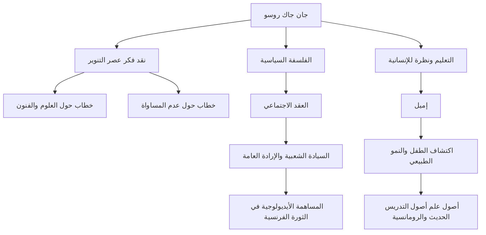

في أوروبا القرن الثامن عشر، عندما ازدهر فكر عصر التنوير الذي اعتبر العقل هو الأسمى، كان هناك رجل تحدى هذا الاتجاه وصرخ: "العودة إلى الطبيعة." كان هذا الرجل جان جاك روسو (1712 - 1778). كان لأفكاره تأثير حاسم على الثورة الفرنسية، وعلاوة على ذلك، أرسى الأساس لعلم أصول التدريس الحديث والأدب الرومانسي. في هذا المقال، نكشف عن حياة روسو، الذي استمر في البحث عن الحقيقة وسط الوحدة والتشرد، وفلسفته العميقة التي لا تزال يتردد صداها حتى اليوم.

## طفولة بائسة وبداية التشرد

ولد روسو عام 1712 في جمهورية جنيف بسويسرا، كابن لصانع ساعات. فقد والدته بعد أيام قليلة من ولادته، وعندما كان في العاشرة من عمره، فر والده بعد مشاجرة عنيفة، تاركًا روسو ليقضي طفولة بائسة في رعاية أقاربه. تم إرساله كمتدرب إلى نقاش، لكنه لم يتمكن من تحمل المعاملة القاسية، ففر من مسقط رأسه جنيف وهو في السادسة عشرة من عمره.

في وقت لاحق، التقى بمدام دي وارينز، التي آوته في منطقة سافوي. أصبحت بمثابة أم لروسو، وفي وقت لاحق، عشيقته. خلال هذه الفترة، استوعب بشراهة الموسيقى والفلسفة والأدب من خلال الدراسة الذاتية، وصقل فكره.

## الاستيقاظ كمفكر

تغير مصير روسو بشكل كبير في عام 1749، عندما كان يبلغ من العمر 37 عامًا. في طريقه لزيارة صديقه دينيس ديدرو، الذي كان مسجونًا في قلعة فينسين، رأى موضوع مسابقة المقال لأكاديمية ديجون: "هل ساهم ترميم العلوم والفنون في تنقية الأخلاق؟" وأصيب بإلهام شديد. لقد طور حجة متناقضة قلبت الفطرة السليمة في ذلك الوقت، مدعيا أن "تطور العلوم والفنون أدى إلى إفساد الأخلاق البشرية"، وفاز بالجائزة ببراعة. مع نشر هذا "الخطاب حول العلوم والفنون"، أصبح روسو فجأة محبوب العالم الفكري الأوروبي.

## الفلسفة الأساسية: الصراع بين "الطبيعة" و "المجتمع"

يكمن جوهر فكر روسو في فكرة أن "الإنسان وُلد في الأصل كائنًا صالحًا وحرًا، لكن عدم المساواة والشر ظهرا بسبب ظهور المؤسسات الاجتماعية والملكية الخاصة". تم تفصيل هذه الفكرة في كتابه "خطاب حول أصل وأسس عدم المساواة بين البشر" (1755).

في عام 1762، نُشرت تحفتيه "العقد الاجتماعي" و "إميل، أو عن التربية". في "العقد الاجتماعي"، جادل من أجل شرعية الدولة على أساس "الإرادة العامة" (الإرادة العالمية للشعب الهادفة إلى المصلحة العامة) وأسس مفهوم السيادة الشعبية. من ناحية أخرى، بشر في "إميل" بأهمية التعليم الذي يحمي الأطفال من العادات السيئة للمجتمع ويرافق التطور الطبيعي للإنسان، مما أدى إلى تسميته "مكتشف الطفل".

## الاضطهاد والعزلة وإرث هائل للأجيال القادمة

ومع ذلك، أثارت هذه الأعمال التاريخية رد فعل عنيفًا من المؤسسة في ذلك الوقت. على وجه الخصوص، نُظر إلى حججه الدينية في "إميل" على أنها خطيرة، وحُكم على كتبه بالحرق مع إصدار أوامر اعتقال في باريس وفي مسقط رأسه جنيف. هربًا من الاضطهاد، أُجبر روسو على النفي عبر سويسرا وفي النهاية إلى إنجلترا. في إنجلترا، حصل على حماية الفيلسوف ديفيد هيوم، لكن جنون العظمة الشديد أدى إلى قطيعة معه أيضًا.

في سنواته الأخيرة، غرق روسو في الدفاع عن النفس والاستبطان في عزلة، وكتب "الاعترافات"، وهو نصب تذكاري للأدب في السيرة الذاتية الحديثة، و "رؤى الماشي المنعزل". في عام 1778، أنهى حياته الصاخبة في إرمينونفيل، إحدى ضواحي باريس.

كان جان جاك روسو أيضًا شخصية مليئة بالتناقضات، حيث ناقش التعليم المثالي بينما كان يرسل أطفاله إلى دار للأيتام. ومع ذلك، فإن الشغف الذي من خلاله رأى نفاق المجتمع وتساءل بلا هوادة عن "الحالة المثالية للبشرية" أصبح العمود الفقري الروحي للثورة الفرنسية، التي اندلعت بعد عشر سنوات من وفاته. كلما تحدثنا عن "الحرية" و "المساواة" و "الكرامة الفردية" كأمر مسلم به، تستمر الأسئلة التي تركها روسو في الصدى هناك.
