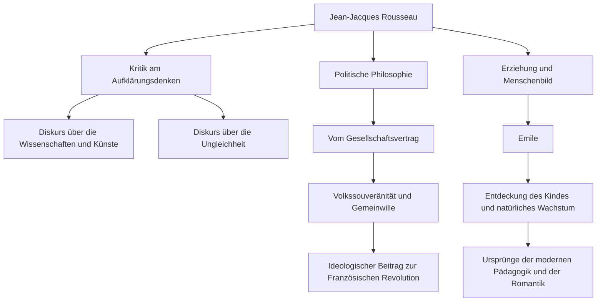

Im Europa des 18. Jahrhunderts, als das Aufklärungsdenken, das die Vernunft als das Höchste ansah, blühte, gab es einen Mann, der sich diesem Trend widersetzte und rief: "Zurück zur Natur". Dieser Mann war Jean-Jacques Rousseau (1712 - 1778). Seine Ideen hatten einen entscheidenden Einfluss auf die Französische Revolution und legten zudem den Grundstein für die moderne Pädagogik und die romantische Literatur. In diesem Artikel entwirren wir das Leben Rousseaus, der inmitten von Einsamkeit und Wanderschaft unermüdlich nach der Wahrheit suchte, und seine tiefgründige Philosophie, die bis heute nachhallt.

## Eine unglückliche Kindheit und der Beginn der Wanderschaft

Rousseau wurde 1712 in der Republik Genf, Schweiz, als Sohn eines Uhrmachers geboren. Er verlor seine Mutter nur wenige Tage nach seiner Geburt, und als er 10 Jahre alt war, floh sein Vater nach einer gewalttätigen Auseinandersetzung, so dass Rousseau eine unglückliche Kindheit in der Obhut von Verwandten verbrachte. Er wurde als Lehrling zu einem Graveur geschickt, aber da er die harte Behandlung nicht ertragen konnte, floh er im Alter von 16 Jahren aus seiner Heimatstadt Genf.

Später lernte er Madame de Warens kennen, die ihm in der Region Savoyen Schutz gewährte. Sie wurde für Rousseau zu einer Mutterfigur und später zu seiner Geliebten. Während dieser Zeit saugte er im Selbststudium gierig Musik, Philosophie und Literatur auf und verfeinerte seinen Intellekt.

## Erwachen als Denker

Rousseaus Schicksal änderte sich dramatisch im Jahr 1749, als er 37 Jahre alt war. Auf dem Weg zu seinem Freund Denis Diderot, der im Schloss Vincennes inhaftiert war, sah er das Thema des Aufsatzwettbewerbs der Akademie von Dijon: "Hat die Wiederherstellung der Wissenschaften und Künste zur Läuterung der Sitten beigetragen?" und wurde von einer heftigen Inspiration getroffen. Er entwickelte ein paradoxes Argument, das den damaligen gesunden Menschenverstand auf den Kopf stellte, und behauptete, dass "die Entwicklung der Wissenschaften und Künste die menschliche Moral eher verdorben hat", und gewann den Preis auf brillante Weise. Mit der Veröffentlichung dieses "Diskurses über die Wissenschaften und die Künste" wurde Rousseau schlagartig zum Liebling der europäischen intellektuellen Welt.

## Die Kernphilosophie: Der Konflikt zwischen "Natur" und "Gesellschaft"

Der Kern von Rousseaus Denken liegt in der Idee, dass "der Mensch ursprünglich als gutes und freies Wesen geboren wurde, aber Ungleichheit und das Böse durch das Aufkommen sozialer Institutionen und des Privateigentums entstanden sind". Diese Idee wurde in seinem "Diskurs über den Ursprung und die Grundlagen der Ungleichheit unter den Menschen" (1755) ausführlich dargelegt.

Und 1762 wurden seine Meisterwerke "Vom Gesellschaftsvertrag" und "Emile oder Über die Erziehung" veröffentlicht. In "Vom Gesellschaftsvertrag" argumentierte er für die Legitimität des Staates auf der Grundlage des "Gemeinwillens" (des auf das öffentliche Interesse gerichteten universellen Willens des Volkes) und begründete das Konzept der Volkssouveränität. Andererseits predigte er in "Emile" die Bedeutung einer Erziehung, die Kinder vor den schlechten Sitten der Gesellschaft schützt und die natürliche Entwicklung des Menschen begleitet, was ihm den Ruf als "Entdecker des Kindes" einbrachte.

## Verfolgung, Isolation und ein gewaltiges Erbe für die Nachwelt

Diese bahnbrechenden Werke provozierten jedoch heftigen Widerstand des damaligen Establishments. Insbesondere seine religiösen Argumente in "Emile" wurden als gefährlich angesehen, und seine Bücher wurden zur Verbrennung verurteilt und in Paris und seiner Heimatstadt Genf Haftbefehle erlassen. Um der Verfolgung zu entgehen, war Rousseau gezwungen, durch die Schweiz und schließlich nach England ins Exil zu gehen. In England erhielt er den Schutz des Philosophen David Hume, aber extreme Paranoia führte auch mit ihm zu einem Bruch.

In seinen späteren Jahren versank Rousseau in Isolation in Selbstverteidigung und Selbstbeobachtung und schrieb "Die Bekenntnisse", ein Denkmal der modernen autobiografischen Literatur, und "Die Träumereien des einsamen Spaziergängers". 1778 beendete er sein turbulentes Leben in Ermenonville, einem Vorort von Paris.

Jean-Jacques Rousseau war auch eine Figur voller Widersprüche, die über ideale Erziehung diskutierte, während er seine eigenen Kinder in ein Waisenhaus schickte. Doch die Leidenschaft, mit der er die Heuchelei der Gesellschaft durchschaute und unerbittlich den "idealen Zustand der Menschheit" in Frage stellte, wurde zum spirituellen Rückgrat der Französischen Revolution, die zehn Jahre nach seinem Tod ausbrach. Wann immer wir von "Freiheit", "Gleichheit" und "individueller Würde" als Selbstverständlichkeit sprechen, hallen die von Rousseau hinterlassenen Fragen dort weiterhin nach.
