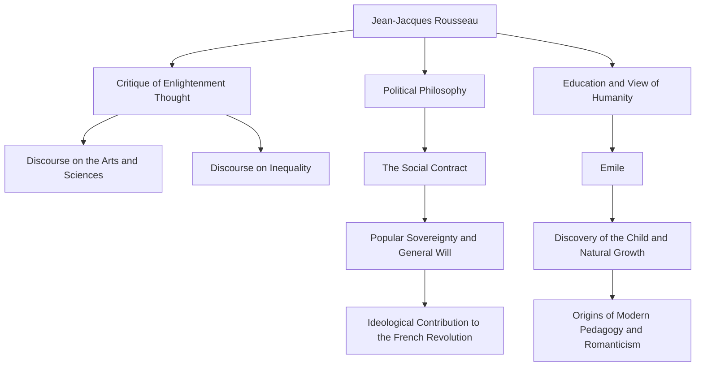

In 18th-century Europe, as the Enlightenment's supreme reasoning blossomed, there was a man who challenged the trend and cried, "Return to nature." That man was Jean-Jacques Rousseau (1712 - 1778). His ideas had a decisive influence on the French Revolution and further laid the foundation for modern pedagogy and Romantic literature. In this article, we unravel the life of Rousseau, who continued to seek the truth amidst loneliness and wandering, and his profound philosophy that still resonates today.

## An Unfortunate Childhood and the Beginning of Wandering

Rousseau was born in 1712 in the Republic of Geneva, Switzerland, as the son of a watchmaker. He lost his mother just days after his birth, and when he was 10, his father fled after a violent altercation, leaving Rousseau to spend an unfortunate childhood in the care of relatives. He was apprenticed to an engraver but, unable to bear the harsh treatment, he fled his hometown of Geneva at the age of 16.

Afterward, he met Madame de Warens, who would shelter him in the Savoy region. She became a mother figure to Rousseau, and later, his lover. During this period, he voraciously absorbed music, philosophy, and literature through self-study, refining his intellect.

## Awakening as a Thinker

Rousseau's destiny changed dramatically in 1749 when he was 37. On his way to visit his friend Denis Diderot, who was imprisoned in the Chateau de Vincennes, he saw the essay topic for the Academy of Dijon: "Has the restoration of the sciences and arts contributed to the purification of morals?" and was struck by a fierce inspiration. He developed a paradoxical argument that overturned the common sense of the time, claiming that "the development of sciences and arts has rather corrupted human morality," and won the prize. With the publication of this "Discourse on the Arts and Sciences," Rousseau suddenly became the darling of the European intellectual world.

## The Core Philosophy: The Conflict Between "Nature" and "Society"

The core of Rousseau's thought lies in the idea that "man was originally born good and free, but inequality and evil arose due to the emergence of social institutions and private property." This idea was elaborated upon in his "Discourse on the Origin and Basis of Inequality Among Men" (1755).

In 1762, his masterpieces "The Social Contract" and "Emile, or On Education" were published. In "The Social Contract," he argued for the legitimacy of the state based on the "general will" (the universal will of the people aiming for public interest) and established the concept of popular sovereignty. On the other hand, in "Emile," he preached the importance of an education that protects children from the evil customs of society and stays close to their natural development, leading him to be called the "discoverer of the child."

## Persecution, Isolation, and a Massive Legacy for Posterity

However, these epoch-making works provoked fierce backlash from the establishment of the time. The religious arguments in "Emile" were particularly viewed as dangerous, and his books were condemned to be burned, with arrest warrants issued in Paris and his hometown of Geneva. To escape persecution, Rousseau was forced into exile across Switzerland and eventually to England. In England, he received the protection of philosopher David Hume, but extreme paranoia led to a rupture with him as well.

In his later years, Rousseau sank into self-defense and introspection in isolation, writing "The Confessions," a monument of modern autobiographical literature, and "Reveries of the Solitary Walker." In 1778, he closed his tumultuous life in Ermenonville, a suburb of Paris.

Jean-Jacques Rousseau was also a figure full of contradictions, discussing ideal education while sending his own children to an orphanage. However, the passion with which he saw through the hypocrisy of society and relentlessly questioned "the ideal state of humanity" became the spiritual backbone of the French Revolution that broke out ten years after his death. Whenever we speak of "freedom," "equality," and "individual dignity" as a matter of course, the questions left by Rousseau continue to resonate there.
