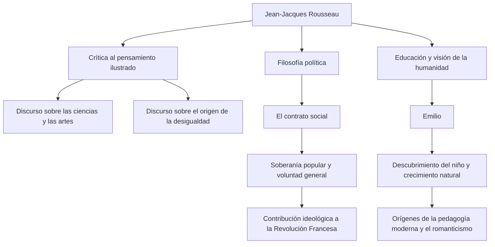

En la Europa del siglo XVIII, mientras florecía el pensamiento ilustrado que consideraba la razón como suprema, hubo un hombre que desafió la corriente y clamó: "Regreso a la naturaleza". Ese hombre fue Jean-Jacques Rousseau (1712 - 1778). Sus ideas tuvieron una influencia decisiva en la Revolución Francesa y, además, sentaron las bases de la pedagogía moderna y la literatura romántica. En este artículo, desentrañaremos la vida de Rousseau, quien continuó buscando la verdad en medio de la soledad y el vagabundeo, y su profunda filosofía que sigue resonando en la actualidad.

## Una infancia desafortunada y el comienzo del vagabundeo

Rousseau nació en 1712 en la República de Ginebra, Suiza, hijo de un relojero. Perdió a su madre pocos días después de nacer, y cuando tenía 10 años, su padre huyó tras un altercado violento, por lo que Rousseau pasó una infancia desafortunada al cuidado de familiares. Fue enviado como aprendiz de un grabador de relojes, pero, incapaz de soportar el duro trato, huyó de su ciudad natal, Ginebra, a los 16 años.

Más tarde, conoció a Madame de Warens, quien lo protegería en la región de Saboya. Ella se convirtió en una figura materna para Rousseau y, posteriormente, en su amante. Durante este período, absorbió con avidez la música, la filosofía y la literatura de forma autodidacta, refinando su intelecto.

## Despertar como pensador

El destino de Rousseau cambió drásticamente en 1749, cuando tenía 37 años. En camino a visitar a su amigo Denis Diderot, quien estaba encarcelado en el Castillo de Vincennes, vio el tema del concurso de ensayos de la Academia de Dijon: "¿El restablecimiento de las ciencias y las artes ha contribuido a la purificación de las costumbres?" y fue golpeado por una intensa inspiración. Desarrolló un argumento paradójico que volcó el sentido común de la época, afirmando que "el desarrollo de las ciencias y las artes ha corrompido más bien la moral humana", y ganó el premio de manera brillante. Con la publicación de este "Discurso sobre las ciencias y las artes", Rousseau se convirtió repentinamente en el niño mimado del mundo intelectual europeo.

## La filosofía central: El conflicto entre "Naturaleza" y "Sociedad"

El núcleo del pensamiento de Rousseau radica en la idea de que "el hombre nació originalmente como un ser bueno y libre, pero la desigualdad y el mal surgieron debido a la aparición de las instituciones sociales y la propiedad privada". Esta idea se discutió minuciosamente en su "Discurso sobre el origen y los fundamentos de la desigualdad entre los hombres" (1755).

Y en 1762, se publicaron sus obras maestras "El contrato social" y "Emilio, o De la educación". En "El contrato social", argumentó a favor de la legitimidad del Estado basada en la "voluntad general" (la voluntad universal del pueblo orientada hacia el interés público) y estableció el concepto de soberanía popular. Por otro lado, en "Emilio", predicó la importancia de una educación que proteja a los niños de las malas costumbres de la sociedad y acompañe el desarrollo natural del ser humano, lo que le valió ser llamado el "descubridor del niño".

## Persecución, aislamiento y un legado masivo para la posteridad

Sin embargo, estas obras trascendentales provocaron una feroz reacción del establishment de la época. En particular, sus argumentos religiosos en "Emilio" fueron vistos como peligrosos, y sus libros fueron condenados a la hoguera y se emitieron órdenes de arresto en París y en su ciudad natal de Ginebra. Para escapar de la persecución, Rousseau se vio obligado a exiliarse en varias partes de Suiza e Inglaterra. En Inglaterra, recibió la protección del filósofo David Hume, pero una paranoia extrema lo llevó a romper también con él.

En sus últimos años, Rousseau se sumió en la autodefensa y la introspección en aislamiento, escribiendo "Las confesiones", un monumento de la literatura autobiográfica moderna, y "Las ensoñaciones del paseante solitario". En 1778, cerró su tumultuosa vida en Ermenonville, un suburbio de París.

Jean-Jacques Rousseau también fue una figura llena de contradicciones, discutiendo sobre la educación ideal mientras enviaba a sus propios hijos a un orfanato. Sin embargo, la pasión con la que vio a través de la hipocresía de la sociedad y cuestionó implacablemente "el estado ideal de la humanidad" se convirtió en la columna vertebral espiritual de la Revolución Francesa que estalló diez años después de su muerte. Cada vez que hablamos de "libertad", "igualdad" y "dignidad individual" con naturalidad, las preguntas dejadas por Rousseau siguen resonando allí.
