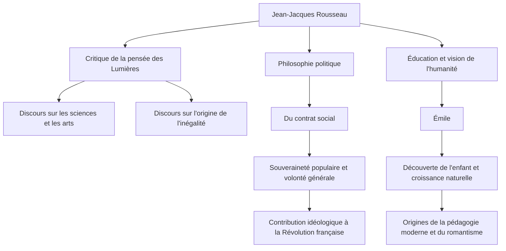

Dans l'Europe du XVIIIe siècle, alors que la pensée des Lumières, qui considérait la raison comme suprême, s'épanouissait, un homme a défié la tendance et s'est écrié : "Retour à la nature." Cet homme était Jean-Jacques Rousseau (1712 - 1778). Ses idées ont eu une influence décisive sur la Révolution française et ont en outre jeté les bases de la pédagogie moderne et de la littérature romantique. Dans cet article, nous dévoilerons la vie de Rousseau, qui a continué à chercher la vérité au milieu de la solitude et de l'errance, et sa philosophie profonde qui résonne encore aujourd'hui.

## Une enfance malheureuse et le début de l'errance

Rousseau est né en 1712 dans la République de Genève, en Suisse, en tant que fils d'un horloger. Il a perdu sa mère quelques jours après sa naissance, et à l'âge de 10 ans, son père s'est enfui après une altercation violente, laissant Rousseau passer une enfance malheureuse aux soins de parents. Il a été placé en apprentissage chez un graveur, mais, incapable de supporter les traitements sévères, il a fui sa ville natale de Genève à l'âge de 16 ans.

Plus tard, il a rencontré Madame de Warens, qui allait le protéger dans la région de Savoie. Elle est devenue une figure maternelle pour Rousseau et, par la suite, son amante. Au cours de cette période, il a absorbé avec voracité la musique, la philosophie et la littérature en autodidacte, affinant son intellect.

## Éveil en tant que penseur

Le destin de Rousseau a radicalement changé en 1749, à l'âge de 37 ans. En route pour rendre visite à son ami Denis Diderot, emprisonné au château de Vincennes, il a vu le sujet du concours de l'Académie de Dijon : "Le rétablissement des sciences et des arts a-t-il contribué à épurer les mœurs ?" et a été frappé par une inspiration féroce. Il a développé un argument paradoxal qui a bouleversé le bon sens de l'époque, affirmant que "le développement des sciences et des arts a plutôt corrompu la morale humaine", et a remporté le prix avec brio. Avec la publication de ce "Discours sur les sciences et les arts", Rousseau est soudainement devenu l'enfant chéri du monde intellectuel européen.

## La philosophie centrale : Le conflit entre "Nature" et "Société"

Le cœur de la pensée de Rousseau réside dans l'idée que "l'homme est né à l'origine bon et libre, mais l'inégalité et le mal sont apparus en raison de l'émergence des institutions sociales et de la propriété privée". Cette idée a été élaborée dans son "Discours sur l'origine et les fondements de l'inégalité parmi les hommes" (1755).

En 1762, ses chefs-d'œuvre "Du contrat social" et "Émile, ou De l'éducation" ont été publiés. Dans "Du contrat social", il a plaidé pour la légitimité de l'État sur la base de la "volonté générale" (la volonté universelle du peuple visant l'intérêt public) et a établi le concept de souveraineté populaire. D'autre part, dans "Émile", il a prêché l'importance d'une éducation qui protège les enfants des mauvaises coutumes de la société et accompagne le développement naturel de l'être humain, ce qui lui a valu d'être appelé le "découvreur de l'enfant".

## Persécution, isolement et un héritage massif pour la postérité

Cependant, ces œuvres d'une importance capitale ont provoqué de violentes réactions de la part de l'establishment de l'époque. En particulier, ses arguments religieux dans "Émile" ont été considérés comme dangereux, et ses livres ont été condamnés à être brûlés avec des mandats d'arrêt émis à Paris et dans sa ville natale de Genève. Pour échapper à la persécution, Rousseau a été contraint de s'exiler à travers la Suisse et finalement en Angleterre. En Angleterre, il a reçu la protection du philosophe David Hume, mais une paranoïa extrême a conduit à une rupture avec lui également.

Dans ses dernières années, Rousseau a sombré dans l'autodéfense et l'introspection dans l'isolement, écrivant "Les Confessions", un monument de la littérature autobiographique moderne, et "Les Rêveries du promeneur solitaire". En 1778, il a terminé sa vie tumultueuse à Ermenonville, en banlieue parisienne.

Jean-Jacques Rousseau était également une figure pleine de contradictions, discutant de l'éducation idéale tout en envoyant ses propres enfants dans un orphelinat. Cependant, la passion avec laquelle il a percé à jour l'hypocrisie de la société et remis en question sans relâche "l'état idéal de l'humanité" est devenue la colonne vertébrale spirituelle de la Révolution française qui a éclaté dix ans après sa mort. Chaque fois que nous parlons de "liberté", d'"égalité" et de "dignité individuelle" comme allant de soi, les questions laissées par Rousseau continuent d'y résonner.
