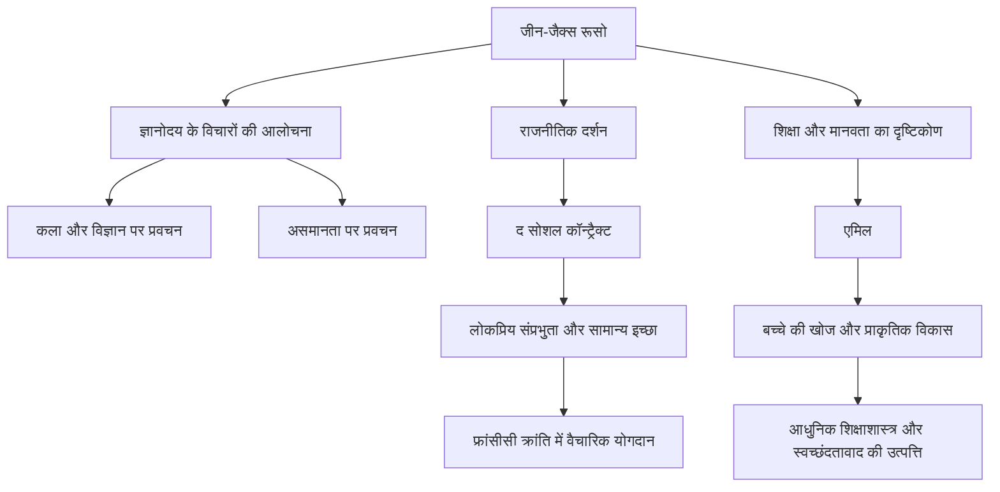

18वीं सदी के यूरोप में, जब ज्ञानोदय का युग, जो तर्क को सर्वोच्च मानता था, अपने चरम पर था, एक आदमी ने इस प्रवृत्ति को चुनौती दी और पुकारा: "प्रकृति की ओर लौटो।" वह आदमी जीन-जैक्स रूसो (1712 - 1778) था। उनके विचारों का फ्रांसीसी क्रांति पर निर्णायक प्रभाव पड़ा और आधुनिक शिक्षाशास्त्र और रोमांटिक साहित्य की नींव भी रखी। इस लेख में, हम रूसो के जीवन को उजागर करेंगे, जिन्होंने अकेलेपन और भटकने के बीच सत्य की खोज जारी रखी, और उनके गहरे दर्शन को जानेंगे जो आज भी गूंजता है।

## एक दुर्भाग्यपूर्ण बचपन और भटकने की शुरुआत

रूसो का जन्म 1712 में स्विट्जरलैंड के जिनेवा गणराज्य में एक घड़ीसाज़ के बेटे के रूप में हुआ था। जन्म के कुछ दिनों बाद ही उन्होंने अपनी माँ को खो दिया, और जब वे 10 वर्ष के थे, तो उनके पिता एक हिंसक विवाद के बाद भाग गए, जिससे रूसो को रिश्तेदारों की देखभाल में एक दुर्भाग्यपूर्ण बचपन बिताना पड़ा। उन्हें एक नक्काशीकार के पास प्रशिक्षु के रूप में भेजा गया था, लेकिन कठोर व्यवहार को सहन न कर पाने के कारण, उन्होंने 16 वर्ष की आयु में अपने गृहनगर जिनेवा से भाग गए।

बाद में, उनकी मुलाकात मैडम डी वारेंस से हुई, जिन्होंने उन्हें सवॉय क्षेत्र में आश्रय दिया। वह रूसो के लिए एक माँ के समान बन गईं, और बाद में उनकी प्रेमिका। इस अवधि के दौरान, उन्होंने स्व-अध्ययन के माध्यम से संगीत, दर्शन और साहित्य को उत्सुकता से आत्मसात किया, अपनी बुद्धि को निखारा।

## एक विचारक के रूप में जागृति

1749 में रूसो की किस्मत नाटकीय रूप से बदल गई, जब वे 37 वर्ष के थे। अपने दोस्त डेनिस डिडेरोट से मिलने के रास्ते में, जो विन्सेनेस के महल में कैद था, उन्होंने डिजॉन की अकादमी के लिए निबंध प्रतियोगिता का विषय देखा: "क्या विज्ञान और कला की बहाली ने नैतिकता की शुद्धि में योगदान दिया है?" और वे एक भयंकर प्रेरणा से प्रभावित हुए। उन्होंने एक विरोधाभासी तर्क विकसित किया जिसने उस समय की सामान्य समझ को उलट दिया, यह दावा करते हुए कि "विज्ञान और कला के विकास ने मानव नैतिकता को और भी भ्रष्ट कर दिया है," और शानदार ढंग से पुरस्कार जीता। इस "कला और विज्ञान पर प्रवचन" के प्रकाशन के साथ, रूसो अचानक यूरोपीय बौद्धिक दुनिया के लाडले बन गए।

## मुख्य दर्शन: "प्रकृति" और "समाज" के बीच संघर्ष

रूसो के विचारों का मूल इस विचार में निहित है कि "मनुष्य मूल रूप से अच्छा और स्वतंत्र पैदा हुआ था, लेकिन सामाजिक संस्थानों और निजी संपत्ति के उद्भव के कारण असमानता और बुराई पैदा हुई।" इस विचार को उनके "पुरुषों के बीच असमानता की उत्पत्ति और आधार पर प्रवचन" (1755) में विस्तार से बताया गया था।

1762 में, उनकी उत्कृष्ट कृतियाँ "द सोशल कॉन्ट्रैक्ट" और "एमिल, या ऑन एजुकेशन" प्रकाशित हुईं। "द सोशल कॉन्ट्रैक्ट" में, उन्होंने "सामान्य इच्छा" (सार्वजनिक हित के उद्देश्य से लोगों की सार्वभौमिक इच्छा) के आधार पर राज्य की वैधता के लिए तर्क दिया और लोकप्रिय संप्रभुता की अवधारणा स्थापित की। दूसरी ओर, "एमिल" में, उन्होंने एक ऐसी शिक्षा के महत्व का उपदेश दिया जो बच्चों को समाज के बुरे रीति-रिवाजों से बचाती है और मानव के प्राकृतिक विकास के साथ चलती है, जिसके कारण उन्हें "बच्चे का खोजकर्ता" कहा जाने लगा।

## उत्पीड़न, अलगाव और भावी पीढ़ी के लिए एक विशाल विरासत

हालाँकि, इन युगांतरकारी कार्यों ने उस समय के सत्ता पक्ष से भयंकर प्रतिक्रिया को उकसाया। विशेष रूप से, "एमिल" में उनके धार्मिक तर्कों को खतरनाक माना गया, और उनकी पुस्तकों को जलाने की निंदा की गई, पेरिस और उनके गृहनगर जिनेवा में गिरफ्तारी वारंट जारी किए गए। उत्पीड़न से बचने के लिए, रूसो को पूरे स्विट्जरलैंड में और अंततः इंग्लैंड में निर्वासन के लिए मजबूर होना पड़ा। इंग्लैंड में, उन्हें दार्शनिक डेविड ह्यूम का संरक्षण प्राप्त हुआ, लेकिन अत्यधिक व्यामोह के कारण उनसे भी दरार आ गई।

अपने बाद के वर्षों में, रूसो अलगाव में आत्म-रक्षा और आत्मनिरीक्षण में डूब गए, उन्होंने "द कन्फेशन्स", आधुनिक आत्मकथात्मक साहित्य का एक स्मारक, और "रिवेरीज़ ऑफ़ द सॉलिटरी वॉकर" लिखा। 1778 में, उन्होंने पेरिस के उपनगर एर्मेननविले में अपने उथल-पुथल भरे जीवन को समाप्त कर दिया।

जीन-जैक्स रूसो विरोधाभासों से भरे व्यक्ति भी थे, जो आदर्श शिक्षा पर चर्चा करते हुए अपने ही बच्चों को अनाथालय भेजते थे। हालाँकि, जिस जुनून के साथ उन्होंने समाज के पाखंड को देखा और "मानवता की आदर्श स्थिति" पर लगातार सवाल उठाया, वह फ्रांसीसी क्रांति की आध्यात्मिक रीढ़ बन गया, जो उनकी मृत्यु के दस साल बाद भड़क उठी। जब भी हम "स्वतंत्रता," "समानता," और "व्यक्तिगत गरिमा" को स्वाभाविक रूप से बोलते हैं, रूसो द्वारा छोड़े गए प्रश्न वहां गूंजते रहते हैं।
