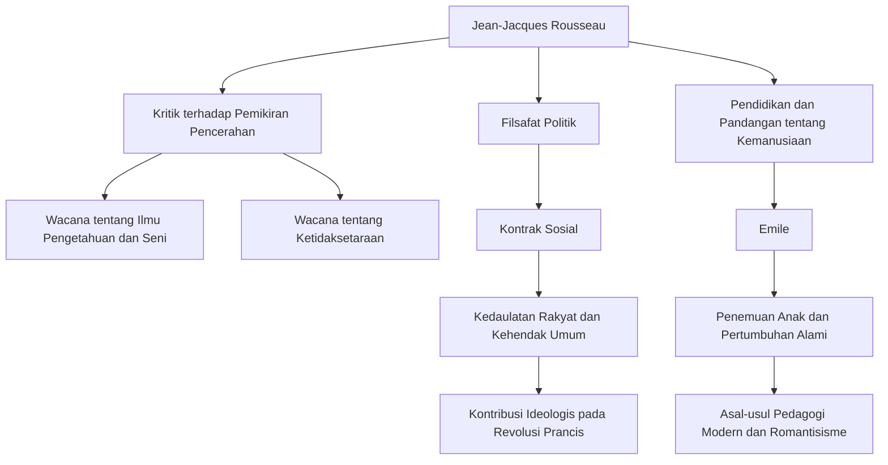

Di Eropa abad ke-18, ketika pemikiran Pencerahan yang memandang akal sebagai hal yang tertinggi sedang berkembang pesat, ada seorang pria yang menantang tren tersebut dan menyerukan, "Kembali ke alam." Pria itu adalah Jean-Jacques Rousseau (1712 - 1778). Ide-idenya memiliki pengaruh yang menentukan pada Revolusi Prancis dan lebih jauh lagi meletakkan dasar bagi pedagogi modern dan literatur Romantis. Dalam artikel ini, kita akan mengurai kehidupan Rousseau, yang terus mencari kebenaran di tengah kesepian dan pengembaraan, serta filosofinya yang mendalam yang terus bergema hingga saat ini.

## Masa Kecil yang Malang dan Awal Pengembaraan

Rousseau lahir pada tahun 1712 di Republik Jenewa, Swiss, sebagai putra seorang pembuat jam. Ia kehilangan ibunya hanya beberapa hari setelah kelahirannya, dan pada usia 10 tahun, ayahnya melarikan diri setelah pertengkaran yang penuh kekerasan, meninggalkan Rousseau untuk menghabiskan masa kecil yang malang di bawah asuhan kerabat. Ia dikirim sebagai pekerja magang kepada seorang pengukir, tetapi karena tidak sanggup menanggung perlakuan kasar, ia melarikan diri dari kampung halamannya di Jenewa pada usia 16 tahun.

Kemudian, ia bertemu Madame de Warens, yang memberinya perlindungan di wilayah Savoy. Ia menjadi sosok ibu bagi Rousseau, dan kemudian menjadi kekasihnya. Selama periode ini, ia dengan rakus menyerap musik, filsafat, dan sastra melalui belajar mandiri, mengasah kecerdasannya.

## Kebangkitan sebagai Pemikir

Nasib Rousseau berubah secara dramatis pada tahun 1749, ketika ia berusia 37 tahun. Dalam perjalanannya mengunjungi temannya Denis Diderot, yang dipenjarakan di Château de Vincennes, ia melihat topik lomba esai Akademi Dijon: "Apakah pemulihan ilmu pengetahuan dan seni telah berkontribusi pada pemurnian moral?" dan terpukul oleh inspirasi yang luar biasa. Ia mengembangkan argumen paradoks yang membalikkan akal sehat pada masa itu, dengan menyatakan bahwa "perkembangan ilmu pengetahuan dan seni justru telah merusak moralitas manusia," dan memenangkan hadiah dengan gemilang. Dengan diterbitkannya "Wacana tentang Ilmu Pengetahuan dan Seni" ini, Rousseau tiba-tiba menjadi kesayangan dunia intelektual Eropa.

## Filosofi Inti: Konflik antara "Alam" dan "Masyarakat"

Inti dari pemikiran Rousseau terletak pada gagasan bahwa "manusia pada awalnya dilahirkan baik dan bebas, tetapi ketidaksetaraan dan kejahatan muncul karena munculnya institusi sosial dan properti pribadi." Gagasan ini diuraikan dalam karyanya "Wacana tentang Asal-usul dan Dasar Ketidaksetaraan di Antara Manusia" (1755).

Pada tahun 1762, mahakaryanya "Kontrak Sosial" dan "Emile, atau Tentang Pendidikan" diterbitkan. Dalam "Kontrak Sosial," ia memperdebatkan legitimasi negara berdasarkan "kehendak umum" (kehendak universal rakyat yang bertujuan untuk kepentingan publik) dan menetapkan konsep kedaulatan rakyat. Di sisi lain, dalam "Emile," ia mengkhotbahkan pentingnya pendidikan yang melindungi anak-anak dari kebiasaan buruk masyarakat dan menyertai perkembangan alamiah manusia, yang membuatnya dijuluki sebagai "penemu anak-anak."

## Penganiayaan, Isolasi, dan Warisan Besar bagi Anak Cucu

Namun, karya-karya penting ini memicu reaksi keras dari kemapanan pada saat itu. Khususnya, argumen agamanya dalam "Emile" dipandang berbahaya, dan buku-bukunya dihukum bakar dengan surat perintah penangkapan yang dikeluarkan di Paris dan di kampung halamannya di Jenewa. Untuk menghindari penganiayaan, Rousseau terpaksa mengasingkan diri ke seluruh Swiss dan akhirnya ke Inggris. Di Inggris, ia menerima perlindungan dari filsuf David Hume, tetapi paranoia ekstrem juga menyebabkan perpecahan dengannya.

Di tahun-tahun terakhirnya, Rousseau tenggelam dalam pembelaan diri dan introspeksi dalam isolasi, menulis "Pengakuan," sebuah monumen sastra otobiografi modern, dan "Lamunan Pejalan Kaki yang Kesepian." Pada tahun 1778, ia mengakhiri kehidupannya yang penuh gejolak di Ermenonville, pinggiran kota Paris.

Jean-Jacques Rousseau juga merupakan sosok yang penuh kontradiksi, mendiskusikan pendidikan ideal sambil mengirim anak-anaknya sendiri ke panti asuhan. Namun, semangatnya dalam melihat melalui kemunafikan masyarakat dan tanpa henti mempertanyakan "keadaan ideal umat manusia" menjadi tulang punggung spiritual Revolusi Prancis, yang meletus sepuluh tahun setelah kematiannya. Kapan pun kita berbicara tentang "kebebasan," "kesetaraan," dan "martabat individu" sebagai hal yang biasa, pertanyaan-pertanyaan yang ditinggalkan oleh Rousseau terus bergema di sana.
