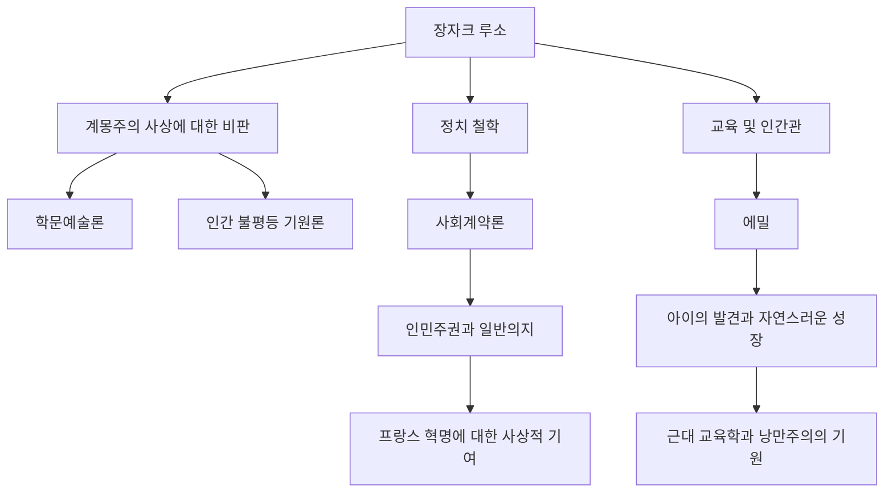

이성을 지상 최고의 가치로 여기는 계몽주의 사상이 꽃피우던 18세기 유럽에서, 그 흐름에 이의를 제기하며 "자연으로 돌아가라"고 외친 한 남자가 있었습니다. 그가 바로 장자크 루소(Jean-Jacques Rousseau, 1712년 - 1778년)입니다. 그의 사상은 프랑스 혁명에 결정적인 영향을 미쳤으며, 더 나아가 근대 교육학과 낭만주의 문학의 초석을 다졌습니다. 본 기사에서는 고독과 방랑 속에서 진리를 계속해서 탐구했던 루소의 생애와 현대에도 통하는 그의 심오한 철학을 풀어보겠습니다.

## 불우한 어린 시절과 방랑의 시작

루소는 1712년 스위스 제네바 공화국에서 시계 장인의 아들로 태어났습니다. 태어난 지 며칠 만에 어머니를 잃고, 10살 때는 아버지가 폭력 사건을 일으켜 도망치는 바람에 루소는 친척들에게 맡겨지는 불우한 어린 시절을 보냈습니다. 시계 조각사의 도제로 보내졌으나, 가혹한 대우를 견디지 못하고 16세에 고향 제네바를 떠나게 됩니다.

그 후, 사부아 지방에서 그를 보호해 줄 바랑 부인을 만나게 됩니다. 그녀는 루소에게 어머니 같은 존재였고, 나중에는 연인이 되기도 했습니다. 이 시기에 그는 독학으로 음악, 철학, 문학 등을 탐욕스럽게 흡수하며 자신의 지성을 갈고닦았습니다.

## 사상가로서의 각성

루소의 운명이 크게 바뀐 것은 1749년, 그가 37세 때의 일입니다. 뱅센 감옥에 수감되어 있던 친구 드니 디드로를 면회하러 가는 길에, 그는 디종 아카데미의 현상 논문 주제인 "학문과 예술의 부흥은 풍속의 순화에 기여했는가?"를 보고 격렬한 영감에 사로잡힙니다. 그는 "학문과 예술의 발전은 오히려 인간의 도덕을 부패시켰다"는 당시의 상식을 뒤엎는 역설적인 주장을 펼쳐 보기 좋게 당선되었습니다. 이 『학문예술론』의 출판으로 루소는 단숨에 유럽 사상계의 총아가 됩니다.

## 핵심이 되는 철학: '자연'과 '사회'의 대립

루소 사상의 핵심은 "인간은 본래 선량하고 자유로운 존재로 태어났으나, 사회 제도와 사유 재산의 발생으로 인해 불평등과 악이 생겨났다"는 점에 있습니다. 이 생각은 『인간 불평등 기원론』(1755년)에서 정교하게 논의되었습니다.

그리고 1762년, 그의 대표작인 『사회계약론』과 『에밀』이 발표됩니다. 『사회계약론』에서 그는 "일반의지(공공의 이익을 지향하는 인민의 보편적인 의지)"에 기초한 국가의 정당성을 주장하며 인민주권의 개념을 세웠습니다. 반면 『에밀』에서는 사회의 악습으로부터 아이를 보호하고 인간의 자연스러운 발달에 다가가는 교육의 중요성을 설파하여 "아이의 발견자"라고도 불리게 됩니다.

## 박해, 고립, 그리고 후세에 남긴 거대한 유산

그러나 이러한 획기적인 저작들은 당시 체제 측으로부터 격렬한 반발을 샀습니다. 특히 『에밀』에 담긴 종교론이 위험시되어, 파리와 고향 제네바에서 분서와 체포 영장 선고를 받습니다. 루소는 박해를 피해 스위스 각지와 영국으로 망명할 수밖에 없었습니다. 영국에서는 철학자 데이비드 흄의 보호를 받지만, 극도의 피해망상으로 인해 그와도 결별하고 맙니다.

말년의 루소는 고독 속에서 자기 변호와 내성에 빠져, 근대 자전 문학의 금자탑인 『고백록』과 『고독한 산책자의 몽상』을 집필했습니다. 그리고 1778년, 파리 근교의 에름농빌에서 파란만장한 생애를 마감했습니다.

장자크 루소는 자신의 아이들을 고아원에 보내면서 이상적인 교육을 논하는 등, 모순으로 가득 찬 인물이기도 했습니다. 그러나 그가 사회의 기만을 꿰뚫어 보고 "인간의 바람직한 모습"을 극한까지 계속해서 물었던 열정은, 그가 죽은 지 10년 후에 발발한 프랑스 혁명의 정신적 지주가 되었습니다. 우리가 "자유"나 "평등", 그리고 "개인의 존엄"을 당연한 듯이 이야기할 때, 거기에는 항상 루소가 남긴 물음이 계속해서 울려 퍼지고 있는 것입니다.
