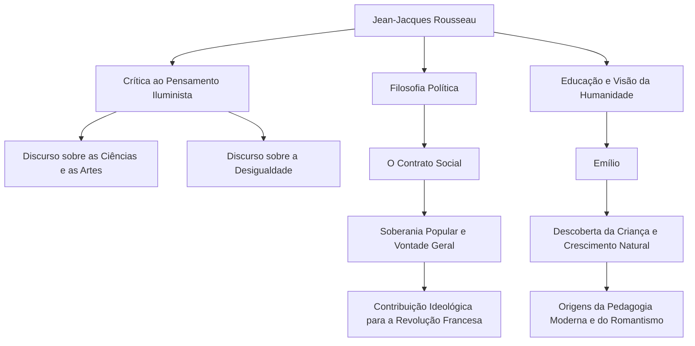

Na Europa do século XVIII, enquanto o pensamento iluminista, que considerava a razão como suprema, florescia, houve um homem que desafiou a tendência e clamou: "Retorno à natureza". Esse homem era Jean-Jacques Rousseau (1712 - 1778). Suas ideias tiveram uma influência decisiva na Revolução Francesa e, além disso, lançaram as bases da pedagogia moderna e da literatura romântica. Neste artigo, desvendamos a vida de Rousseau, que continuou a buscar a verdade em meio à solidão e à errância, e sua filosofia profunda que continua a ressoar hoje.

## Uma Infância Infeliz e o Início da Errância

Rousseau nasceu em 1712 na República de Genebra, na Suíça, como filho de um relojoeiro. Ele perdeu a mãe poucos dias após seu nascimento e, aos 10 anos, seu pai fugiu após uma altercação violenta, deixando Rousseau passar uma infância infeliz aos cuidados de parentes. Ele foi aprendiz de um gravador, mas, incapaz de suportar o tratamento severo, fugiu de sua cidade natal, Genebra, aos 16 anos.

Mais tarde, ele conheceu Madame de Warens, que o abrigaria na região de Saboia. Ela se tornou uma figura materna para Rousseau e, posteriormente, sua amante. Durante esse período, ele absorveu vorazmente música, filosofia e literatura como autodidata, refinando seu intelecto.

## Despertar como Pensador

O destino de Rousseau mudou drasticamente em 1749, quando ele tinha 37 anos. A caminho de visitar seu amigo Denis Diderot, que estava preso no Château de Vincennes, ele viu o tema do concurso de redação da Academia de Dijon: "O restabelecimento das ciências e das artes contribuiu para a purificação dos costumes?" e foi atingido por uma inspiração feroz. Ele desenvolveu um argumento paradoxal que derrubou o senso comum da época, afirmando que "o desenvolvimento das ciências e das artes corrompeu a moral humana", e ganhou o prêmio de forma brilhante. Com a publicação desse "Discurso sobre as Ciências e as Artes", Rousseau de repente se tornou o queridinho do mundo intelectual europeu.

## A Filosofia Central: O Conflito entre "Natureza" e "Sociedade"

O cerne do pensamento de Rousseau reside na ideia de que "o homem nasceu originalmente bom e livre, mas a desigualdade e o mal surgiram devido ao surgimento de instituições sociais e da propriedade privada". Essa ideia foi elaborada em seu "Discurso sobre a Origem e os Fundamentos da Desigualdade entre os Homens" (1755).

Em 1762, suas obras-primas "O Contrato Social" e "Emílio, ou Da Educação" foram publicadas. Em "O Contrato Social", ele argumentou pela legitimidade do Estado com base na "vontade geral" (a vontade universal do povo voltada para o interesse público) e estabeleceu o conceito de soberania popular. Por outro lado, em "Emílio", ele pregou a importância de uma educação que proteja as crianças dos maus costumes da sociedade e acompanhe o desenvolvimento natural do ser humano, o que o levou a ser chamado de "o descobridor da criança".

## Perseguição, Isolamento e um Legado Massivo para a Posteridade

No entanto, essas obras marcantes provocaram uma reação feroz do establishment da época. Em particular, seus argumentos religiosos em "Emílio" foram vistos como perigosos, e seus livros foram condenados à fogueira com mandados de prisão emitidos em Paris e em sua cidade natal, Genebra. Para escapar da perseguição, Rousseau foi forçado a se exilar pela Suíça e, eventualmente, na Inglaterra. Na Inglaterra, ele recebeu a proteção do filósofo David Hume, mas uma paranoia extrema levou a uma ruptura com ele também.

Em seus últimos anos, Rousseau afundou na autodefesa e introspecção em isolamento, escrevendo "As Confissões", um monumento da literatura autobiográfica moderna, e "Os Devaneios do Caminhante Solitário". Em 1778, ele encerrou sua vida tumultuada em Ermenonville, um subúrbio de Paris.

Jean-Jacques Rousseau também foi uma figura cheia de contradições, discutindo a educação ideal enquanto enviava seus próprios filhos para um orfanato. No entanto, a paixão com que ele viu através da hipocrisia da sociedade e questionou implacavelmente "o estado ideal da humanidade" tornou-se a espinha dorsal espiritual da Revolução Francesa, que estourou dez anos após sua morte. Sempre que falamos de "liberdade", "igualdade" e "dignidade individual" como algo natural, as questões deixadas por Rousseau continuam a ressoar lá.
