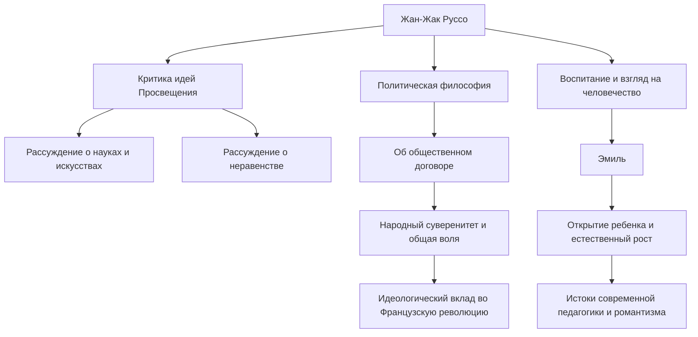

В Европе 18 века, когда процветало просветительское мышление, ставившее разум превыше всего, был человек, который бросил вызов этой тенденции и воскликнул: «Назад к природе!». Этим человеком был Жан-Жак Руссо (1712 - 1778). Его идеи оказали решающее влияние на Великую французскую революцию и, более того, заложили основу современной педагогики и романтической литературы. В этой статье мы разберем жизнь Руссо, который продолжал искать истину в одиночестве и скитаниях, и его глубокую философию, которая продолжает находить отклик и сегодня.

## Несчастное детство и начало скитаний

Руссо родился в 1712 году в Женевской республике, Швейцария, в семье часовщика. Он потерял мать через несколько дней после рождения, а когда ему было 10 лет, его отец сбежал после жестокой ссоры, в результате чего Руссо провел несчастное детство на попечении родственников. Его отдали в ученики к граверу, но, не в силах выносить суровое обращение, он сбежал из родной Женевы в возрасте 16 лет.

Позже он встретил мадам де Варан, которая дала ему приют в регионе Савойя. Она стала для Руссо фигурой матери, а позже и его любовницей. В этот период он жадно впитывал музыку, философию и литературу путем самообразования, оттачивая свой интеллект.

## Пробуждение мыслителя

Судьба Руссо кардинально изменилась в 1749 году, когда ему было 37 лет. По пути к своему другу Дени Дидро, который был заключен в Венсенский замок, он увидел тему конкурса эссе Дижонской академии: «Способствовало ли возрождение наук и искусств очищению нравов?» — и был поражен сильным вдохновением. Он выдвинул парадоксальный аргумент, перевернувший здравый смысл того времени, утверждая, что «развитие наук и искусств скорее развратило человеческую мораль», и блестяще выиграл приз. С публикацией этого «Рассуждения о науках и искусствах» Руссо внезапно стал любимцем европейского интеллектуального мира.

## Основная философия: Конфликт между «Природой» и «Обществом»

Суть мысли Руссо заключается в идее о том, что «человек изначально родился добрым и свободным, но неравенство и зло возникли из-за появления социальных институтов и частной собственности». Эта идея была подробно изложена в его «Рассуждении о происхождении и основаниях неравенства между людьми» (1755).

В 1762 году были опубликованы его шедевры «Об общественном договоре» и «Эмиль, или О воспитании». В трактате «Об общественном договоре» он доказывал легитимность государства, основанного на «общей воле» (универсальной воле народа, направленной на общественные интересы), и утвердил концепцию народного суверенитета. С другой стороны, в «Эмиле» он проповедовал важность образования, которое защищает детей от дурных обычаев общества и сопровождает естественное развитие человека, за что его назвали «открывателем ребенка».

## Преследования, изоляция и огромное наследие для потомков

Однако эти эпохальные произведения вызвали яростную реакцию со стороны истеблишмента того времени. В частности, его религиозные аргументы в «Эмиле» были признаны опасными, а его книги были приговорены к сожжению, с выдачей ордеров на арест в Париже и в его родной Женеве. Чтобы избежать преследований, Руссо был вынужден отправиться в изгнание по всей Швейцарии и, в конечном итоге, в Англию. В Англии он получил защиту философа Дэвида Юма, но крайняя паранойя привела к разрыву и с ним.

В свои последние годы Руссо погрузился в самозащиту и самоанализ в изоляции, написав «Исповедь», памятник современной автобиографической литературы, и «Прогулки одинокого мечтателя». В 1778 году он завершил свою бурную жизнь в Эрменонвиле, пригороде Парижа.

Жан-Жак Руссо также был фигурой, полной противоречий, рассуждая об идеальном воспитании, отдавая при этом своих собственных детей в приют. Тем не менее, страсть, с которой он видел сквозь лицемерие общества и безжалостно ставил под сомнение «идеальное состояние человечества», стала духовным стержнем Французской революции, вспыхнувшей через десять лет после его смерти. Всякий раз, когда мы говорим о «свободе», «равенстве» и «личном достоинстве» как о само собой разумеющемся, оставленные Руссо вопросы продолжают там звучать.
