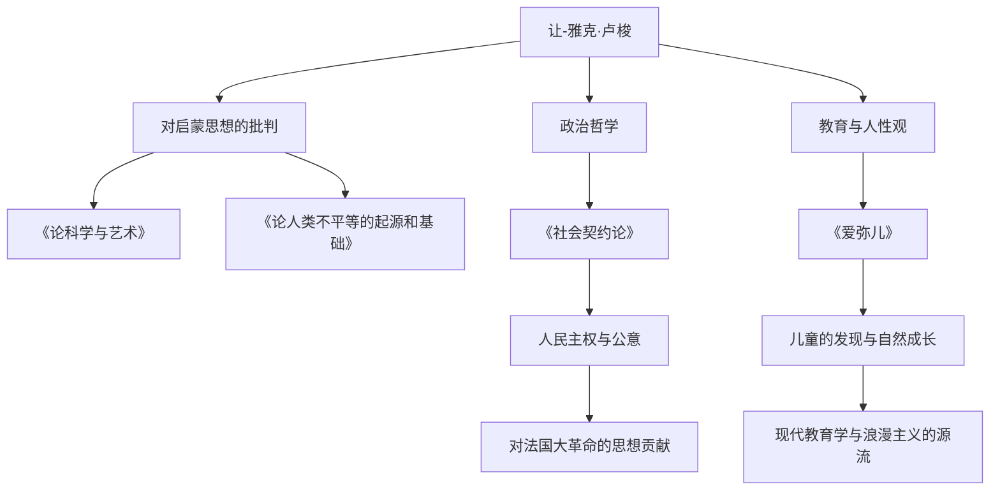

在18世纪的欧洲，当以理性至上为特征的启蒙思想盛行时，有一个人却反其道而行之，高呼“回归自然”。他就是让-雅克·卢梭（Jean-Jacques Rousseau，1712年 - 1778年）。他的思想对法国大革命产生了决定性的影响，并进一步奠定了现代教育学和浪漫主义文学的基础。在本文中，我们将深入探讨这位在孤独与流浪中不断探寻真理的卢梭的生平，以及他那至今仍在回响的深邃哲学。

## 不幸的童年与流浪的开始

卢梭于1712年出生在瑞士日内瓦共和国，是一个钟表匠的儿子。他在出生几天后就失去了母亲，10岁时，父亲因伤人事件逃亡，卢梭在亲戚的寄养下度过了不幸的童年。他曾被送去当钟表雕刻匠的学徒，但因无法忍受苛刻的对待，在16岁时逃离了故乡日内瓦。

之后，他在萨伏依地区遇到了后来庇护他的华伦夫人。她对卢梭而言如母亲一般，后来也成为了他的情人。在这一时期，他通过自学贪婪地吸收了音乐、哲学、文学等知识，不断磨砺自己的才智。

## 思想家的觉醒

卢梭的命运在1749年，即他37岁时发生了巨大转折。在前往文森城堡探望被囚禁的友人德尼·狄德罗的途中，他看到了第戎科学院的征文题目：“科学与艺术的复兴是否有助于敦化风俗？”这使他受到了强烈的启发。他提出了一个颠覆当时常识的悖论式主张：“科学和艺术的发展反而腐败了人类的道德”，并一举获奖。随着这篇《论科学与艺术》的出版，卢梭一跃成为欧洲思想界的宠儿。

## 核心哲学：“自然”与“社会”的对立

卢梭思想的核心在于：“人类生来是善良且自由的，但社会制度和私有财产的出现导致了不平等和罪恶。”这一观点在其《论人类不平等的起源和基础》（1755年）中得到了精细的论述。

1762年，他的代表作《社会契约论》和《爱弥儿》发表。在《社会契约论》中，他主张建立在“公意”（旨在实现公共利益的人民普遍意志）基础上的国家的合法性，确立了人民主权的概念。另一方面，在《爱弥儿》中，他主张教育应保护儿童免受社会恶习的侵害，顺应人类的自然发展，他也因此被称为“儿童的发现者”。

## 迫害、孤立与留给后世的巨大遗产

然而，这些划时代的著作却招致了当时体制内的强烈反对。特别是《爱弥儿》中的宗教论被视为危险，其著作在巴黎和故乡日内瓦被宣告焚毁并下达了逮捕令。为了逃避迫害，卢梭被迫流亡瑞士各地乃至英国。在英国，他受到了哲学家大卫·休谟的庇护，但因极度的被害妄想，他最终与休谟决裂。

晚年的卢梭在孤独中陷入自我辩护与反省，创作了现代自传文学的丰碑《忏悔录》和《一个孤独漫步者的遐想》。1778年，他在巴黎郊外的埃尔芒农维尔结束了波澜壮阔的一生。

让-雅克·卢梭也是一个充满矛盾的人物，他一边高谈阔论理想的教育，一边却将自己的孩子们送进孤儿院。然而，他看穿社会虚伪、极限追问“人类应有之姿”的热情，成为了他死后十年爆发的法国大革命的精神支柱。当我们理所当然地谈论“自由”、“平等”和“个人尊严”时，卢梭留下的拷问始终在其中回响。
