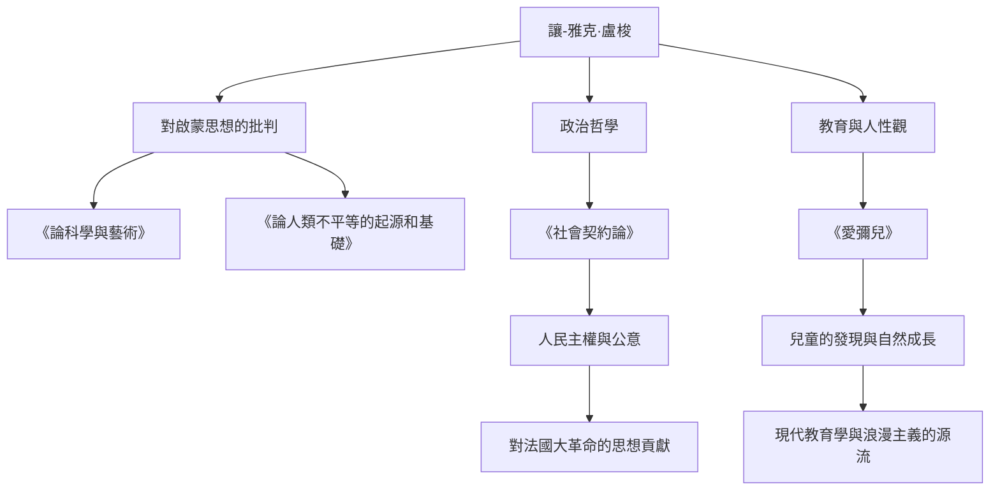

在18世紀的歐洲，當以理性至上為特徵的啟蒙思想盛行時，有一個人卻反其道而行之，高呼“回歸自然”。他就是讓-雅克·盧梭（Jean-Jacques Rousseau，1712年 - 1778年）。他的思想對法國大革命產生了決定性的影響，並進一步奠定了現代教育學和浪漫主義文學的基礎。在本文中，我們將深入探討這位在孤獨與流浪中不斷探尋真理的盧梭的生平，以及他那至今仍在迴響的深邃哲學。

## 不幸的童年與流浪的開始

盧梭於1712年出生在瑞士日內瓦共和國，是一個鐘錶匠的兒子。他在出生幾天後就失去了母親，10歲時，父親因傷人事件逃亡，盧梭在親戚的寄養下度過了不幸的童年。他曾被送去當鐘錶雕刻匠的學徒，但因無法忍受苛刻的對待，在16歲時逃離了故鄉日內瓦。

之後，他在薩伏依地區遇到了後來庇護他的華倫夫人。她對盧梭而言如母親一般，後來也成為了他的情人。在這一時期，他通過自學貪婪地吸收了音樂、哲學、文學等知識，不斷磨礪自己的才智。

## 思想家的覺醒

盧梭的命運在1749年，即他37歲時發生了巨大轉折。在前往文森城堡探望被囚禁的友人德尼·狄德羅的途中，他看到了第戎科學院的徵文題目：“科學與藝術的復興是否有助於敦化風俗？”這使他受到了強烈的啟發。他提出了一個顛覆當時常識的悖論式主張：“科學和藝術的發展反而腐敗了人類的道德”，並一舉獲獎。隨著這篇《論科學與藝術》的出版，盧梭一躍成為歐洲思想界的寵兒。

## 核心哲學：“自然”與“社會”的對立

盧梭思想的核心在於：“人類生來是善良且自由的，但社會制度和私有財產的出現導致了不平等和罪惡。”這一觀點在其《論人類不平等的起源和基礎》（1755年）中得到了精細的論述。

1762年，他的代表作《社會契約論》和《愛彌兒》發表。在《社會契約論》中，他主張建立在“公意”（旨在實現公共利益的人民普遍意志）基礎上的國家的合法性，確立了人民主權的概念。另一方面，在《愛彌兒》中，他主張教育應保護兒童免受社會惡習的侵害，順應人類的自然發展，他也因此被稱為“兒童的發現者”。

## 迫害、孤立與留給後世的巨大遺產

然而，這些劃時代的著作卻招致了當時體制內的強烈反對。特別是《愛彌兒》中的宗教論被視為危險，其著作在巴黎和故鄉日內瓦被宣告焚毀並下達了逮捕令。為了逃避迫害，盧梭被迫流亡瑞士各地乃至英國。在英國，他受到了哲學家大衛·休謨的庇護，但因極度的被害妄想，他最終與休謨決裂。

晚年的盧梭在孤獨中陷入自我辯護與反省，創作了現代自傳文學的豐碑《懺悔錄》和《一個孤獨漫步者的遐想》。1778年，他在巴黎郊外的埃爾芒農維爾結束了波瀾壯闊的一生。

讓-雅克·盧梭也是一個充滿矛盾的人物，他一邊高談闊論理想的教育，一邊卻將自己的孩子們送進孤兒院。然而，他看穿社會虛偽、極限追問“人類應有之姿”的熱情，成為了他死後十年爆發的法國大革命的精神支柱。當我們理所當然地談論“自由”、“平等”和“個人尊嚴”時，盧梭留下的拷問始終在其中迴響。
