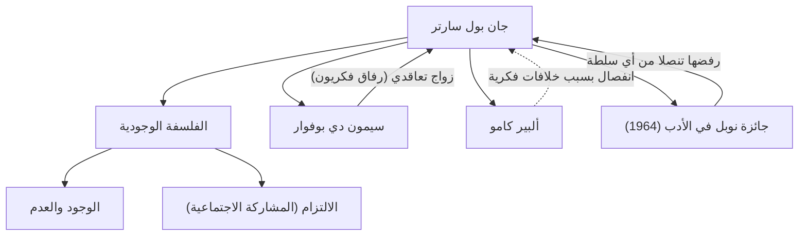

كان جان بول سارتر (1905-1980) فيلسوفاً فرنسياً بارزاً في القرن العشرين، وترك أيضاً بصمة هائلة كروائي وكاتب مسرحي وناقد. كان لفكره، المعروف بمقولة "الوجود يسبق الماهية"، تأثير قوي على عالم ما بعد الحرب وأصبح تياراً رئيسياً في الفكر المعاصر. في هذا المقال، سنتعمق في حياته، وفلسفته الفريدة، والتأثير الذي تركه على الأجيال القادمة.

## الطفولة وسنوات الدراسة: اليقظة للفلسفة

وُلد جان بول سارتر في 21 يونيو 1905 لعائلة برجوازية في باريس. فَقَد والده، الذي كان ضابطاً بحرياً، بعد فترة وجيزة من ولادته، ونشأ في منزل جده لأمه، تشارلز شفايتزر (عم الحائز على جائزة نوبل للسلام ألبرت شفايتزر). نشأ سارتر محاطاً بعدد هائل من الكتب في مكتبة جده، وانغمس في عالم الأدب والمعرفة منذ سن مبكرة. يصور عمله في سيرته الذاتية، "الكلمات"، ببراعة هوس طفولته بالكلمات المطبوعة والتركيبة النفسية المعقدة لسلوكه كطفل معجزة.

في عام 1924، التحق بمدرسة المعلمين العليا، وهي واحدة من أرقى المؤسسات الأكاديمية في فرنسا. هناك، التقى بمواهب ستقود الفكر الفرنسي لاحقاً، مثل سيمون دي بوفوار، التي أصبحت شريكة حياته ورفيقته الفكرية، وريمون آرون، وموريس ميرلو بونتي. قرر سارتر متابعة طريق الفلسفة، وطور اهتماماً خاصاً بظاهراتية هوسرل وفلسفة هايدغر. في عام 1933، ذهب للدراسة في برلين لتعلم الظاهراتية مباشرة، مما أرسى أسس نظامه الفلسفي الخاص.

## تأسيس الوجودية: "الوجود يسبق الماهية"

يتلخص جوهر فكر سارتر في مقولة "الوجود يسبق الماهية". ففي حين تُصنع أداة مثل سكين الورق لغرض (ماهية) محدد مسبقاً وهو "قطع الورق"، إلا أنه لا يوجد بالنسبة للبشر غرض أو ماهية أو إله محدد مسبقاً لتحديدهم. جادل سارتر بأن الإنسان يُلقى به أولاً في هذا العالم (يوجد)، وبعد ذلك، من خلال أفعاله وخياراته الخاصة، يخلق ماهيته الخاصة.

في عمله الرئيسي "الوجود والعدم"، الذي نُشر في عام 1943، قام بالتمييز الصارم بين الوعي البشري (الوجود لذاته) ووجود الأشياء (الوجود في ذاته)، وجادل بأن الإنسان حر تماماً. ومع ذلك، تأتي هذه الحرية مصحوبة بمسؤولية ثقيلة. تظهر عبارته "الإنسان محكوم عليه بالحرية" أخلاقيات صارمة تفيد بأنه لا يمكن للمرء أن يلوم الآخرين أو البيئة على حياته، بل يجب عليه أن يتحمل المسؤولية عن جميع خياراته.

## الالتزام والمشاركة الاجتماعية

خلال الحرب العالمية الثانية، خدم سارتر كجندي أرصاد جوية وأصبح أسير حرب لدى الألمان، لكن تم إطلاق سراحه لاحقاً. بعد الحرب، لم يكن مجرد فيلسوف منعزل في مكتبه، بل كان مثقفاً يشارك بنشاط في القضايا الاجتماعية والسياسية. وقد أطلق على ذلك اسم "الالتزام" (المشاركة الاجتماعية)، مؤكداً على أهمية استخدام حريته لتحمل المسؤولية عن وضع المجتمع والعمل من أجل التغيير.

أسس مجلة "الأزمنة الحديثة" ووقف في طليعة النشاط السياسي اليساري، معارضاً الاستعمار، وداعماً لحرب الاستقلال الجزائرية، ومحتجاً على حرب فيتنام. في بعض الأحيان، حاول دمج الماركسية والوجودية ("نقد العقل الجدلي")، مما أثار جدلاً عنيفاً. كما أن انفصاله وصراعاته الأيديولوجية مع حلفاء سابقين مثل ألبير كامو تشهد على حقيقة أنه لم يساوم أبداً على قناعاته.

## شبكة سارتر الفكرية والشخصية

يوضح الرسم البياني التالي الإنجازات الفلسفية الرئيسية لسارتر وعلاقاته المهمة.

علاقة سارتر وبوفوار مشهورة باعتبارها "زواجاً تعاقدياً"، غير مقيد بمؤسسة الزواج القائمة. مع الاعتراف بالحب الحر لكل منهما، كانت هذه العلاقة التي أعطت الأولوية لرابطتهما الفكرية بمثابة ممارسة لأسلوب حياتهما الوجودي.

بالإضافة إلى ذلك، في عام 1964، تم اختياره لجائزة نوبل في الأدب عن أعماله "الغنية بالأفكار والمفعمة بروح الحرية"، لكنه رفضها، قائلاً "يجب على الكاتب أن يرفض تحويل نفسه إلى مؤسسة". إنه حدث رمزي لموقفه بأن يكون دائماً مثقفاً حراً مستقلاً، ولا يتماشى مع أي سلطة.

## التأثير والإرث للأجيال القادمة

في 15 أبريل 1980، توفي جان بول سارتر عن عمر يناهز 74 عاماً. جمعت جنازته، التي أقيمت في مقبرة مونبارناس في باريس، حشداً من أكثر من 50000 مشيع لتوديع أحد أعظم مفكري القرن العشرين.

بعد وفاته، مع صعود البنيوية وما بعد البنيوية، كانت فلسفة سارتر التي تركز على الذات والوعي تُعتبر أحياناً عفا عليها الزمن مؤقتاً. ومع ذلك، حتى في العصر الحديث، وسط تطور التكنولوجيا وتنوع القيم، فإن السؤال الوجودي "كيف تختار وتتحمل المسؤولية عن حياتك الخاصة" لم يفقد بريقه أبداً.

لا تزال الرسالة التي تركها سارتر، "الإنسان ليس سوى ما يصنعه بنفسه"، تمنحنا الشجاعة لمواجهة حريتنا ومسؤولياتنا في عصر من عدم اليقين. مسيرته محفورة بعمق في التاريخ كدراما عظيمة لمثقف كافح من أجل توحيد الفكر والعمل.
