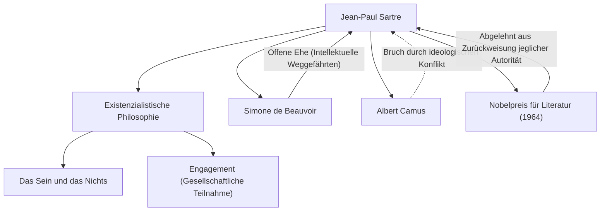

Jean-Paul Sartre (1905-1980) war ein repräsentativer Philosoph des Frankreichs des 20. Jahrhunderts, der auch als Schriftsteller, Dramatiker und Kritiker große Spuren hinterließ. Sein Denken, bekannt durch den Satz „Die Existenz geht der Essenz voraus“, hatte starke Auswirkungen auf die Nachkriegswelt und wurde zu einer großen Strömung im modernen Denken. In diesem Artikel werden wir sein Leben, seine einzigartige Philosophie und seinen Einfluss auf nachfolgende Generationen näher beleuchten.

## Von der Kindheit zur Studienzeit: Das Erwachen der Philosophie

Jean-Paul Sartre wurde am 21. Juni 1905 in einer bürgerlichen Familie in Paris geboren. Kurz nach seiner Geburt verlor er seinen Vater, einen Marineoffizier, und wuchs im Haus seines Großvaters mütterlicherseits, Charles Schweitzer (dem Onkel des Friedensnobelpreisträgers Albert Schweitzer), auf. Inmitten der riesigen Büchersammlung im Arbeitszimmer seines Großvaters vertiefte sich Sartre schon früh in die Welt der Literatur und des Wissens. Sein autobiografisches Werk „Die Wörter“ beschreibt meisterhaft diese kindliche Besessenheit vom geschriebenen Wort und seine komplexe Psychologie, als Wunderkind aufzutreten.

1924 trat er in die École Normale Supérieure ein, eine der höchsten Bildungseinrichtungen Frankreichs. Dort traf er auf Talente, die später die französische Geisteswelt anführen würden, wie Simone de Beauvoir, die später seine Lebensgefährtin und intellektuelle Weggefährtin wurde, Raymond Aron und Maurice Merleau-Ponty. Sartre entschied sich für den Weg der Philosophie und interessierte sich besonders für die Phänomenologie Husserls und die Philosophie Heideggers. 1933 studierte er in Berlin, um die Phänomenologie direkt zu erlernen und damit den Grundstein für sein eigenes philosophisches System zu legen.

## Die Etablierung des Existenzialismus: „Die Existenz geht der Essenz voraus“

Der Kern von Sartres Denken lässt sich in der These zusammenfassen: „Die Existenz geht der Essenz voraus“. Ein Werkzeug wie ein Brieföffner wird mit dem Zweck (der Essenz) hergestellt, „Papier zu schneiden“, der vorher existiert, aber für den Menschen gibt es keinen vorherbestimmten Zweck, keine Essenz und keinen Gott, der diesen festlegt. Sartre argumentierte, dass der Mensch zuerst in diese Welt geworfen wird (existiert) und erst danach durch seine eigenen Handlungen und Entscheidungen seine eigene Essenz erschafft.

In seinem 1943 veröffentlichten Hauptwerk „Das Sein und das Nichts“ unterschied er streng zwischen dem menschlichen Bewusstsein (Für-sich) und der Existenz der Dinge (An-sich) und argumentierte, dass der Mensch absolut frei ist. Diese Freiheit ist jedoch gleichzeitig mit schwerer Verantwortung verbunden. Seine Worte „Der Mensch ist verurteilt, frei zu sein“ zeigen eine strenge Ethik, wonach man nicht anderen oder der Umwelt die Schuld für sein Leben geben darf, sondern alle Entscheidungen selbst verantworten muss.

## Engagement und gesellschaftliche Teilnahme

Während des Zweiten Weltkriegs diente Sartre als Meteorologe in der Armee und geriet in deutsche Kriegsgefangenschaft, wurde aber später freigelassen. Nach dem Krieg war er nicht nur ein in seinem Arbeitszimmer eingeschlossener Philosoph, sondern ein Intellektueller, der sich aktiv an gesellschaftlichen und politischen Fragen beteiligte. Er nannte dies „Engagement (gesellschaftliche Teilnahme)“ und betonte, wie wichtig es sei, die eigene Freiheit zu nutzen, um Verantwortung für die gesellschaftliche Situation zu übernehmen und für Veränderungen zu handeln.

Er gründete die Zeitschrift „Les Temps Modernes“ und stand an vorderster Front linker politischer Aktivitäten wie der Opposition gegen den Kolonialismus, der Unterstützung des Algerienkrieges und dem Protest gegen den Vietnamkrieg. Zeitweise versuchte er, Marxismus und Existenzialismus zu integrieren („Kritik der dialektischen Vernunft“), was heftige Kontroversen auslöste. Sein ideologischer Konflikt und Bruch mit ehemaligen Verbündeten wie Albert Camus ist ebenfalls ein Beweis dafür, dass er seine eigenen Überzeugungen nie verbog.

## Sartres ideologisches und persönliches Netzwerk

Das folgende Diagramm zeigt Sartres wichtigste ideologische Errungenschaften und bedeutende Beziehungen.

Die Beziehung zwischen Sartre und Beauvoir ist berühmt als „offene Ehe (Vertragsehe)“, die nicht an das bestehende Ehesystem gebunden war. Diese Beziehung, die freie Liebe des anderen anerkannte und gleichzeitig die intellektuelle Bindung an die erste Stelle setzte, war auch eine Praxis ihres existenzialistischen Lebensstils.

Darüber hinaus wurde er 1964 für sein „geistreiches und freiheitsliebendes Werk“ für den Literaturnobelpreis ausgewählt, den er jedoch ablehnte, da er erklärte, dass „ein Schriftsteller sich weigern muss, sich in eine Institution verwandeln zu lassen“. Dies ist ein Ereignis, das seine Haltung symbolisiert, stets ein freier intellektueller Einzelner sein zu wollen, ohne sich einer Autorität zu unterwerfen.

## Einfluss auf die Nachwelt und Vermächtnis

Am 15. April 1980 verstarb Jean-Paul Sartre im Alter von 74 Jahren. An seiner Beerdigung auf dem Friedhof Montparnasse in Paris nahmen mehr als 50.000 Menschen teil, um den Tod eines der größten Intellektuellen des 20. Jahrhunderts zu betrauern und Abschied zu nehmen.

Nach seinem Tod wurde Sartres Philosophie, die das Subjekt und das Bewusstsein in den Mittelpunkt stellt, aufgrund des Aufstiegs von Strukturalismus und Poststrukturalismus vorübergehend als veraltet angesehen. Dennoch ist die existenzielle Frage, „wie man sein eigenes Leben wählt und Verantwortung dafür übernimmt“, auch heute angesichts technologischer Fortschritte und der Diversifizierung von Werten keineswegs gealtert.

Die von Sartre hinterlassene Botschaft, dass „der Mensch nichts anderes ist als das, was er aus sich selbst macht“, gibt uns weiterhin den Mut, uns in einer unsicheren Zeit unserer eigenen Freiheit und Verantwortung zu stellen. Sein Weg hat sich tief in die Geschichte eingegraben als das große Drama eines Intellektuellen, der dafür kämpfte, Denken und Handeln in Einklang zu bringen.
