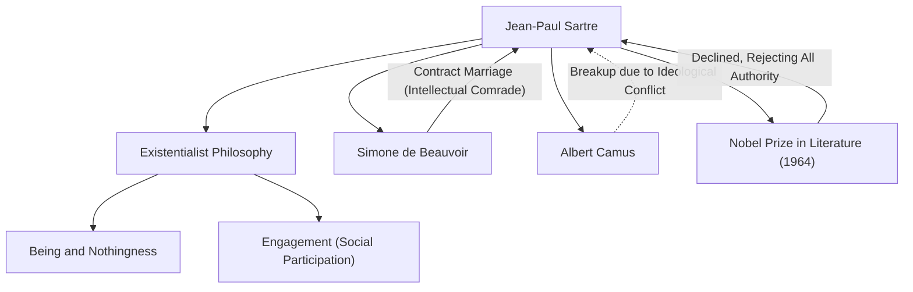

Jean-Paul Sartre (1905-1980), a philosopher representing 20th-century France, also left a massive footprint as a novelist, playwright, and critic. His thought, known by the phrase "existence precedes essence," had a profound impact on the post-war world and became a major current in modern philosophy. In this article, we delve deeply into his life, his unique philosophy, and the influence he left on future generations.

## Childhood to Student Days: Awakening to Philosophy

Jean-Paul Sartre was born on June 21, 1905, into a bourgeois family in Paris. Losing his father, a naval officer, shortly after birth, he was raised in the home of his maternal grandfather, Charles Schweitzer (uncle of Nobel Peace Prize laureate Albert Schweitzer). Surrounded by the vast collection of books in his grandfather's study, Sartre immersed himself in the world of literature and knowledge from an early age. His autobiographical work, *The Words* (*Les Mots*), brilliantly depicts his childhood obsession with the printed word and his complex psychology as he played the role of a child prodigy.

In 1924, he entered the École Normale Supérieure, one of France's most prestigious institutions of higher education. Here, he met talents who would later lead the French intellectual world, such as Simone de Beauvoir, who became his lifelong partner and intellectual comrade, Raymond Aron, and Maurice Merleau-Ponty. Sartre decided to pursue philosophy, developing a strong interest particularly in Husserl's phenomenology and Heidegger's philosophy. In 1933, he went to study in Berlin to learn phenomenology directly, thereby building the foundation of his own philosophical system.

## Establishment of Existentialism: "Existence Precedes Essence"

The core of Sartre's thought is summarized in the proposition that "existence precedes essence." A tool like a paper knife is made with a predefined purpose (essence), such as "cutting paper," but for human beings, there is no predetermined purpose or essence, nor a God to define it. Sartre argued that humans are first thrown into this world (exist), and only later create their own essence through their actions and choices.

In his magnum opus, *Being and Nothingness* (*L'Être et le néant*), published in 1943, he strictly distinguished between human consciousness (for-itself) and the existence of things (in-itself), arguing that human beings are absolutely free. However, this freedom also entails heavy responsibility. His phrase, "Man is condemned to be free," demonstrates a strict ethical view that one must not blame one's life on others or on the environment, but must take responsibility for all choices.

## Engagement and Social Participation

During World War II, Sartre served as a meteorologist and was taken prisoner by the German army, though he was later released. After the war, he became an intellectual who actively engaged in social issues and politics, rather than a philosopher confined to his study. He called this "engagement" (social participation), emphasizing the importance of taking responsibility for the social situation using one's freedom and taking action for change.

He founded the journal *Les Temps Modernes* and stood at the forefront of left-wing political activism, including opposition to colonialism, support for the Algerian War of Independence, and protests against the Vietnam War. He sometimes attempted to synthesize Marxism and existentialism (*Critique of Dialectical Reason*), which sparked fierce debates. His ideological conflicts and break with former allies like Albert Camus can be seen as evidence that he never compromised his beliefs.

## Sartre's Intellectual and Personal Network

The diagram below shows Sartre's main intellectual achievements and important relationships.

The relationship between Sartre and Beauvoir is famous as a "contract marriage" unbound by conventional marriage institutions. Prioritizing their intellectual bond while allowing mutual free romances, this relationship was an actualization of their existentialist way of life.

Also, in 1964, he was selected for the Nobel Prize in Literature for his "work which, rich in ideas and filled with the spirit of freedom," but he declined it, stating that "a writer must refuse to allow himself to be transformed into an institution." This event symbolizes his stance of always striving to be a free, independent intellectual without conforming to authority.

## Influence on Future Generations and Legacy

On April 15, 1980, Jean-Paul Sartre passed away at the age of 74. More than 50,000 people gathered for his funeral at the Montparnasse Cemetery in Paris, bidding farewell to one of the greatest intellectuals of the 20th century.

After his death, with the rise of structuralism and post-structuralism, Sartre's philosophy, which centered on the subject and consciousness, was temporarily considered outdated. However, even today, amidst the evolution of technology and the diversification of values, the existential question of "how to choose one's own life and take responsibility" has never grown old.

Sartre's message that "man is nothing else but what he makes of himself" continues to give us the courage to face our own freedom and responsibility as we live in uncertain times. His trajectory is deeply engraved in history as an epic drama of an intellectual who struggled to align his thought with his actions.
