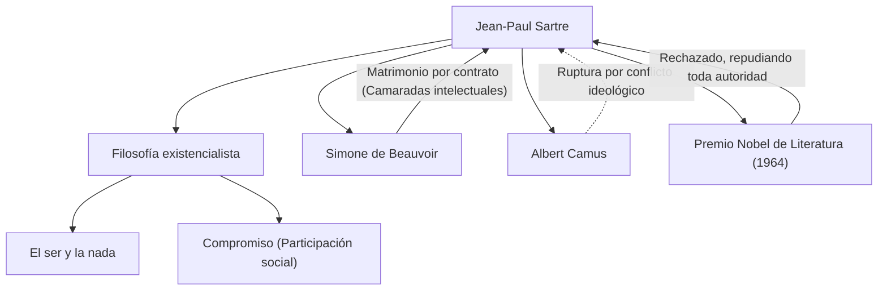

Jean-Paul Sartre (1905-1980), un filósofo que representa a la Francia del siglo XX, también dejó una huella enorme como novelista, dramaturgo y crítico. Su pensamiento, conocido por la frase "la existencia precede a la esencia", tuvo un impacto profundo en el mundo de la posguerra y se convirtió en una de las principales corrientes de la filosofía moderna. En este artículo, profundizaremos en su vida, su filosofía única y la influencia que dejó en las generaciones futuras.

## De la infancia a la época de estudiante: El despertar a la filosofía

Jean-Paul Sartre nació el 21 de junio de 1905 en el seno de una familia burguesa en París. Habiendo perdido a su padre, un oficial naval, poco después de nacer, fue criado en la casa de su abuelo materno, Charles Schweitzer (tío del premio Nobel de la Paz Albert Schweitzer). Rodeado por la vasta colección de libros en el estudio de su abuelo, Sartre se sumergió en el mundo de la literatura y el conocimiento desde una edad temprana. Su obra autobiográfica, *Las palabras* (*Les Mots*), describe brillantemente su obsesión infantil por la letra impresa y su compleja psicología al actuar como un niño prodigio.

En 1924, ingresó en la École Normale Supérieure, una de las instituciones de educación superior más prestigiosas de Francia. Allí conoció a talentos que más tarde liderarían el mundo intelectual francés, como Simone de Beauvoir, quien se convertiría en su compañera de vida y camarada intelectual, Raymond Aron y Maurice Merleau-Ponty. Sartre decidió seguir el camino de la filosofía, desarrollando un fuerte interés particularmente en la fenomenología de Husserl y en la filosofía de Heidegger. En 1933, viajó a estudiar a Berlín para aprender la fenomenología directamente, sentando así las bases de su propio sistema filosófico.

## Consolidación del existencialismo: "La existencia precede a la esencia"

El núcleo del pensamiento de Sartre se resume en la proposición de que "la existencia precede a la esencia". Una herramienta como un cortapapeles se hace con un propósito predefinido (esencia), como "cortar papel", pero para los seres humanos, no existe un propósito o esencia predeterminados, ni un Dios que lo defina. Sartre argumentó que los humanos son primero arrojados a este mundo (existen), y solo después crean su propia esencia a través de sus acciones y elecciones.

En su obra magna, *El ser y la nada* (*L'Être et le néant*), publicada en 1943, distinguió estrictamente entre la conciencia humana (para-sí) y la existencia de las cosas (en-sí), argumentando que los seres humanos son absolutamente libres. Sin embargo, esta libertad también conlleva una gran responsabilidad. Su frase, "El hombre está condenado a ser libre", demuestra una visión ética estricta de que uno no debe culpar de su vida a los demás o al entorno, sino que debe asumir la responsabilidad de todas sus elecciones.

## Compromiso y participación social

Durante la Segunda Guerra Mundial, Sartre sirvió como meteorólogo y fue tomado prisionero por el ejército alemán, aunque más tarde fue liberado. Después de la guerra, se convirtió en un intelectual que se involucró activamente en temas sociales y en la política, en lugar de un filósofo confinado en su estudio. Llamó a esto *engagement* (compromiso social), enfatizando la importancia de asumir la responsabilidad de la situación social utilizando la propia libertad y tomando medidas para el cambio.

Fundó la revista *Les Temps Modernes* (Los tiempos modernos) y se situó a la vanguardia del activismo político de izquierda, incluyendo la oposición al colonialismo, el apoyo a la Guerra de Independencia de Argelia y las protestas contra la Guerra de Vietnam. En ocasiones, intentó sintetizar el marxismo y el existencialismo (*Crítica de la razón dialéctica*), lo que desató feroces debates. Sus conflictos ideológicos y su ruptura con antiguos aliados como Albert Camus pueden verse como evidencia de que nunca comprometió sus creencias.

## Red intelectual y personal de Sartre

El siguiente diagrama muestra los principales logros intelectuales de Sartre y sus relaciones importantes.

La relación entre Sartre y Beauvoir es famosa como un "matrimonio por contrato" libre de las instituciones matrimoniales convencionales. Priorizando su vínculo intelectual mientras se permitían romances libres mutuos, esta relación fue una realización práctica de su estilo de vida existencialista.

Además, en 1964, fue seleccionado para el Premio Nobel de Literatura por "su obra, rica en ideas y llena del espíritu de libertad", pero lo rechazó afirmando que "un escritor debe negarse a permitir que lo transformen en una institución". Este evento simboliza su postura de esforzarse siempre por ser un intelectual libre e independiente sin someterse a la autoridad.

## Influencia en las generaciones futuras y legado

El 15 de abril de 1980, Jean-Paul Sartre falleció a la edad de 74 años. Más de 50.000 personas se reunieron para su funeral en el cementerio de Montparnasse en París, despidiéndose de uno de los intelectuales más grandes del siglo XX.

Después de su muerte, con el surgimiento del estructuralismo y el postestructuralismo, la filosofía de Sartre, que se centraba en el sujeto y la conciencia, fue considerada temporalmente obsoleta. Sin embargo, incluso hoy, en medio de la evolución de la tecnología y la diversificación de valores, la pregunta existencial de "cómo elegir la propia vida y asumir la responsabilidad" nunca ha envejecido.

El mensaje de Sartre de que "el hombre no es otra cosa que lo que él se hace" continúa dándonos el coraje para enfrentar nuestra propia libertad y responsabilidad mientras vivimos en tiempos inciertos. Su trayectoria está profundamente grabada en la historia como un drama épico de un intelectual que luchó por alinear su pensamiento con sus acciones.
