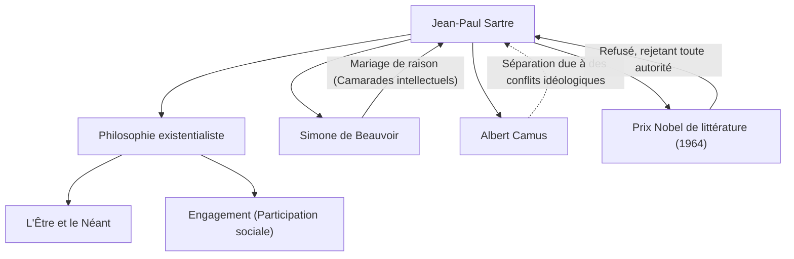

Jean-Paul Sartre (1905-1980), philosophe représentant la France du 20ème siècle, a également laissé une empreinte considérable en tant que romancier, dramaturge et critique. Sa pensée, connue par l'expression "l'existence précède l'essence", a eu un impact puissant sur le monde de l'après-guerre et est devenue un courant majeur de la pensée contemporaine. Dans cet article, nous plongerons profondément dans sa vie, sa philosophie unique et l'influence qu'il a laissée sur les générations futures.

## Enfance et années étudiantes : L'éveil à la philosophie

Jean-Paul Sartre est né le 21 juin 1905 dans une famille bourgeoise à Paris. Il a perdu son père, officier de marine, peu après sa naissance, et a été élevé dans la maison de son grand-père maternel, Charles Schweitzer (l'oncle du lauréat du prix Nobel de la paix, Albert Schweitzer). Élevé entouré d'innombrables livres dans le bureau de son grand-père, Sartre s'est plongé dans le monde de la littérature et de la connaissance dès son plus jeune âge. Son œuvre autobiographique, *Les Mots*, dépeint brillamment son obsession pour l'imprimé durant son enfance et la psychologie complexe de son comportement d'enfant prodige.

En 1924, il entre à l'École Normale Supérieure, l'une des plus prestigieuses institutions universitaires de France. Là, il rencontre des talents qui dirigeront plus tard la pensée française, tels que Simone de Beauvoir, qui deviendra sa compagne pour la vie et sa camarade intellectuelle, Raymond Aron, et Maurice Merleau-Ponty. Sartre décide de poursuivre la voie de la philosophie, développant un intérêt particulier pour la phénoménologie de Husserl et la philosophie de Heidegger. En 1933, il étudie à Berlin pour apprendre directement la phénoménologie, posant ainsi les bases de son propre système philosophique.

## L'établissement de l'existentialisme : "L'existence précède l'essence"

Le cœur de la pensée de Sartre se résume dans la proposition "l'existence précède l'essence". Un outil comme un coupe-papier est fabriqué avec le but (l'essence) de "couper du papier" préétabli, mais pour les êtres humains, il n'y a pas de but, d'essence ou de Dieu prédéterminé pour le définir. Sartre a soutenu que l'homme est d'abord jeté dans ce monde (il existe), et ensuite, par ses propres actions et choix, il crée sa propre essence.

Dans son œuvre majeure *L'Être et le Néant*, publiée en 1943, il a fait une distinction stricte entre la conscience humaine (pour-soi) et l'existence des choses (en-soi), et a soutenu que l'homme est absolument libre. Cependant, cette liberté s'accompagne simultanément d'une lourde responsabilité. Sa phrase "l'homme est condamné à être libre" montre une éthique rigoureuse selon laquelle on ne peut pas blâmer les autres ou l'environnement pour sa propre vie, mais qu'il faut assumer tous ses choix.

## Engagement et participation sociale

Pendant la Seconde Guerre mondiale, Sartre a servi comme météorologue et est devenu prisonnier de guerre des Allemands, mais il a été libéré plus tard. Après la guerre, il n'était pas seulement un philosophe confiné dans son bureau, mais un intellectuel activement impliqué dans les questions sociales et politiques. Il appelait cela l'"engagement" (participation sociale), soulignant l'importance d'utiliser sa propre liberté pour prendre la responsabilité de la situation de la société et agir pour le changement.

Il a fondé la revue *Les Temps Modernes* et s'est tenu à l'avant-garde de l'activisme politique de gauche, s'opposant au colonialisme, soutenant la guerre d'indépendance de l'Algérie et protestant contre la guerre du Vietnam. Parfois, il a tenté d'intégrer le marxisme et l'existentialisme (*Critique de la raison dialectique*), suscitant de féroces controverses. Sa séparation et ses conflits idéologiques avec d'anciens alliés comme Albert Camus témoignent du fait qu'il n'a jamais compromis ses propres convictions.

## Réseau idéologique et personnel de Sartre

Le diagramme suivant montre les principales réalisations philosophiques et les relations importantes de Sartre.

La relation entre Sartre et Beauvoir est célèbre en tant que "mariage de raison", non liée par l'institution du mariage existante. Tout en reconnaissant leurs amours libres mutuelles, cette relation qui donnait la priorité à leur lien intellectuel était aussi une pratique de leur mode de vie existentialiste.

De plus, en 1964, il a été sélectionné pour le prix Nobel de littérature pour ses "œuvres riches en idées et remplies de l'esprit de liberté jusqu'à présent", mais il l'a refusé, déclarant que "l'écrivain doit refuser de se laisser transformer en institution". C'est un événement symbolique de son attitude d'être toujours un intellectuel libre et individuel, sans s'aligner sur l'autorité.

## Influence et héritage pour les générations futures

Le 15 avril 1980, Jean-Paul Sartre est décédé à l'âge de 74 ans. Ses funérailles, qui ont eu lieu au cimetière du Montparnasse à Paris, ont rassemblé une foule de plus de 50 000 personnes en deuil, faisant leurs adieux à l'un des plus grands intellectuels du 20ème siècle.

Après sa mort, avec la montée du structuralisme et du post-structuralisme, la philosophie de Sartre qui centrait le sujet et la conscience a parfois été considérée comme temporairement dépassée. Cependant, même à l'époque contemporaine, au milieu de l'évolution de la technologie et de la diversification des valeurs, la question existentielle "comment choisir et assumer la responsabilité de sa propre vie" n'a jamais vieilli.

Le message laissé par Sartre, "l'homme n'est rien d'autre que ce qu'il se fait", continue de nous donner le courage de faire face à notre propre liberté et à nos responsabilités dans une ère d'incertitude. Sa trajectoire est profondément gravée dans l'histoire comme le grand drame d'un intellectuel luttant pour unifier pensée et action.
