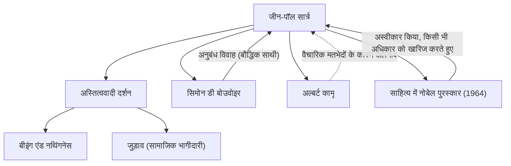

जीन-पॉल सार्त्र (1905-1980) 20वीं सदी के फ्रांस के एक प्रमुख दार्शनिक थे, जिन्होंने एक उपन्यासकार, नाटककार और आलोचक के रूप में भी एक बड़ा प्रभाव छोड़ा। उनका विचार, जिसे "अस्तित्व सार से पहले आता है" वाक्यांश से जाना जाता है, ने युद्ध के बाद की दुनिया पर एक शक्तिशाली प्रभाव डाला और समकालीन विचार की एक प्रमुख धारा बन गया। इस लेख में, हम उनके जीवन, अद्वितीय दर्शन और आने वाली पीढ़ियों पर उनके द्वारा छोड़े गए प्रभाव की गहराई में जाएंगे।

## बचपन और छात्र जीवन: दर्शन के प्रति जागृति

जीन-पॉल सार्त्र का जन्म 21 जून 1905 को पेरिस के एक बुर्जुआ परिवार में हुआ था। उनके जन्म के कुछ समय बाद ही एक नौसेना अधिकारी रहे उनके पिता का निधन हो गया, और उनका पालन-पोषण उनके नाना चार्ल्स श्वाइत्ज़र (नोबेल शांति पुरस्कार विजेता अल्बर्ट श्वाइत्ज़र के चाचा) के घर में हुआ। अपने नाना के अध्ययन कक्ष में अनगिनत किताबों से घिरे होने के कारण, सार्त्र बचपन से ही साहित्य और ज्ञान की दुनिया में डूब गए। उनकी आत्मकथात्मक कृति "शब्द" (Les Mots) बचपन में छपे हुए शब्दों के प्रति उनके जुनून और एक बाल कौतुक के रूप में व्यवहार करने के उनके जटिल मनोविज्ञान को शानदार ढंग से चित्रित करती है।

1924 में, उन्होंने फ्रांस के सबसे प्रतिष्ठित शैक्षणिक संस्थानों में से एक, इकोले नॉर्मले सुप्रीयर (École Normale Supérieure) में प्रवेश लिया। वहां उनकी मुलाकात उन प्रतिभाओं से हुई जो बाद में फ्रांसीसी विचार का नेतृत्व करेंगे, जैसे कि सिमोन डी बोउवोइर, जो उनकी आजीवन साथी और बौद्धिक कॉमरेड बनीं, रेमंड एरोन, और मौरिस मेर्लेउ-पोंटी। सार्त्र ने विशेष रूप से हुसर्ल की घटना-क्रिया-विज्ञान (phenomenology) और हाइडेगर के दर्शन में रुचि विकसित करते हुए, दर्शन के मार्ग को आगे बढ़ाने का फैसला किया। 1933 में, उन्होंने घटना-क्रिया-विज्ञान को सीधे सीखने के लिए बर्लिन में अध्ययन किया, जिससे उनके अपने दार्शनिक प्रणाली की नींव पड़ी।

## अस्तित्ववाद की स्थापना: "अस्तित्व सार से पहले आता है"

सार्त्र के विचार का मूल इस प्रस्ताव में समाहित है कि "अस्तित्व सार से पहले आता है"। पेपर नाइफ जैसे उपकरण को "कागज काटने" के पूर्व-निर्धारित उद्देश्य (सार) के साथ बनाया जाता है, लेकिन मनुष्य के लिए, उन्हें परिभाषित करने के लिए कोई पूर्व-निर्धारित उद्देश्य, सार या ईश्वर नहीं है। सार्त्र ने तर्क दिया कि मनुष्य पहले इस दुनिया में फेंका जाता है (अस्तित्व में आता है), और फिर, अपने स्वयं के कार्यों और विकल्पों के माध्यम से, वह अपना सार बनाता है।

1943 में प्रकाशित अपनी प्रमुख कृति "बीइंग एंड नथिंगनेस" में, उन्होंने मानव चेतना (अपने-लिए) और चीजों के अस्तित्व (अपने-आप में) के बीच एक सख्त अंतर किया, और तर्क दिया कि मनुष्य पूरी तरह से स्वतंत्र है। हालांकि, यह स्वतंत्रता एक साथ भारी जिम्मेदारी के साथ आती है। उनका यह कथन कि "मनुष्य स्वतंत्र होने के लिए अभिशप्त है" एक सख्त नैतिकता को दर्शाता है कि कोई व्यक्ति अपने जीवन के लिए दूसरों या पर्यावरण को दोष नहीं दे सकता है, बल्कि उसे अपने सभी विकल्पों की जिम्मेदारी लेनी चाहिए।

## जुड़ाव और सामाजिक भागीदारी

द्वितीय विश्व युद्ध के दौरान, सार्त्र ने एक मौसम विज्ञानी के रूप में कार्य किया और जर्मनों के युद्धबंदी बन गए, लेकिन बाद में उन्हें रिहा कर दिया गया। युद्ध के बाद, वह केवल अपने अध्ययन कक्ष तक सीमित रहने वाले दार्शनिक नहीं थे, बल्कि सामाजिक और राजनीतिक मुद्दों में सक्रिय रूप से शामिल एक बुद्धिजीवी बन गए। उन्होंने इसे "जुड़ाव" (engagement या सामाजिक भागीदारी) कहा, समाज की स्थिति के लिए जिम्मेदारी लेने और परिवर्तन के लिए कार्य करने के लिए अपनी स्वतंत्रता का उपयोग करने के महत्व पर जोर दिया।

उन्होंने "लेस टेम्प्स मॉडर्न्स" (आधुनिक युग) पत्रिका की स्थापना की और वामपंथी राजनीतिक सक्रियता में सबसे आगे रहे, उपनिवेशवाद का विरोध किया, अल्जीरियाई स्वतंत्रता संग्राम का समर्थन किया और वियतनाम युद्ध का विरोध किया। कभी-कभी, उन्होंने मार्क्सवाद और अस्तित्ववाद को एकीकृत करने का प्रयास किया ("द्वंद्वात्मक तर्क की आलोचना"), जिससे भयंकर विवाद पैदा हुए। अल्बर्ट कामू जैसे पूर्व सहयोगियों के साथ उनके वैचारिक टकराव और अलगाव इस बात की गवाही देते हैं कि उन्होंने कभी भी अपने विश्वासों से समझौता नहीं किया।

## सार्त्र का वैचारिक और व्यक्तिगत नेटवर्क

निम्नलिखित आरेख सार्त्र की मुख्य दार्शनिक उपलब्धियों और महत्वपूर्ण संबंधों को दर्शाता है।

सार्त्र और बोउवोइर का संबंध एक "अनुबंध विवाह" के रूप में प्रसिद्ध है, जो विवाह की मौजूदा संस्था से बंधा नहीं था। एक-दूसरे के स्वतंत्र प्रेम को स्वीकार চুক্তा स्वतंत्र प्रेम को स्वीकार करते हुए, यह संबंध जिसने उनके बौद्धिक जुड़ाव को प्राथमिकता दी, उनके अस्तित्ववादी जीवन शैली का एक अभ्यास भी था।

इसके अलावा, 1964 में, उन्हें "स्वतंत्रता की भावना से भरपूर उनके काम" के लिए साहित्य के नोबेल पुरस्कार के लिए चुना गया था, लेकिन उन्होंने इसे यह कहते हुए अस्वीकार कर दिया कि "एक लेखक को खुद को एक संस्थान में बदलने से इनकार करना चाहिए।" यह उनकी इस प्रवृत्ति की एक प्रतीकात्मक घटना है कि वे बिना किसी सत्ता के साथ जुड़े, हमेशा एक स्वतंत्र, व्यक्तिगत बुद्धिजीवी बने रहें।

## भावी पीढ़ियों के लिए प्रभाव और विरासत

15 अप्रैल, 1980 को 74 वर्ष की आयु में जीन-पॉल सार्त्र का निधन हो गया। पेरिस के मोंटपर्नासे कब्रिस्तान में आयोजित उनके अंतिम संस्कार में 50,000 से अधिक शोक मनाने वालों की भीड़ 20वीं सदी के सबसे महान बुद्धिजीवियों में से एक को विदाई देने के लिए एकत्र हुई थी।

उनकी मृत्यु के बाद, संरचनावाद और उत्तर-संरचनावाद के उदय के साथ, सार्त्र का दर्शन जिसने विषय और चेतना को केंद्र में रखा था, कभी-कभी अस्थायी रूप से पुराना माना जाता था। हालांकि, आधुनिक युग में भी, प्रौद्योगिकी के विकास और मूल्यों के विविधीकरण के बीच, अस्तित्वगत प्रश्न "अपने स्वयं के जीवन के लिए कैसे चुनाव करें और जिम्मेदारी लें" कभी पुराना नहीं हुआ है।

सार्त्र द्वारा छोड़ा गया संदेश, "मनुष्य अपने आप को जो बनाता है उसके अलावा और कुछ नहीं है," हमें अनिश्चितता के युग में अपनी स्वतंत्रता और जिम्मेदारियों का सामना करने का साहस देता रहता है। उनका सफर इतिहास में विचार और क्रिया को एकजुट करने के लिए संघर्ष करने वाले एक बुद्धिजीवी के महान नाटक के रूप में गहराई से अंकित है।
