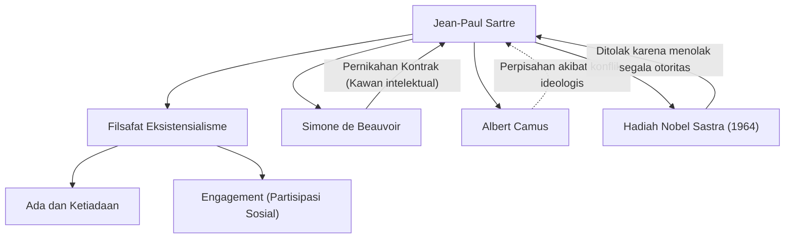

Jean-Paul Sartre (1905-1980) adalah seorang filsuf terkemuka dari Prancis abad ke-20 yang juga meninggalkan jejak besar sebagai novelis, dramawan, dan kritikus. Pemikirannya, yang dikenal dengan ungkapan "Eksistensi mendahului esensi", memberikan dampak kuat pada dunia pasca-perang dan menjadi arus besar dalam pemikiran modern. Dalam artikel ini, kita akan mendalami kehidupannya, filosofinya yang unik, serta pengaruh yang ditinggalkannya bagi generasi berikutnya.

## Dari Masa Kecil Hingga Masa Mahasiswa: Kebangkitan Menuju Filsafat

Jean-Paul Sartre lahir pada 21 Juni 1905 di sebuah keluarga borjuis di Paris. Segera setelah lahir, ia kehilangan ayahnya yang merupakan seorang perwira angkatan laut, dan dibesarkan di rumah kakek dari pihak ibu, Charles Schweitzer (paman dari pemenang Hadiah Nobel Perdamaian Albert Schweitzer). Tumbuh di kelilingi oleh banyak buku di ruang kerja kakeknya, Sartre tenggelam dalam dunia sastra dan pengetahuan sejak kecil. Karya otobiografinya yang berjudul "Kata-kata" (Les Mots) menggambarkan dengan sangat baik obsesinya terhadap tulisan di masa kecil dan psikologi rumitnya ketika bertingkah sebagai anak jenius.

Pada tahun 1924, ia mendaftar di École Normale Supérieure, salah satu institusi pendidikan tertinggi di Prancis. Di sana, ia bertemu dengan talenta-talenta yang kelak memimpin dunia pemikiran Prancis, seperti Simone de Beauvoir yang kemudian menjadi pasangan hidup dan kawan intelektualnya, Raymond Aron, dan Maurice Merleau-Ponty. Sartre memutuskan untuk menempuh jalan filsafat dan secara khusus menjadi sangat tertarik pada fenomenologi Husserl dan filsafat Heidegger. Pada tahun 1933, ia belajar di Berlin untuk mempelajari fenomenologi secara langsung, sehingga membangun dasar sistem filsafatnya sendiri.

## Pembentukan Eksistensialisme: "Eksistensi Mendahului Esensi"

Inti dari pemikiran Sartre dirangkum dalam dalil: "Eksistensi mendahului esensi". Sebuah alat seperti pembuka surat dibuat dengan tujuan (esensi) "memotong kertas" yang sudah ada lebih dulu, tetapi bagi manusia, tidak ada tujuan yang ditentukan sebelumnya, esensi, atau Tuhan yang menentukannya. Sartre berpendapat bahwa manusia pertama-tama dilemparkan ke dunia ini (bereksistensi), dan kemudian menciptakan esensinya sendiri melalui tindakan dan pilihannya sendiri.

Dalam karya utamanya yang diterbitkan pada tahun 1943, "Ada dan Ketiadaan" (L'Être et le Néant), ia secara tegas membedakan antara kesadaran manusia (untuk-dirinya sendiri) dan keberadaan benda-benda (pada-dirinya sendiri), dan berpendapat bahwa manusia adalah bebas secara mutlak. Namun, kebebasan ini disertai dengan tanggung jawab yang berat. Kata-katanya, "Manusia dihukum untuk bebas", menunjukkan pandangan etis yang ketat bahwa seseorang tidak boleh menyalahkan orang lain atau lingkungan atas hidupnya, dan harus menanggung semua pilihan yang diambilnya.

## Engagement dan Partisipasi Sosial

Selama Perang Dunia II, Sartre bertugas sebagai pengamat cuaca di angkatan darat dan menjadi tawanan tentara Jerman, tetapi kemudian dibebaskan. Setelah perang, ia bukan hanya seorang filsuf yang mengurung diri di ruang kerjanya, tetapi menjadi seorang intelektual yang secara aktif terlibat dalam masalah sosial dan politik. Ia menyebutnya sebagai "Engagement (partisipasi sosial)", dan menekankan penggunaan kebebasan sendiri untuk mengambil tanggung jawab atas situasi sosial dan bertindak demi perubahan.

Ia mendirikan majalah "Les Temps Modernes" dan berdiri di garis depan kegiatan politik sayap kiri, seperti menentang kolonialisme, mendukung Perang Kemerdekaan Aljazair, dan memprotes Perang Vietnam. Terkadang ia mencoba mengintegrasikan Marxisme dan Eksistensialisme ("Kritik atas Nalar Dialektis"), yang juga memicu kontroversi sengit. Konflik ideologis dan perpisahannya dengan mantan sekutunya seperti Albert Camus juga menjadi bukti bahwa ia tidak pernah mengkompromikan keyakinannya sendiri.

## Jaringan Ideologis dan Pribadi Sartre

Diagram di bawah ini menunjukkan pencapaian ideologis utama dan hubungan penting Sartre.

Hubungan antara Sartre dan Beauvoir terkenal sebagai "pernikahan kontrak" yang tidak terikat oleh sistem pernikahan yang ada. Hubungan yang mengakui kebebasan cinta satu sama lain sambil memprioritaskan ikatan intelektual ini juga merupakan praktik gaya hidup eksistensialis mereka.

Selain itu, pada tahun 1964, ia terpilih untuk menerima Hadiah Nobel Sastra karena "karyanya yang kaya dan penuh semangat kebebasan", tetapi ia menolaknya dengan menyatakan bahwa "seorang penulis harus menolak untuk diubah menjadi institusi publik". Ini adalah peristiwa yang melambangkan sikapnya untuk selalu berusaha menjadi seorang intelektual bebas tanpa tunduk pada otoritas apa pun.

## Pengaruh pada Generasi Berikutnya dan Warisan

Pada tanggal 15 April 1980, Jean-Paul Sartre meninggal dunia pada usia 74 tahun. Pemakamannya yang diadakan di Pemakaman Montparnasse di Paris dihadiri oleh lebih dari 50.000 pelayat, yang berkumpul untuk mengucapkan selamat tinggal kepada salah satu intelektual terbesar abad ke-20.

Setelah kematiannya, karena kebangkitan strukturalisme dan pasca-strukturalisme, filsafat Sartre yang menempatkan subjek dan kesadaran di pusat sempat dianggap ketinggalan zaman. Namun, bahkan hingga hari ini, di tengah kemajuan teknologi dan diversifikasi nilai, pertanyaan eksistensialis tentang "bagaimana memilih dan bertanggung jawab atas kehidupan diri sendiri" tidak pernah menjadi usang.

Pesan yang ditinggalkan Sartre, bahwa "Manusia bukanlah apa-apa selain dari apa yang ia jadikan dari dirinya sendiri", terus memberi kita keberanian untuk menghadapi kebebasan dan tanggung jawab kita sendiri di era yang tidak pasti. Perjalanannya terukir dalam sejarah sebagai drama epik seorang intelektual yang berjuang untuk menyelaraskan pemikiran dan tindakan.
