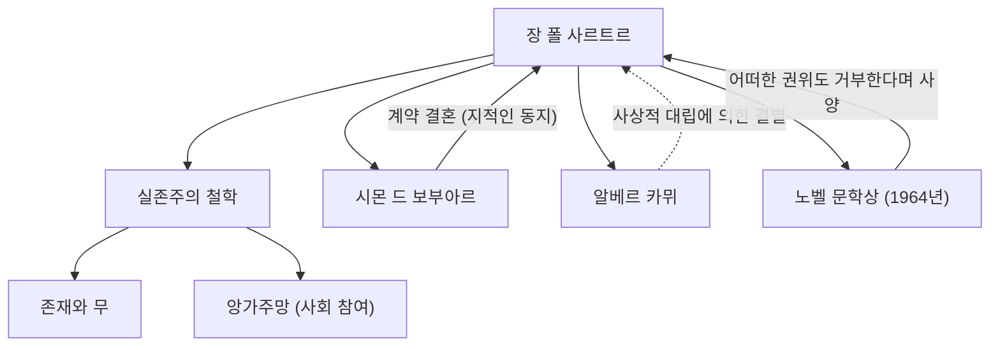

20세기 프랑스를 대표하는 철학자이자 소설가, 극작가, 평론가로서도 지대한 족적을 남긴 장 폴 사르트르(Jean-Paul Sartre, 1905-1980). "실존은 본질에 앞선다"는 말로 알려진 그의 사상은 전후 세계에 강렬한 임팩트를 주며 현대 사상의 큰 조류가 되었습니다. 본 기사에서는 그의 생애, 독자적인 철학, 그리고 후세에 미친 영향에 대해 깊이 파헤쳐 봅니다.

## 유년기부터 학생 시절: 철학에의 눈뜸

장 폴 사르트르는 1905년 6월 21일 파리의 부르주아 가정에서 태어났습니다. 생후 직후 해군 장교였던 아버지를 여의고, 외할아버지인 샤를 슈바이처(노벨 평화상 수상자 알베르트 슈바이처의 백부)의 집에서 자랐습니다. 할아버지의 서재에 있는 방대한 책들에 둘러싸여 자란 사르트르는 어릴 적부터 문학과 지식의 세계에 몰두합니다. 그의 자전적 작품 『말』에는 이 유년 시절 활자에 대한 집착과 천재 소년으로 행동하는 것에 대한 복잡한 심리가 훌륭하게 묘사되어 있습니다.

1924년, 프랑스의 최고 학부 중 하나인 에콜 노르말 슈페리외르(고등사범학교)에 입학. 여기서 그는 훗날 평생의 반려자이자 지적인 동지가 되는 시몬 드 보부아르나, 레몽 아롱, 모리스 메를로퐁티 등 훗날 프랑스 사상계를 이끌어갈 재능들과 만납니다. 사르트르는 철학의 길을 뜻에 두고, 특히 후설의 현상학과 하이데거의 철학에 강한 관심을 갖게 되었습니다. 1933년에는 베를린으로 유학하여 현상학을 직접 배움으로써 자신만의 철학 체계의 기초를 구축해 나갑니다.

## 실존주의의 확립: "실존은 본질에 앞선다"

사르트르 사상의 핵심은 "실존은 본질에 앞선다"는 명제로 집약됩니다. 페이퍼 나이프 같은 도구는 "종이를 자른다"는 목적(본질)이 먼저 있고 만들어지지만, 인간에게는 미리 정해진 목적이나 본질, 혹은 그것을 정한 신이 존재하지 않습니다. 인간은 먼저 이 세계에 내던져지고(실존하고), 그 후에 자신의 행동이나 선택에 의해 스스로의 본질을 창조해 나가는 존재라고 사르트르는 주장했습니다.

1943년에 발표된 주저 『존재와 무』에서, 그는 인간의 의식(대자)과 사물의 존재(즉자)를 엄밀히 구별하고, 인간은 절대적으로 자유롭다고 논했습니다. 그러나 이 자유는 동시에 무거운 책임을 동반합니다. "인간은 자유라는 형벌에 처해 있다"는 그의 말은, 자신의 인생을 타인이나 환경의 탓으로 돌리지 않고 모든 선택을 책임져야 한다는 엄격한 윤리관을 보여줍니다.

## 앙가주망과 사회 참여

제2차 세계대전 중, 사르트르는 기상 관측병으로 종군하여 독일군의 포로가 되지만, 나중에 풀려납니다. 전후의 그는 단지 서재에 틀어박힌 철학자가 아니라, 적극적으로 사회 문제나 정치에 관여하는 지식인이 되었습니다. 그는 이를 "앙가주망(사회 참여)"이라 부르며, 스스로의 자유를 이용하여 사회의 상황에 책임을 지고 변혁을 위해 행동하는 것을 중시했습니다.

잡지 『레 탕 모데른(현대)』을 창간하여 식민주의에 대한 반대나 알제리 독립 전쟁에 대한 지지, 베트남 전쟁에 대한 항의 등 좌파적 정치 활동의 최전선에 섰습니다. 때로는 마르크스주의와 실존주의의 통합을 시도하여(『변증법적 이성 비판』) 격렬한 논쟁을 불러일으키기도 했습니다. 알베르 카뮈 등 과거의 맹우들과의 사상적 대립과 결별도, 그가 자신의 신념을 굽히지 않았다는 증거라 할 수 있습니다.

## 사르트르의 사상적·인적 네트워크

아래 그림은 사르트르의 주요 사상적 공적과 중요한 관계성을 나타낸 것입니다.

사르트르와 보부아르의 관계는 기존의 결혼 제도에 얽매이지 않는 "계약 결혼"으로 유명합니다. 서로의 자유로운 연애를 인정하면서 지적인 유대를 최우선시하는 이 관계는 그들의 실존주의적 삶의 방식의 실천이기도 했습니다.

또한, 1964년에는 "그동안의 풍요롭고 자유의 정신이 넘치는 저작"을 이유로 노벨 문학상에 선정되지만, "작가는 공적인 기관이 되는 것을 거부해야 한다"며 이를 사양했습니다. 권위에 편승하지 않고 항상 한 개인으로서 자유로운 지식인이 되고자 했던 그의 자세를 상징하는 사건입니다.

## 후세에 미친 영향과 유산

1980년 4월 15일, 장 폴 사르트르는 74세의 나이로 세상을 떠났습니다. 파리의 몽파르나스 묘지에서 열린 장례식에는 그의 죽음을 애도하는 5만 명 이상의 군중이 모여, 20세기 최대의 지식인 중 한 명에게 작별을 고했습니다.

그의 사후, 구조주의와 포스트구조주의의 대두로 인해 주체와 의식을 중심에 두는 사르트르의 철학은 일시적으로 시대에 뒤떨어진 것으로 간주되기도 했습니다. 그러나 현대에 있어서도 기술의 진화와 가치관의 다양화 속에서 "자신의 인생을 어떻게 선택하고, 책임을 질 것인가"라는 실존적인 물음은 결코 낡지 않았습니다.

사르트르가 남긴 "인간은 스스로 창조하는 것 이외의 아무것도 아니다"라는 메시지는 불확실한 시대를 살아가는 우리들에게, 자기의 자유와 책임에 마주할 용기를 지금도 계속해서 주고 있습니다. 그의 궤적은 사상과 행동을 일치시키고자 격투했던 지식인의 장대한 드라마로서 역사에 깊이 새겨져 있습니다.
