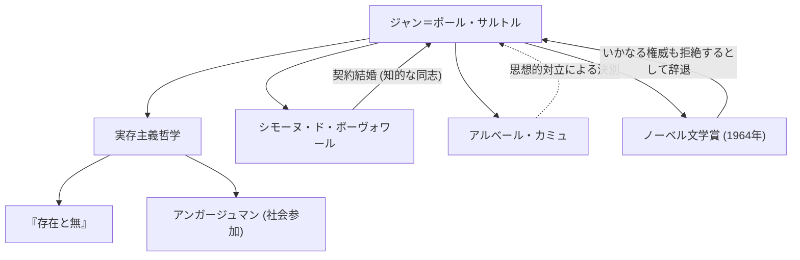

20世紀のフランスを代表する哲学者であり、小説家、劇作家、評論家としても多大な足跡を残したジャン＝ポール・サルトル（Jean-Paul Sartre, 1905-1980）。「実存は本質に先立つ」という言葉で知られる彼の思想は、戦後の世界に強烈なインパクトを与え、現代思想の大きな潮流となりました。本記事では、彼の生涯、独自の哲学、そして後世に与えた影響について深く掘り下げます。

## 幼少期から学生時代：哲学への目覚め

ジャン＝ポール・サルトルは1905年6月21日、パリのブルジョワ家庭に生まれました。生後間もなく海軍将校だった父を亡くし、母方の祖父であるシャルル・シュヴァイツァー（ノーベル平和賞受賞者アルベルト・シュヴァイツァーの伯父）の家で育てられました。祖父の書斎にある膨大な書物に囲まれて育ったサルトルは、幼い頃から文学と知識の世界に没頭します。彼の自伝的作品『言葉』には、この幼少期の活字への執着と、天才少年として振る舞うことへの複雑な心理が見事に描かれています。

1924年、フランスの最高学府の一つであるエコール・ノルマル・シュペリウール（高等師範学校）に入学。ここで彼は、後に生涯の伴侶であり知的な同志となるシモーヌ・ド・ボーヴォワールや、レイモン・アロン、モーリス・メルロー＝ポンティら、後のフランス思想界を牽引する才能たちと出会います。サルトルは哲学の道を志し、特にフッサールの現象学やハイデガーの哲学に強い関心を抱くようになりました。1933年にはベルリンへ留学し、現象学を直接学ぶことで、自身の哲学体系の基礎を築いていきます。

## 実存主義の確立：「実存は本質に先立つ」

サルトルの思想の核心は、「実存は本質に先立つ」という命題に集約されます。ペーパーナイフのような道具は、「紙を切る」という目的（本質）が先にあって作られますが、人間にはあらかじめ定められた目的や本質、あるいはそれを定めた神が存在しません。人間はまずこの世界に投げ出され（実存し）、その後で自分自身の行動や選択によって自らの本質を創り上げていく存在である、とサルトルは主張しました。

1943年に発表された主著『存在と無』において、彼は人間の意識（対自）と事物の存在（即自）を厳密に区別し、人間は絶対的に自由であると論じました。しかし、この自由は同時に重い責任を伴います。「人間は自由の刑に処せられている」という彼の言葉は、自らの人生を他者や環境のせいにせず、すべての選択を引き受けなければならないという厳しい倫理観を示しています。

## アンガージュマンと社会参加

第二次世界大戦中、サルトルは気象観測兵として従軍し、ドイツ軍の捕虜となりますが、後に解放されます。戦後の彼は、ただ書斎にこもる哲学者ではなく、積極的に社会問題や政治に関与する知識人となりました。彼はこれを「アンガージュマン（社会参加）」と呼び、自らの自由を用いて社会の状況に責任を持ち、変革のために行動することを重視しました。

雑誌『レ・タン・モデルヌ（現代）』を創刊し、植民地主義への反対やアルジェリア独立戦争への支持、ベトナム戦争への抗議など、左派的な政治活動の最前線に立ちました。時にはマルクス主義と実存主義の統合を試み（『弁証法理性批判』）、激しい論争を巻き起こすこともありました。アルベール・カミュなど、かつての盟友たちとの思想的な対立と決別も、彼が自らの信念を曲げなかった証左と言えます。

## サルトルの思想的・人的ネットワーク

以下の図は、サルトルの主な思想的功績と重要な関係性を示したものです。

サルトルとボーヴォワールの関係は、既存の結婚制度に縛られない「契約結婚」として有名です。互いの自由な恋愛を認めつつ、知的な結びつきを最優先するこの関係は、彼らの実存主義的生き方の実践でもありました。

また、1964年には「これまでの豊かで自由の精神に満ちた著作」を理由にノーベル文学賞に選出されますが、「作家は公的な機関になることを拒否しなければならない」として、これを辞退しました。権威に与することなく、常に一個人の自由な知識人であろうとした彼の姿勢を象徴する出来事です。

## 後世への影響と遺産

1980年4月15日、ジャン＝ポール・サルトルは74歳でこの世を去りました。パリのモンパルナス墓地で行われた葬儀には、彼の死を悼む5万人以上の群衆が集まり、20世紀最大の知識人の一人への別れを告げました。

彼の死後、構造主義やポスト構造主義の台頭により、主体や意識を中心に据えるサルトルの哲学は一時的に時代遅れとみなされたこともありました。しかし、現代においても、テクノロジーの進化や価値観の多様化の中で「自分自身の人生をどう選択し、責任を持つか」という実存的な問いは決して古びていません。

サルトルが残した「人間は自らが創り上げるもの以外の何者でもない」というメッセージは、不確実な時代を生きる私たちに対して、自己の自由と責任に向き合う勇気を今なお与え続けています。彼の軌跡は、思想と行動を一致させようと格闘した知識人の壮大なドラマとして、歴史に深く刻まれています。
