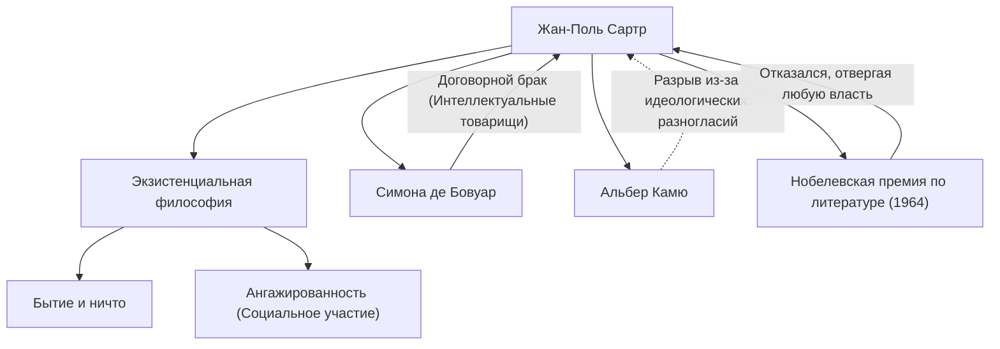

Жан-Поль Сартр (1905–1980) — выдающийся французский философ 20-го века, который также оставил значительный след как романист, драматург и критик. Его мысль, известная благодаря фразе «существование предшествует сущности», оказала сильное влияние на послевоенный мир и стала крупным течением в современной философии. В этой статье мы глубоко погрузимся в его жизнь, уникальную философию и влияние, которое он оказал на последующие поколения.

## Детство и студенческие годы: Пробуждение к философии

Жан-Поль Сартр родился 21 июня 1905 года в буржуазной семье в Париже. Вскоре после рождения он потерял отца, морского офицера, и воспитывался в доме своего деда по материнской линии, Шарля Швейцера (дяди лауреата Нобелевской премии мира Альберта Швейцера). Выросший в окружении огромного количества книг в кабинете деда, Сартр с ранних лет погрузился в мир литературы и знаний. Его автобиографическое произведение «Слова» блестяще описывает эту детскую одержимость печатным словом и сложную психологию поведения вундеркинда.

В 1924 году он поступил в Высшую нормальную школу (École Normale Supérieure), одно из лучших учебных заведений Франции. Здесь он встретил таланты, которые позже возглавят французскую философскую мысль, такие как Симона де Бовуар, ставшая его спутницей на всю жизнь и интеллектуальным товарищем, Раймон Арон и Морис Мерло-Понти. Сартр решил пойти по пути философии, проявив особый интерес к феноменологии Гуссерля и философии Хайдеггера. В 1933 году он отправился на учебу в Берлин, чтобы изучать феноменологию напрямую, закладывая тем самым основы своей собственной философской системы.

## Утверждение экзистенциализма: «Существование предшествует сущности»

Ядро мысли Сартра сводится к утверждению «существование предшествует сущности». Инструмент, такой как нож для бумаги, создается с заранее определенной целью (сущностью) — «резать бумагу», но для человека нет заранее определенной цели, сущности или Бога, который бы ее определил. Сартр утверждал, что человек сначала забрасывается в этот мир (существует), а затем своими собственными действиями и выбором создает свою собственную сущность.

В своем главном труде «Бытие и ничто», опубликованном в 1943 году, он провел строгое различие между человеческим сознанием (для-себя) и существованием вещей (в-себе) и утверждал, что человек абсолютно свободен. Однако эта свобода одновременно сопровождается тяжелой ответственностью. Его слова «человек осужден быть свободным» показывают строгую этику, согласно которой нельзя винить других или окружение за свою жизнь, а нужно принимать ответственность за все свои выборы.

## Ангажированность и социальное участие

Во время Второй мировой войны Сартр служил метеорологом, попал в плен к немцам, но позже был освобожден. После войны он стал не просто философом, запертым в своем кабинете, а интеллектуалом, активно вовлеченным в социальные и политические проблемы. Он называл это «ангажированностью» (социальным участием), подчеркивая важность использования своей свободы для того, чтобы нести ответственность за состояние общества и действовать ради перемен.

Он основал журнал «Там модерн» (Les Temps Modernes) и стоял в авангарде левого политического активизма, выступая против колониализма, поддерживая войну за независимость Алжира и протестуя против войны во Вьетнаме. Иногда он пытался объединить марксизм и экзистенциализм («Критика диалектического разума»), вызывая ожесточенные споры. Его идеологические конфликты и разрыв с бывшими союзниками, такими как Альбер Камю, также свидетельствуют о том, что он никогда не отступал от своих убеждений.

## Идеологическая и личная сеть Сартра

Следующая диаграмма показывает основные философские достижения и важные связи Сартра.

Отношения между Сартром и Бовуар знамениты как «договорной брак», не связанный существующим институтом брака. Признавая свободную любовь друг друга, эти отношения, в которых интеллектуальная связь была на первом месте, также стали практикой их экзистенциалистского образа жизни.

Кроме того, в 1964 году он был выбран лауреатом Нобелевской премии по литературе за его «богатое идеями, пронизанное духом свободы и поисками истины творчество», но отказался от нее, заявив, что «писатель должен отказаться превращаться в институт». Это символическое событие отражает его позицию всегда оставаться свободным, независимым интеллектуалом, не подчиняясь авторитетам.

## Влияние и наследие для будущих поколений

15 апреля 1980 года Жан-Поль Сартр скончался в возрасте 74 лет. На его похоронах на кладбище Монпарнас в Париже собралась толпа из более чем 50 000 скорбящих, чтобы попрощаться с одним из величайших интеллектуалов 20-го века.

После его смерти, с подъемом структурализма и постструктурализма, философия Сартра, ставившая в центр субъекта и сознание, иногда рассматривалась как временно устаревшая. Однако даже в современную эпоху, на фоне развития технологий и диверсификации ценностей, экзистенциальный вопрос «как выбирать и нести ответственность за собственную жизнь» никогда не устареет.

Послание, оставленное Сартром, «человек есть не что иное, как то, что он из себя делает», продолжает давать нам мужество встречать нашу собственную свободу и ответственность в эпоху неопределенности. Его путь глубоко запечатлен в истории как великая драма интеллектуала, боровшегося за единство мысли и действия.
