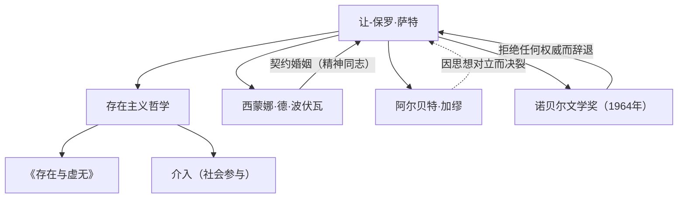

让-保罗·萨特（Jean-Paul Sartre, 1905-1980）是20世纪法国的代表性哲学家，同时作为小说家、剧作家和评论家也留下了深远的足迹。他的思想以“存在先于本质”这一名言而闻名，给战后世界带来了强烈的冲击，并成为现代思想的一大潮流。本文将深入探讨他的生平、独特的哲学以及对后世产生的影响。

## 从童年到学生时代：哲学的觉醒

让-保罗·萨特于1905年6月21日出生在巴黎的一个资产阶级家庭。出生后不久，他身为海军军官的父亲便去世了，他由外祖父查尔斯·施韦泽（诺贝尔和平奖得主阿尔贝特·施韦泽的伯父）抚养长大。在祖父书房浩瀚的藏书包围中长大的萨特，从小就沉浸在文学和知识的世界中。他的自传体作品《词语》（Les Mots）精彩地描绘了他童年时代对文字的痴迷，以及作为天才少年行事时复杂的心理。

1924年，他考入法国最高学府之一的巴黎高等师范学院。在这里，他结识了后来成为他终身伴侣和精神同志的西蒙娜·德·波伏瓦，以及雷蒙·阿隆、莫里斯·梅洛-庞蒂等后来引领法国思想界的人才。萨特立志走向哲学之路，尤其对胡塞尔的现象学和海德格尔的哲学产生了浓厚的兴趣。1933年，他前往柏林留学，直接学习现象学，从而奠定了自己哲学体系的基础。

## 存在主义的确立：“存在先于本质”

萨特思想的核心可以概括为“存在先于本质”这一命题。像裁纸刀这样的工具，是先有“裁纸”的目的（本质）才被制造出来的；但对于人类来说，并没有预先设定的目的或本质，也没有设定这一切的上帝。萨特主张，人首先是被抛入这个世界（存在），然后通过自己的行动和选择来创造自身的本质。

在1943年发表的代表作《存在与虚无》（L'Être et le néant）中，他严格区分了人的意识（自为）工事物的存在（自在），论证了人是绝对自由的。然而，这种自由同时也伴随着沉重的责任。他的名言“人类被判处了自由的徒刑”，展现了一种严厉的伦理观，即人们不能把自己的生活归咎于他人或环境，而必须承担所有的选择。

## 介入与社会参与

第二次世界大战期间，萨特作为气象观测兵服役，曾被德军俘虏，后被释放。战后的他，不再是只躲在书房里的哲学家，而是成为积极参与社会问题和政治的知识分子。他将此称为“介入”（社会参与），强调利用自己的自由对社会状况负责，并为变革而采取行动。

他创办了杂志《现代》，并站在左翼政治活动的最前沿，包括反对殖民主义、支持阿尔及利亚独立战争、抗议越南战争等。他有时试图将马克思主义和存在主义结合起来（《辩证理性批判》），这引发了激烈的争论。他与阿尔贝特·加缪等昔日盟友的思想对立与决裂，也可以看作是他坚持自己信念的证明。

## 萨特的思想与人际网络

下图展示了萨特的主要思想成就和重要人际关系。

萨特和波伏瓦的关系作为不受传统婚姻制度束缚的“契约婚姻”而闻名。他们在承认彼此自由恋爱的同时，将精神上的结合放在首位，这种关系也是他们存在主义生活方式的实践。

此外，1964年，他因“其作品思想丰富，充满自由精神”而入选诺贝尔文学奖，但他以“作家必须拒绝将自己变成一个机构”为由予以辞退。这一事件象征着他不屈从于权威、始终力求作为一个独立的自由知识分子的姿态。

## 对后世的影响与遗产

1980年4月15日，让-保罗·萨特逝世，享年74岁。在巴黎蒙帕纳斯公墓举行的葬礼上，超过五万名群众聚集在一起哀悼，向这位20世纪最伟大的知识分子之一告别。

他去世后，随着结构主义和后结构主义的兴起，萨特以主体和意识为中心的哲学一度被认为是过时的。然而，在当今时代，在科技的发展和价值观的多元化中，“如何选择自己的人生并承担责任”这一存在主义问题却从未过时。

萨特留下的“人除了自己塑造自己之外，什么都不是”的信息，至今仍在激励着生活在充满不确定性时代的我们，赋予我们面对自身自由与责任的勇气。他的轨迹作为一位努力使思想与行动一致的知识分子的壮丽戏剧，已深深铭刻在历史中。
