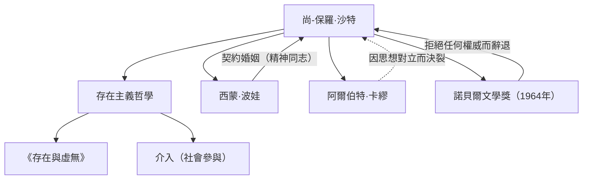

尚-保羅·沙特（Jean-Paul Sartre, 1905-1980）是20世紀法國的代表性哲學家，同時作為小說家、劇作家和評論家也留下了深遠的足跡。他的思想以「存在先於本質」這句名言而聞名，給戰後世界帶來了強烈的衝擊，並成為現代思想的一大潮流。本文將深入探討他的生平、獨特的哲學以及對後世產生的影響。

## 從童年到學生時代：哲學的覺醒

尚-保羅·沙特於1905年6月21日出生在巴黎的一個資產階級家庭。出生後不久，他身為海軍軍官的父親便去世了，他由外祖父查爾斯·史懷哲（諾貝爾和平獎得主阿爾伯特·史懷哲的伯父）撫養長大。在祖父書房浩瀚的藏書包圍中長大的沙特，從小就沉浸在文學和知識的世界中。他的自傳體作品《詞語》（Les Mots）精彩地描繪了他童年時代對文字的癡迷，以及作為天才少年行事時複雜的心理。

1924年，他考入法國最高學府之一的巴黎高等師範學院。在這裡，他結識了後來成為他終身伴侶和精神同志的西蒙·波娃，以及雷蒙·阿隆、莫里斯·梅洛-龐蒂等後來引領法國思想界的人才。沙特立志走向哲學之路，尤其對胡塞爾的現象學和海德格的哲學產生了濃厚的興趣。1933年，他前往柏林留學，直接學習現象學，從而奠定了自己哲學體系的基礎。

## 存在主義的確立：「存在先於本質」

沙特思想的核心可以概括為「存在先於本質」這一命題。像拆信刀這樣的工具，是先有「裁紙」的目的（本質）才被製造出來的；但對於人類來說，並沒有預先設定的目的或本質，也沒有設定這一切的上帝。沙特主張，人首先是被拋入這個世界（存在），然後透過自己的行動和選擇來創造自身的本質。

在1943年發表的代表作《存在與虛無》（L'Être et le néant）中，他嚴格區分了人的意識（自為）與事物的存在（自在），論證了人是絕對自由的。然而，這種自由同時也伴隨著沉重的責任。他的名言「人類被判處了自由的徒刑」，展現了一種嚴厲的倫理觀，即人們不能把自己的生活歸咎於他人或環境，而必須承擔所有的選擇。

## 介入與社會參與

第二次世界大戰期間，沙特作為氣象觀測兵服役，曾被德軍俘虜，後被釋放。戰後的他，不再是只躲在書房裡的哲學家，而是成為積極參與社會問題和政治的知識分子。他將此稱為「介入」（社會參與），強調利用自己的自由對社會狀況負責，並為變革而採取行動。

他創辦了雜誌《現代》，並站在左翼政治活動的最前線，包括反對殖民主義、支持阿爾及利亞獨立戰爭、抗議越南戰爭等。他有時試圖將馬克思主義和存在主義結合起來（《辯證理性批判》），這引發了激烈的爭論。他與阿爾伯特·卡繆等昔日盟友的思想對立與決裂，也可以看作是他堅持自己信念的證明。

## 沙特的思想與人際網絡

下圖展示了沙特的主要思想成就和重要人際關係。

沙特和波娃的關係作為不受傳統婚姻制度束縛的「契約婚姻」而聞名。他們在承認彼此自由戀愛的同時，將精神上的結合放在首位，這種關係也是他們存在主義生活方式的實踐。

此外，1964年，他因「其作品思想豐富，充滿自由精神」而入選諾貝爾文學獎，但他以「作家必須拒絕將自己變成一個機構」為由予以辭退。這一事件象徵著他不屈從於權威、始終力求作為一個獨立的自由知識分子的姿態。

## 對後世的影響與遺產

1980年4月15日，尚-保羅·沙特逝世，享壽74歲。在巴黎蒙帕納斯公墓舉行的葬禮上，超過五萬名群眾聚集在一起哀悼，向這位20世紀最偉大的知識分子之一告別。

他去世後，隨著結構主義和後結構主義的興起，沙特以主體和意識為中心的哲學一度被認為是過時的。然而，在當今時代，在科技的發展和價值觀的多元化中，「如何選擇自己的人生並承擔責任」這一存在主義問題卻從未過時。

沙特留下的「人除了自己塑造自己之外，什麼都不是」的訊息，至今仍在激勵著生活在充滿不確定性時代的我們，賦予我們面對自身自由與責任的勇氣。他的軌跡作為一位努力使思想與行動一致的知識分子的壯麗戲劇，已深深銘刻在歷史中。
