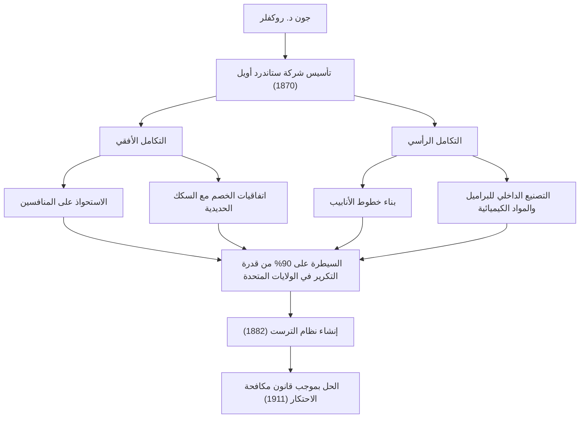
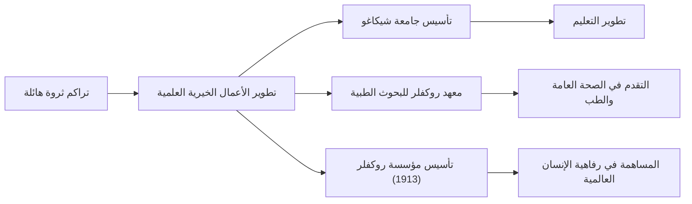

من أواخر القرن التاسع عشر إلى أوائل القرن العشرين، كانت هناك شخصية كان لها تأثير عميق ليس فقط على الولايات المتحدة ولكن على الاقتصاد العالمي. كان اسمه جون دافيسون روكفلر (John Davison Rockefeller). يُعرف على نطاق واسع باسم "ملك النفط" الذي أسس شركة ستاندرد أويل وجمع ما يُقال إنه أكبر ثروة في التاريخ من خلال احتكار ساحق. ومع ذلك، فإن عظمته الحقيقية لم تكمن ببساطة في جمع الثروة، بل في تأسيس نظام الرأسمالية الحديثة ومنهجة الأعمال الخيرية غير المسبوقة التي ستؤثر على الأجيال القادمة. في هذا المقال، سوف نتعمق في حياته المضطربة، وفلسفته التجارية الفريدة، والإرث العظيم الذي تركه للمجتمع الحديث.

## التعاليم المبكرة والهوس بدفاتر الحسابات

ولد روكفلر في ريتشفورد، نيويورك، في عام 1839، ونشأ تحت رعاية والدين متناقضين. كان والده، ويليام، بائع أدوية متجولًا يُعرف باسم "طبيب القار"، وغالبًا ما كان بعيدًا عن المنزل ويكسب لقمة عيشه بتكتيكات تجارية ماكرة. في المقابل، كانت والدته، إليزا، معمدانية متدينة غرست في ابنها بعمق روح الاجتهاد، والاقتصاد، والصدقة.

أحد أهم الدروس التي تعلمها روكفلر في طفولته هو أن "الأرقام لا تكذب". منذ صغره، كان يحمل دفتر حسابات صغيرًا يُدعى "دفتر الأستاذ أ" (Ledger A)، حيث كان يسجل دخله ونفقاته وتبرعاته حتى آخر سنت. أصبحت هذه العقلانية الشديدة والقدرة على التحليل الموضوعي بناءً على الأرقام هي الأساس لبناء إمبراطوريته الضخمة لاحقًا. في السادسة عشرة من عمره، حصل على وظيفة كمحاسب في سوق جملة للمنتجات الزراعية في كليفلاند، حيث برز بسرعة بسبب دقته واجتهاده الاستثنائيين.

## تأسيس شركة ستاندرد أويل واكتمال "الاحتكار"

في عام 1859، جلب نجاح بئر دريك النفطية في ولاية بنسلفانيا طفرة نفطية إلى الولايات المتحدة. في ذلك الوقت، كان النفط يُستخدم أساسًا ككيروسين للإضاءة، ولكن عملية التكرير كانت غير فعالة والجودة كانت غير مستقرة. رأى روكفلر فرصة هنا ودخل في مجال التكرير في عام 1863. وتجنب الطبيعة المضاربة للتنقيب وركز على السيطرة على عمليتي "التكرير" و"النقل"، اللتين ولدتا أرباحًا أكثر استقرارًا.

في عام 1870، أسس "شركة ستاندرد أويل" مع شقيقه ويليام روكفلر، وهنري فلاجلر، وآخرين. وعكس اسم "ستاندرد" (المعيار) الإيمان بتقديم منتجات موحدة وآمنة دائمًا في سوق كانت فيه الجودة غير متسقة.

كان نموذج عمله لا يرحم على الإطلاق. لقد سحق منافسيه من خلال تأمين اتفاقيات خصم سرية مع شركات السكك الحديدية، مما أدى إلى خفض تكاليف النقل بشكل كبير. واستحوذ على المنافسين الذين يعانون من أزمات مالية واحدًا تلو الآخر (التكامل الأفقي)، وفي الوقت نفسه، أنشأ نظامًا تقوم فيه شركته بكل شيء من تصنيع البراميل إلى بناء خطوط الأنابيب (التكامل الرأسي). في عام 1882، ابتكر شكلًا جديدًا للشركات يُسمى "ترست"، لاستكمال احتكار غير مسبوق يسيطر على أكثر من 90% من قدرة تكرير النفط في الولايات المتحدة.

## فلسفة روكفلر التجارية

اعتمدت الفلسفة الكامنة وراء نجاح روكفلر على عقلانية بسيطة وباردة للغاية.

1. **القضاء التام على الهدر**: كان شعاره "ألا نضيع قطرة واحدة من النفط"، وقام بتسويق جميع المنتجات الثانوية (مثل البنزين والقطران) الناتجة عن عملية التكرير.
2. **رفض المنافسة**: كان يعتقد اعتقادًا راسخًا أن "المنافسة المفرطة شر وتولد الهدر". وكان مقتنعًا بأن الاحتكار هو الطريقة الوحيدة لتعظيم الكفاءة وتزويد المستهلكين باستمرار بمنتجات رخيصة وعالية الجودة.
3. **السيطرة العاطفية الهادئة**: بغض النظر عن الأزمات أو الانتقادات التي واجهها، لم يفقد رباطة جأشه أبدًا. حافظ على صمته وواصل أعماله بهدوء بناءً على معتقداته الخاصة.

ومع ذلك، أثارت أساليبه العدوانية تدريجيًا رد فعل اجتماعي عنيف. بسبب المقالات الاستقصائية (Muckrakers) التي كتبها صحفيون مثل إيدا تاربيل، تصاعدت الانتقادات العامة، وفي عام 1911، أمرت المحكمة العليا الأمريكية بحل شركة ستاندرد أويل (التقسيم إلى 34 شركة) لانتهاكها قانون مكافحة الاحتكار. ومن المفارقات أن هذا التقسيم أدى إلى ارتفاع أسعار أسهم كل شركة، مما أدى إلى تضخم ثروة روكفلر بشكل أكبر.

## الأعمال الخيرية غير المسبوقة والإرث للأجيال القادمة

بعد تقاعده، كرس روكفلر النصف الثاني من حياته لإعادة ثروته الهائلة إلى المجتمع. جلب الأساليب المنهجية والعقلانية التي صقلها في مجال الأعمال إلى عمله الخيري، مؤسسًا المفهوم الجديد لـ "الأعمال الخيرية العلمية".

استثمر أموالاً ضخمة في تأسيس جامعة شيكاغو، ودفعها لتصبح مؤسسة بحثية ذات مستوى عالمي. كما أسس معهد روكفلر للبحوث الطبية (جامعة روكفلر الآن) وقدم مساهمات كبيرة في القضاء على الأمراض المعدية مثل الحمى الصفراء والدودة الشصية. علاوة على ذلك، في عام 1913، أسس مؤسسة روكفلر، وأطلق أنشطة دعم عالمية تهدف إلى "تعزيز رفاهية البشرية".

جون د. روكفلر هو الشخصية التي ترمز بشكل أفضل إلى نور وظل الرأسمالية الأمريكية. في حين تم انتقاده باعتباره رأسماليًا احتكاريًا قاسيًا، فقد أنقذ أيضًا أرواحًا لا حصر لها كأحد أعظم فاعلي الخير في العالم وساهم في التنمية الأكاديمية. لا تزال حياته، التي سعى فيها إلى أقصى درجات "كسب المال" و"التبرع بالمال"، تطرح أسئلة عميقة على قادة الأعمال وفاعلي الخير المعاصرين. الإرث الذي تركه لا يزال حيًا بالتأكيد في البنية التحتية للطاقة بأسعار معقولة والفوائد الطبية التي نتمتع بها اليوم.
