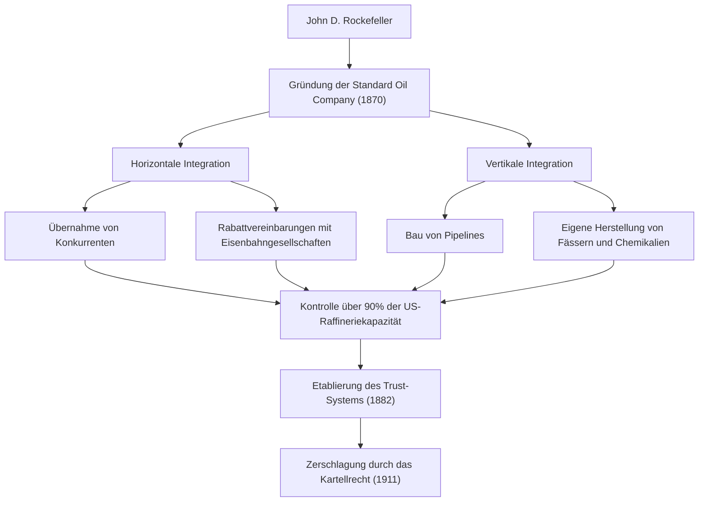
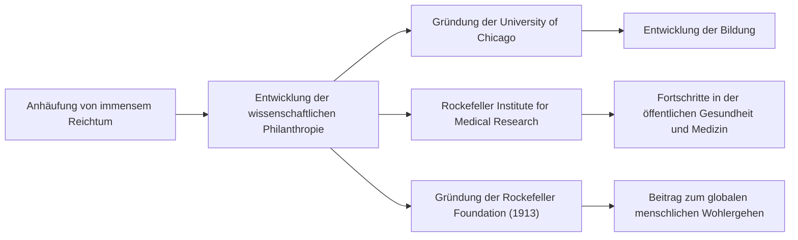

Vom späten 19. bis zum frühen 20. Jahrhundert gab es eine Person, die nicht nur die Vereinigten Staaten, sondern auch die Weltwirtschaft tiefgreifend beeinflusste. Sein Name war John Davison Rockefeller. Er gründete die Standard Oil Company und ist weithin als der "Ölkönig" bekannt, der durch sein überwältigendes Monopol ein massives Vermögen aufbaute, das oft als das größte der Geschichte bezeichnet wird. Seine wahre Größe lag jedoch nicht nur in der Anhäufung von Reichtum, sondern in der Etablierung des modernen kapitalistischen Systems und der Systematisierung beispielloser philanthropischer Bemühungen, die auch zukünftige Generationen beeinflussen sollten. In diesem Artikel werden wir tief in sein turbulentes Leben, seine einzigartige Geschäftsphilosophie und das große Erbe eintauchen, das er der modernen Gesellschaft hinterlassen hat.

## Lehren der Jugend und Obsession für das Hauptbuch

Rockefeller wurde 1839 in Richford, New York, geboren und wuchs bei Eltern auf, die ein Studium der Gegensätze waren. Sein Vater, William, war ein reisender Verkäufer, der als "Pitch Doctor" bekannt war, oft von zu Hause weg war und seinen Lebensunterhalt durch listige Geschäftspraktiken verdiente. Im Gegensatz dazu war seine Mutter, Eliza, eine fromme Baptistin, die ihrem Sohn eine tief verwurzelte Arbeitsmoral, Sparsamkeit und den Geist der Nächstenliebe einprägte.

Eine der wichtigsten Lektionen, die Rockefeller in seiner Kindheit lernte, war: "Zahlen lügen nicht." Von klein auf trug er ein kleines Buch namens "Ledger A" bei sich, in dem er jeden Cent seiner Einnahmen, Ausgaben und Spenden festhielt. Dieser strikte Rationalismus und die objektive, auf Zahlen basierende Analysefähigkeit wurden zur Grundlage für den späteren Aufbau seines riesigen Imperiums. Mit 16 Jahren begann er als Buchhalter in einem landwirtschaftlichen Großhandelsunternehmen in Cleveland zu arbeiten und tat sich durch seine außergewöhnliche Genauigkeit und seinen Fleiß schnell hervor.

## Gründung von Standard Oil und Vollendung des "Monopols"

Im Jahr 1859 erzielte die Drake-Ölquelle in Pennsylvania Erfolge und löste einen Ölboom in Amerika aus. Damals wurde Öl hauptsächlich als Kerosin für die Beleuchtung verwendet, aber der Raffinerieprozess war ineffizient und die Qualität instabil. Rockefeller erkannte diese Chance und stieg 1863 in das Raffineriegeschäft ein. Anstatt sich auf die glücksspielartige Natur des Bergbaus einzulassen, konzentrierte er sich darauf, die stabileren und profitableren Prozesse der "Raffinerie" und des "Transports" zu kontrollieren.

Im Jahr 1870 gründete er zusammen mit seinem Bruder William Rockefeller und Henry Flagler die "Standard Oil Company". Der Name "Standard" spiegelte ihre Überzeugung wider, in einem Markt, in dem die Qualität oft inkonsistent war, stets einheitliche und sichere Produkte anzubieten.

Sein Geschäftsmodell war äußerst unbarmherzig. Er schloss heimlich Rabattvereinbarungen mit Eisenbahngesellschaften ab, senkte die Transportkosten drastisch und überwältigte so seine Konkurrenten. Er übernahm nacheinander Konkurrenten, die in finanzielle Schwierigkeiten geraten waren (horizontale Integration), und baute gleichzeitig ein System auf, um von der Fassherstellung bis zum Bau von Pipelines alles intern abzuwickeln (vertikale Integration). 1882 entwarf er eine neue Unternehmensform namens "Trust" und vollendete damit ein beispielloses Monopolunternehmen, das mehr als 90 % der Ölraffineriekapazitäten in den Vereinigten Staaten kontrollierte.

## Rockefellers Geschäftsphilosophie

Die Philosophie, die Rockefellers Erfolg zugrunde lag, basierte auf einem extrem einfachen und kühlen Rationalismus.

1. **Vollständige Beseitigung von Verschwendung**: Er lebte nach dem Motto "verschwende keinen Tropfen Öl" und vermarktete alle Nebenprodukte (wie Benzin und Teer), die beim Raffinerieprozess anfielen.
2. **Ablehnung des Wettbewerbs**: Er war fest davon überzeugt, dass "übermäßiger Wettbewerb böse ist und Verschwendung erzeugt". Er glaubte fest daran, dass ein Monopol der einzige Weg war, die Effizienz zu maximieren und den Verbrauchern eine stabile Versorgung mit billigen und hochwertigen Produkten zu bieten.
3. **Ruhige und gesammelte emotionale Kontrolle**: Angesichts jeglicher Krise oder Kritik verlor er nie die Fassung. Er schwieg und führte sein Geschäft stoisch auf der Grundlage seiner Überzeugungen weiter.

Seine aggressiven Methoden stießen jedoch allmählich auf gesellschaftliche Ablehnung. Ausgelöst durch investigative Artikel von Journalisten wie Ida Tarbell (Muckrakers) wuchs die öffentliche Kritik, und 1911 ordnete der Oberste Gerichtshof der Vereinigten Staaten wegen Verstoßes gegen das Kartellrecht die Zerschlagung von Standard Oil (aufgeteilt in 34 Unternehmen) an. Ironischerweise führte diese Aufspaltung zu einem rasanten Anstieg der Aktienkurse der einzelnen Unternehmen, was Rockefellers Vermögen noch weiter ansteigen ließ.

## Beispiellose Philanthropie und Vermächtnis für zukünftige Generationen

Nach seiner Pensionierung widmete Rockefeller die zweite Hälfte seines Lebens der Rückgabe seines immensen Reichtums an die Gesellschaft. Er brachte die organisatorischen und rationalen Methoden, die er in der Wirtschaft kultiviert hatte, in seine wohltätigen Bemühungen ein und etablierte ein neues Konzept namens "wissenschaftliche Philanthropie".

Er investierte riesige Summen in die Gründung der University of Chicago und machte sie zu einer der weltweit führenden Forschungseinrichtungen. Er gründete auch das Rockefeller Institute for Medical Research (heute Rockefeller University) und leistete wichtige Beiträge zur Ausrottung von Infektionskrankheiten wie Gelbfieber und Hakenwurm-Krankheit. Darüber hinaus gründete er 1913 die Rockefeller Foundation, die globale Unterstützungsaktivitäten mit dem Ziel der "Förderung des Wohlergehens der Menschheit" ins Leben rief.

John D. Rockefeller ist eine Figur, die das Licht und den Schatten des amerikanischen Kapitalismus am stärksten symbolisiert. Während er als rücksichtsloser Monopolkapitalist kritisiert wurde, rettete er als weltgrößter Philanthrop unzählige Leben und trug zur akademischen Entwicklung bei. Sein Leben, das in den Bereichen "Geld verdienen" und "Geld geben" das Extreme anstrebte, stellt Wirtschaftsführer und Philanthropen heute noch vor tiefgreifende Fragen. Das Vermächtnis, das er hinterlassen hat, lebt zweifellos in der billigen Energieinfrastruktur und den medizinischen Vorteilen weiter, die wir heute genießen.
