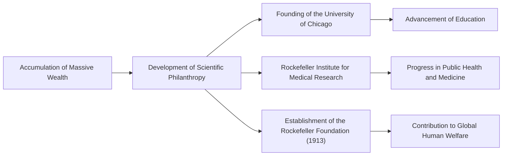

From the late 19th century to the early 20th century, there was a figure who had a massive impact not only on the United States but on the global economy. His name was John Davison Rockefeller. He is widely known as the "Oil King" who founded the Standard Oil Company and amassed an unprecedented fortune through overwhelming monopoly, often said to be the highest in history. However, his true greatness lay not just in accumulating wealth, but in establishing the system of modern capitalism and systematizing unprecedented philanthropy that continues to influence future generations. In this article, we will delve deep into his turbulent life, unique business philosophy, and the great legacy he left to modern society.

## Early Teachings and Obsession with Ledgers

Born in Richford, New York, in 1839, Rockefeller was raised by contrasting parents. His father, William, was a traveling "pitch doctor" who was often away from home and made a living through cunning business practices. In contrast, his mother, Eliza, was a devout Baptist who deeply instilled in her son the spirit of diligence, thrift, and charity.

One of the most important lessons young Rockefeller learned was that "numbers don't lie." From a young age, he carried a small notebook called "Ledger A," recording his income, expenses, and donations down to the cent. This thorough rationalism and objective analytical ability based on numbers became the foundation for building his later massive empire. Securing a job as a bookkeeper at a wholesale produce firm in Cleveland at the age of 16, he quickly distinguished himself with exceptional accuracy and diligence.

## The Founding of Standard Oil and the Completion of "Monopoly"

In 1859, the Drake Well succeeded in Pennsylvania, bringing an oil boom to America. At the time, oil was primarily used as kerosene for lighting, but the refining process was inefficient and the quality unstable. Rockefeller set his sights on this, entering the refining business in 1863. He did not touch the gambling nature of drilling, but focused on controlling the more stable and profitable processes of "refining" and "transportation."

In 1870, he founded the "Standard Oil Company" with his brother William Rockefeller, Henry Flagler, and others. The name "Standard" reflected their conviction to always provide uniform, safe products in a market where quality was inconsistent.

His business model was extremely ruthless. He overwhelmed competitors by secretly making rebate agreements with railroad companies to dramatically lower transportation costs. He successively acquired distressed rival companies (horizontal integration) while simultaneously creating a system to handle everything in-house, from manufacturing barrels to building pipelines (vertical integration). In 1882, he devised a new corporate form called a "trust," completing an unprecedented monopoly that controlled over 90% of the oil refining capacity in the United States.

## Rockefeller's Business Philosophy

The philosophy that supported Rockefeller's success was based on extremely simple and cold rationalism.

1. **Thorough Elimination of Waste**: His motto was "never waste a single drop of oil," turning all by-products from the refining process (such as gasoline and tar) into commercial products.
2. **Denial of Competition**: He firmly believed that "excessive competition is evil and breeds waste." He was convinced that monopoly was the only way to maximize efficiency and provide consumers with a stable supply of cheap, high-quality products.
3. **Calm and Collected Emotional Control**: No matter what crisis or criticism he faced, he never lost his composure. He maintained silence and calmly advanced his business based on his own beliefs.

However, these aggressive methods gradually invited societal backlash. Triggered by exposé articles by journalists like Ida Tarbell (the Muckrakers), public criticism mounted, and in 1911, the US Supreme Court ordered the dissolution of Standard Oil (split into 34 companies) for violating antitrust laws. Ironically, this breakup caused the stock prices of the individual companies to soar, further swelling Rockefeller's wealth.

## Unprecedented Philanthropy and Legacy for Future Generations

After his retirement, Rockefeller dedicated the latter half of his life to returning his massive amassed fortune to society. He brought the organizational and rational methods he cultivated in business into his philanthropic work, establishing a new concept of "scientific philanthropy."

He invested enormous funds into the founding of the University of Chicago, elevating it to a world-class research institution. He also established the Rockefeller Institute for Medical Research (now Rockefeller University), making massive contributions to the eradication of infectious diseases like yellow fever and hookworm. Furthermore, in 1913, he founded the Rockefeller Foundation, deploying global support activities aimed at "promoting the well-being of humanity."

John D. Rockefeller is a figure who most symbolizes the light and shadow of American capitalism. While criticized as a ruthless monopolistic capitalist, he saved countless lives and contributed to the advancement of learning as one of the world's largest philanthropists. His life, which pursued extremes in both "making money" and "giving money," continues to pose deep questions to modern business leaders and philanthropists. The legacy he left is certainly alive today in the cheap energy infrastructure and medical benefits we enjoy.
