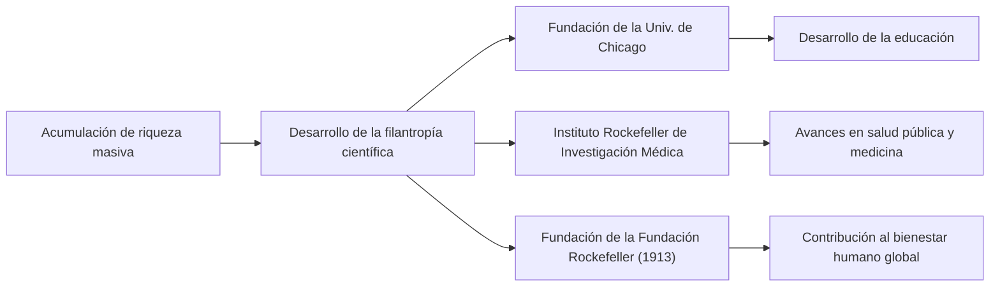

Desde finales del siglo XIX hasta principios del siglo XX, hubo una figura que tuvo un profundo impacto no solo en los Estados Unidos, sino en la economía global. Su nombre era John Davison Rockefeller. Es ampliamente conocido como el "Rey del Petróleo", quien fundó la Standard Oil Company y amasó lo que se dice es la mayor fortuna de la historia a través de un monopolio abrumador. Sin embargo, su verdadera grandeza no radicó simplemente en acumular riqueza, sino en establecer el sistema del capitalismo moderno y sistematizar una filantropía sin precedentes que influiría en las generaciones futuras. En este artículo, profundizaremos en su turbulenta vida, su filosofía empresarial única y el gran legado que dejó a la sociedad moderna.

## Enseñanzas tempranas y obsesión por los libros de contabilidad

Nacido en Richford, Nueva York, en 1839, Rockefeller creció bajo el cuidado de padres contrastantes. Su padre, William, era un vendedor ambulante de medicinas conocido como "médico de brea" (pitch doctor), que a menudo estaba fuera de casa y se ganaba la vida con tácticas comerciales astutas. En contraste, su madre, Eliza, era una bautista devota que inculcó profundamente en su hijo el espíritu de la diligencia, el ahorro y la caridad.

Una de las lecciones más importantes que Rockefeller aprendió en su infancia fue que "los números no mienten". Desde joven, llevaba un pequeño libro de contabilidad llamado "Ledger A" (Libro Mayor A), donde registraba sus ingresos, gastos y donaciones hasta el último centavo. Este racionalismo extremo y su capacidad de análisis objetivo basado en números se convirtieron en la base para construir su posterior y masivo imperio. A los 16 años, consiguió un trabajo como tenedor de libros en un mercado de productos agrícolas al por mayor en Cleveland, donde rápidamente se destacó por su extraordinaria precisión y diligencia.

## La fundación de Standard Oil y la finalización del "Monopolio"

En 1859, el éxito del pozo petrolero de Drake en Pensilvania trajo un boom petrolero a los Estados Unidos. En ese momento, el petróleo se usaba principalmente como queroseno para iluminación, pero el proceso de refinación era ineficiente y la calidad era inestable. Rockefeller vio una oportunidad aquí y entró en el negocio de la refinación en 1863. Evitó la naturaleza especulativa de la perforación y se centró en controlar los procesos de "refinación" y "transporte", que generaban ganancias más estables.

En 1870, fundó la "Standard Oil Company" junto a su hermano William Rockefeller, Henry Flagler y otros. El nombre "Standard" reflejaba la creencia de proporcionar siempre productos uniformes y seguros en un mercado donde la calidad era inconsistente.

Su modelo de negocio fue extremadamente implacable. Abrumó a sus competidores al asegurar acuerdos de reembolso secretos con compañías ferroviarias, reduciendo drásticamente los costos de transporte. Adquirió competidores en dificultades financieras uno tras otro (integración horizontal) y, al mismo tiempo, creó un sistema en el que su empresa lo hacía todo, desde la fabricación de barriles hasta la construcción de oleoductos (integración vertical). En 1882, ideó una nueva forma corporativa llamada "trust", completando un monopolio sin precedentes que controlaba más del 90% de la capacidad de refinación de petróleo en los Estados Unidos.

## La filosofía empresarial de Rockefeller

La filosofía detrás del éxito de Rockefeller se basaba en un racionalismo extremadamente simple y frío.

1. **Eliminación exhaustiva del desperdicio**: Tenía el lema de "no desperdiciar ni una gota de petróleo" y comercializaba todos los subproductos (como gasolina y alquitrán) generados en el proceso de refinación.
2. **Rechazo a la competencia**: Creía firmemente que "la competencia excesiva es mala y genera desperdicio". Estaba convencido de que el monopolio era la única forma de maximizar la eficiencia y proporcionar constantemente a los consumidores productos baratos y de alta calidad.
3. **Control emocional sereno**: No importaba qué crisis o críticas enfrentara, nunca perdía la compostura. Mantuvo su silencio y continuó con sus negocios tranquilamente basándose en sus propias creencias.

Sin embargo, sus métodos agresivos gradualmente provocaron una reacción social. Provocada por artículos de denuncia (muckrakers) de periodistas como Ida Tarbell, la crítica pública creció, y en 1911, la Corte Suprema de los EE. UU. ordenó la disolución de Standard Oil (división en 34 empresas) por violar la ley antimonopolio. Irónicamente, esta división hizo que los precios de las acciones de cada empresa se dispararan, inflando aún más la riqueza de Rockefeller.

## Filantropía sin precedentes y legado a las generaciones futuras

Después de su retiro, Rockefeller dedicó la segunda mitad de su vida a devolver su masiva fortuna a la sociedad. Llevó los métodos sistemáticos y racionales que cultivó en los negocios a su trabajo filantrópico, estableciendo el nuevo concepto de "filantropía científica".

Invirtió enormes fondos en la fundación de la Universidad de Chicago, impulsándola a convertirse en una institución de investigación de clase mundial. También estableció el Instituto Rockefeller de Investigación Médica (ahora Universidad Rockefeller) e hizo contribuciones significativas a la erradicación de enfermedades infecciosas como la fiebre amarilla y la anquilostomiasis. Además, fundó la Fundación Rockefeller en 1913, lanzando actividades de apoyo global destinadas a "promover el bienestar de la humanidad".

John D. Rockefeller es la figura que mejor simboliza la luz y la sombra del capitalismo estadounidense. Mientras fue criticado como un capitalista monopolista despiadado, también salvó innumerables vidas como uno de los filántropos más grandes del mundo y contribuyó al desarrollo académico. Su vida, en la que persiguió los extremos tanto de "hacer dinero" como de "regalar dinero", continúa planteando preguntas profundas a los líderes empresariales y filántropos modernos. El legado que dejó sin duda perdura en la infraestructura energética asequible y los beneficios médicos que disfrutamos hoy.
