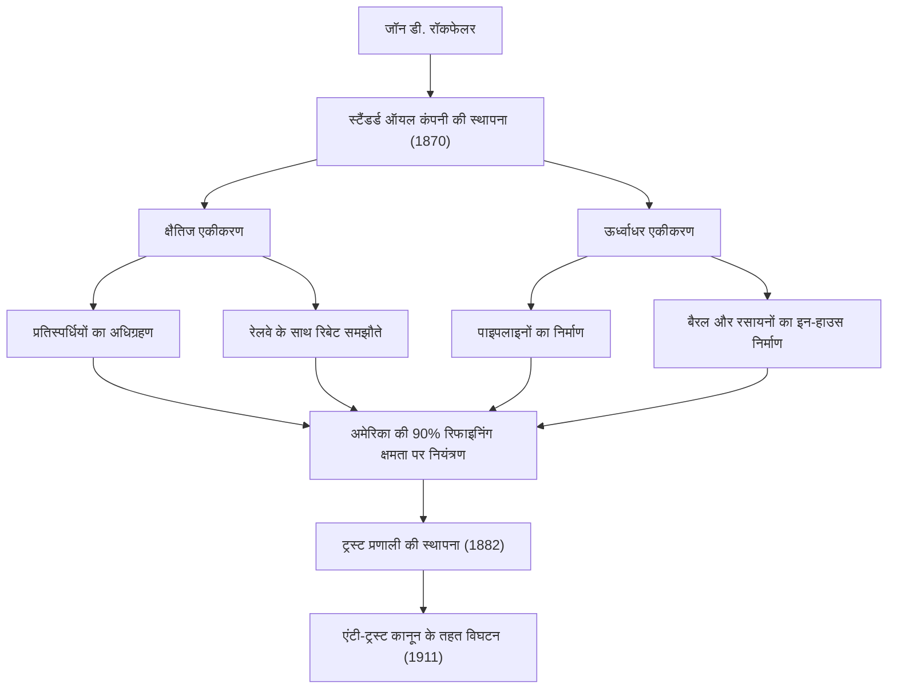
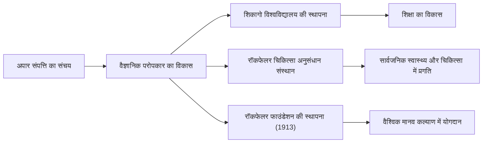

19वीं सदी के अंत और 20वीं सदी की शुरुआत में एक ऐसा व्यक्ति था जिसने न केवल संयुक्त राज्य अमेरिका बल्कि वैश्विक अर्थव्यवस्था पर गहरा प्रभाव डाला। उनका नाम जॉन डेविसन रॉकफेलर (John Davison Rockefeller) था। उन्हें व्यापक रूप से "ऑयल किंग" (Oil King) के रूप में जाना जाता है, जिन्होंने स्टैंडर्ड ऑयल कंपनी की स्थापना की और एक पूर्ण एकाधिकार के माध्यम से इतिहास की सबसे बड़ी संपत्ति अर्जित की। हालांकि, उनकी असली महानता केवल संपत्ति जमा करने में नहीं थी, बल्कि आधुनिक पूंजीवादी प्रणाली की स्थापना और एक अभूतपूर्व परोपकारी प्रणाली तैयार करने में थी जो भविष्य की पीढ़ियों को प्रभावित करेगी। इस लेख में, हम उनके उथल-पुथल भरे जीवन, उनके अनूठे व्यावसायिक दर्शन और आधुनिक समाज के लिए उनके द्वारा छोड़ी गई महान विरासत के बारे में गहराई से जानेंगे।

## शुरुआती शिक्षा और लेजर (बहीखाता) के प्रति लगाव

1839 में रिचफोर्ड, न्यूयॉर्क में जन्मे रॉकफेलर का पालन-पोषण बिल्कुल विपरीत स्वभाव वाले माता-पिता ने किया था। उनके पिता, विलियम, एक भ्रमणशील दवा विक्रेता थे, जिन्हें "पिच डॉक्टर" कहा जाता था। वे अक्सर घर से दूर रहते थे और चालाक व्यावसायिक युक्तियों से अपनी आजीविका कमाते थे। इसके विपरीत, उनकी माँ, एलिज़ा, एक धर्मनिष्ठ बैपटिस्ट थीं, जिन्होंने अपने बेटे में परिश्रम, मितव्ययता और दान की भावना को गहराई से बैठाया।

रॉकफेलर ने अपने बचपन में जो सबसे महत्वपूर्ण सबक सीखा, वह यह था कि "आंकड़े कभी झूठ नहीं बोलते।" कम उम्र से ही, वह "लेजर ए" (Ledger A) नामक एक छोटी सी खाता पुस्तिका अपने साथ रखते थे, जिसमें वह अपनी आय, व्यय और दान को एक-एक सेंट तक दर्ज करते थे। यह अत्यधिक तर्कसंगतता और संख्याओं पर आधारित उद्देश्यपूर्ण विश्लेषण ही बाद में एक विशाल साम्राज्य के निर्माण का आधार बना। 16 साल की उम्र में, उन्हें क्लीवलैंड में एक थोक कृषि उपज बाज़ार में एक बुककीपर (मुनीम) के रूप में नौकरी मिल गई, जहाँ उन्होंने अपनी असाधारण सटीकता और परिश्रम से तेज़ी से अपनी पहचान बनाई।

## स्टैंडर्ड ऑयल की स्थापना और "एकाधिकार" का पूरा होना

1859 में, पेंसिल्वेनिया में ड्रेक तेल के कुएं की सफलता ने अमेरिका में तेल की लहर ला दी। उस समय, तेल का उपयोग मुख्य रूप से रोशनी के लिए मिट्टी के तेल के रूप में किया जाता था, लेकिन रिफाइनिंग प्रक्रिया अक्षम थी और गुणवत्ता अस्थिर थी। रॉकफेलर ने यहाँ एक अवसर देखा और 1863 में रिफाइनिंग व्यवसाय में प्रवेश किया। उन्होंने ड्रिलिंग की सट्टेबाजी प्रकृति से परहेज किया और "रिफाइनिंग" और "परिवहन" प्रक्रियाओं को नियंत्रित करने पर ध्यान केंद्रित किया, जिससे अधिक स्थिर लाभ प्राप्त होता था।

1870 में, उन्होंने अपने भाई विलियम रॉकफेलर, हेनरी फ्लैगलर और अन्य लोगों के साथ "स्टैंडर्ड ऑयल कंपनी" की स्थापना की। "स्टैंडर्ड" नाम में ऐसे बाज़ार में हमेशा एक समान और सुरक्षित उत्पाद प्रदान करने का विश्वास शामिल था, जहाँ गुणवत्ता असंगत थी।

उनका बिजनेस मॉडल बेहद कठोर था। उन्होंने रेलवे कंपनियों के साथ गुप्त छूट (रिबेट) समझौते करके अपने प्रतिस्पर्धियों को पछाड़ दिया, जिससे परिवहन लागत में भारी कमी आई। उन्होंने एक के बाद एक वित्तीय संकटों से जूझ रहे प्रतिस्पर्धियों का अधिग्रहण किया (क्षैतिज एकीकरण), और साथ ही, एक ऐसी प्रणाली (ऊर्ध्वाधर एकीकरण) बनाई जिसमें उनकी कंपनी बैरल बनाने से लेकर पाइपलाइन बिछाने तक सब कुछ खुद करती थी। 1882 में, उन्होंने "ट्रस्ट" नामक एक नया कॉर्पोरेट स्वरूप तैयार किया, जिसने एक अभूतपूर्व एकाधिकार पूरा किया जो संयुक्त राज्य अमेरिका में तेल शोधन क्षमता के 90% से अधिक को नियंत्रित करता था।



## रॉकफेलर का व्यावसायिक दर्शन

रॉकफेलर की सफलता के पीछे का दर्शन अत्यंत सरल और ठंडे तर्कवाद पर आधारित था।

1. **कचरे का पूर्ण उन्मूलन**: उनका आदर्श वाक्य था "तेल की एक बूँद भी बर्बाद न करें," और उन्होंने रिफाइनिंग प्रक्रिया से उत्पन्न सभी उपोत्पादों (जैसे गैसोलीन और टार) का व्यवसायीकरण किया।
2. **प्रतिस्पर्धा की अस्वीकृति**: उनका दृढ़ विश्वास था कि "अत्यधिक प्रतिस्पर्धा बुरी है और बर्बादी पैदा करती है।" उनका मानना था कि एकाधिकार ही दक्षता को अधिकतम करने और उपभोक्ताओं को सस्ते, उच्च गुणवत्ता वाले उत्पादों की लगातार आपूर्ति करने का एकमात्र तरीका है।
3. **शांत भावनात्मक नियंत्रण**: चाहे उन्हें किसी भी संकट या आलोचना का सामना करना पड़े, उन्होंने कभी भी अपना आपा नहीं खोया। उन्होंने अपनी चुप्पी बनाए रखी और अपने विश्वासों के आधार पर शांति से अपना व्यवसाय जारी रखा।

हालाँकि, उनके आक्रामक तरीकों ने धीरे-धीरे सामाजिक आक्रोश को भड़का दिया। इडा टार्बेल जैसे पत्रकारों के खोजी लेखों (मकरैकर्स) से भड़की जनता की आलोचना बढ़ गई, और 1911 में, अमेरिकी सर्वोच्च न्यायालय ने एंटी-ट्रस्ट कानून के उल्लंघन के लिए स्टैंडर्ड ऑयल के विघटन (34 कंपनियों में विभाजन) का आदेश दिया। विडंबना यह है कि इस विभाजन के कारण प्रत्येक कंपनी के शेयर की कीमतें आसमान छूने लगीं, जिससे रॉकफेलर की संपत्ति और भी अधिक बढ़ गई।

## अभूतपूर्व परोपकार और भविष्य की पीढ़ियों के लिए विरासत

सेवानिवृत्ति के बाद, रॉकफेलर ने अपने जीवन का उत्तरार्ध अपनी अपार संपत्ति को समाज को वापस देने में समर्पित कर दिया। उन्होंने व्यापार में अपनाए गए व्यवस्थित और तर्कसंगत तरीकों को अपने परोपकारी कार्यों में भी लागू किया, जिससे "वैज्ञानिक परोपकार" की नई अवधारणा स्थापित हुई।

उन्होंने शिकागो विश्वविद्यालय की स्थापना में भारी धन का निवेश किया, जिससे वह एक विश्व स्तरीय शोध संस्थान बन गया। उन्होंने रॉकफेलर चिकित्सा अनुसंधान संस्थान (अब रॉकफेलर विश्वविद्यालय) की भी स्थापना की और पीले बुखार और हुकवर्म जैसी संक्रामक बीमारियों के उन्मूलन में महत्वपूर्ण योगदान दिया। इसके अलावा, 1913 में, उन्होंने रॉकफेलर फाउंडेशन की स्थापना की, जिसने "मानवता के कल्याण को बढ़ावा देने" के उद्देश्य से वैश्विक सहायता गतिविधियाँ शुरू कीं।



जॉन डी. रॉकफेलर एक ऐसे व्यक्ति हैं जो अमेरिकी पूंजीवाद के प्रकाश और अंधकार का सबसे अच्छा प्रतीक हैं। जहाँ एक ओर उन्हें एक निर्दयी एकाधिकारवादी पूंजीपति के रूप में आलोचना का सामना करना पड़ा, वहीं दूसरी ओर उन्होंने दुनिया के सबसे बड़े परोपकारियों में से एक के रूप में अनगिनत लोगों की जान बचाई और शैक्षणिक विकास में योगदान दिया। उनका जीवन, जिसमें उन्होंने "पैसे कमाने" और "पैसे देने" दोनों की चरम सीमाओं का पीछा किया, आधुनिक व्यापारिक नेताओं और परोपकारियों के लिए आज भी गहरे सवाल खड़े करता है। उनके द्वारा छोड़ी गई विरासत आज भी हमारे द्वारा उपभोग किए जाने वाले सस्ते ऊर्जा बुनियादी ढांचे और चिकित्सा लाभों में जीवित है।
```
