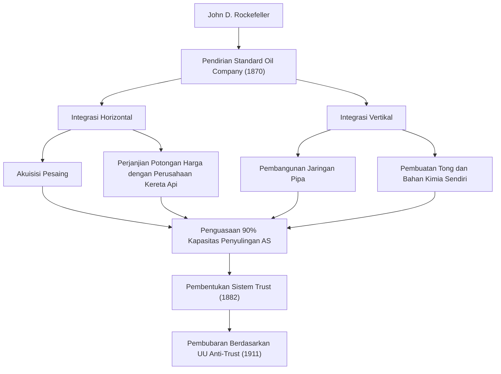
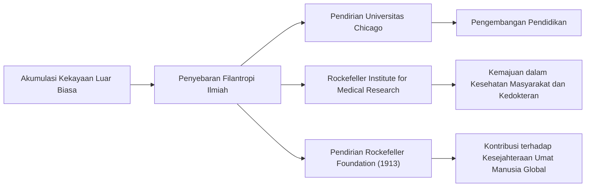

Dari akhir abad ke-19 hingga awal abad ke-20, ada seorang tokoh yang memberikan pengaruh besar tidak hanya pada Amerika Serikat tetapi juga pada ekonomi dunia. Namanya adalah John Davison Rockefeller. Ia mendirikan Standard Oil Company dan dikenal luas sebagai "Raja Minyak" yang membangun kekayaan luar biasa, sering disebut sebagai yang terbesar dalam sejarah, melalui monopoli yang luar biasa. Namun, kehebatannya yang sesungguhnya bukan hanya terletak pada akumulasi kekayaan, melainkan pada pembentukan sistem kapitalisme modern dan sistematisasi filantropi yang belum pernah ada sebelumnya yang terus memengaruhi generasi mendatang. Dalam artikel ini, kita akan menyelami kehidupannya yang penuh gejolak, filosofi bisnisnya yang unik, dan warisan besar yang ia tinggalkan untuk masyarakat modern.

## Ajaran Masa Muda dan Obsesi pada Buku Besar

Lahir di Richford, New York pada tahun 1839, Rockefeller dibesarkan oleh orang tua yang sangat bertolak belakang. Ayahnya, William, adalah seorang penjual obat keliling yang dikenal sebagai "pitch doctor", sering jauh dari rumah dan mencari nafkah melalui praktik bisnis yang licik. Sebaliknya, ibunya, Eliza, adalah seorang penganut Baptis yang taat, menanamkan semangat kerja keras, penghematan, dan filantropi yang dalam pada putranya.

Salah satu pelajaran paling penting yang dipelajari Rockefeller di masa kecilnya adalah "angka tidak berbohong". Sejak usia muda, ia membawa buku besar kecil yang disebut "Ledger A" untuk mencatat setiap sen pendapatan, pengeluaran, dan sumbangannya. Rasionalitas yang ketat dan kekuatan analitis objektif berdasarkan angka-angka inilah yang menjadi fondasi untuk membangun kerajaan raksasanya di kemudian hari. Pada usia 16 tahun, ia mulai bekerja sebagai pemegang buku di sebuah perusahaan grosir hasil pertanian di Cleveland, dan dengan cepat menonjol berkat ketepatan dan ketekunannya yang luar biasa.

## Pendirian Standard Oil dan Penyelesaian "Monopoli"

Pada tahun 1859, Sumur Minyak Drake meraih kesuksesan di Pennsylvania, memicu demam minyak di Amerika. Pada saat itu, minyak terutama digunakan sebagai minyak tanah untuk penerangan, tetapi proses penyulingannya tidak efisien dan kualitasnya tidak stabil. Rockefeller melihat peluang ini dan memasuki bisnis penyulingan pada tahun 1863. Alih-alih terlibat dalam sifat pertambangan yang seperti perjudian, ia fokus pada pengendalian proses "penyulingan" dan "transportasi" yang lebih stabil dan menguntungkan.

Pada tahun 1870, ia mendirikan "Standard Oil Company" bersama adiknya William Rockefeller dan Henry Flagler. Nama "Standard" mencerminkan keyakinan mereka untuk selalu menyediakan produk yang seragam dan aman di pasar di mana kualitas sering kali tidak konsisten.

Model bisnisnya sangat kejam. Ia secara diam-diam membuat perjanjian potongan harga dengan perusahaan kereta api, secara dramatis menurunkan biaya transportasi untuk mengalahkan para pesaingnya. Ia secara berturut-turut mengakuisisi pesaing yang menghadapi krisis keuangan (integrasi horizontal), sambil sekaligus membangun sistem untuk melakukan segalanya secara internal, mulai dari pembuatan tong hingga pembangunan jaringan pipa (integrasi vertikal). Pada tahun 1882, ia merancang bentuk perusahaan baru yang disebut "Trust", menyelesaikan sebuah perusahaan monopoli yang belum pernah terjadi sebelumnya yang mengendalikan lebih dari 90% kapasitas penyulingan minyak di seluruh Amerika Serikat.

## Filosofi Bisnis Rockefeller

Filosofi yang mendukung kesuksesan Rockefeller didasarkan pada rasionalitas yang sangat sederhana dan dingin.

1. **Penghapusan Pemborosan secara Menyeluruh**: Ia memiliki moto "jangan buang setetes minyak pun" dan mengomersialkan semua produk sampingan (seperti bensin dan tar) yang dihasilkan selama proses penyulingan.
2. **Penolakan terhadap Persaingan**: Ia sangat yakin bahwa "persaingan yang berlebihan adalah kejahatan dan menyebabkan pemborosan". Ia sangat percaya bahwa monopoli adalah satu-satunya cara untuk memaksimalkan efisiensi dan menyediakan pasokan produk yang murah dan berkualitas tinggi secara stabil bagi konsumen.
3. **Pengendalian Emosi yang Tenang dan Terkumpul**: Menghadapi krisis atau kritik apa pun, ia tidak pernah kehilangan ketenangannya. Ia tetap diam dan terus menjalankan bisnisnya berdasarkan keyakinannya.

Namun, metode agresifnya secara bertahap memicu reaksi masyarakat. Dipicu oleh artikel investigasi oleh jurnalis seperti Ida Tarbell (Muckrakers), kritik publik meningkat, dan pada tahun 1911, Mahkamah Agung Amerika Serikat memerintahkan pembubaran Standard Oil (dibagi menjadi 34 perusahaan) karena melanggar Undang-Undang Anti-Trust. Ironisnya, perpecahan ini menyebabkan harga saham masing-masing perusahaan melonjak, semakin meningkatkan kekayaan Rockefeller.

## Filantropi yang Belum Pernah Ada Sebelumnya dan Warisan untuk Generasi Mendatang

Setelah pensiun, Rockefeller mendedikasikan paruh kedua hidupnya untuk mengembalikan kekayaan besarnya kepada masyarakat. Ia membawa metode organisasi dan rasional yang ia kembangkan dalam bisnis ke dalam kegiatan amalnya, menetapkan konsep baru yang disebut "filantropi ilmiah".

Ia menginvestasikan sejumlah besar dana dalam pendirian Universitas Chicago, menjadikannya salah satu lembaga penelitian terkemuka di dunia. Ia juga mendirikan Rockefeller Institute for Medical Research (sekarang Universitas Rockefeller), memberikan kontribusi besar pada pemberantasan penyakit menular seperti demam kuning dan penyakit cacing tambang. Selain itu, pada tahun 1913, ia mendirikan Rockefeller Foundation, meluncurkan kegiatan dukungan global yang bertujuan untuk "mempromosikan kesejahteraan umat manusia".

John D. Rockefeller adalah sosok yang paling melambangkan terang dan gelapnya kapitalisme Amerika. Sementara dikritik sebagai kapitalis monopoli yang kejam, sebagai filantropis terbesar di dunia, ia menyelamatkan nyawa yang tak terhitung jumlahnya dan berkontribusi pada pengembangan akademis. Kehidupannya yang mengejar titik ekstrem dalam "menghasilkan uang" dan "memberikan uang" terus mengajukan pertanyaan mendalam bagi para pemimpin bisnis dan filantropis saat ini. Warisan yang ia tinggalkan tentu saja hidup dalam infrastruktur energi murah dan manfaat medis yang kita nikmati saat ini.
