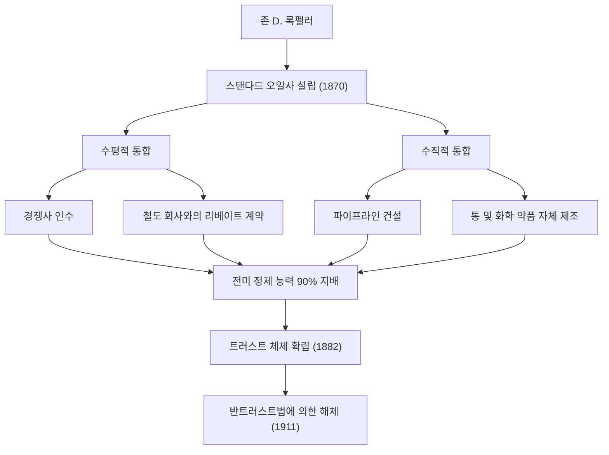
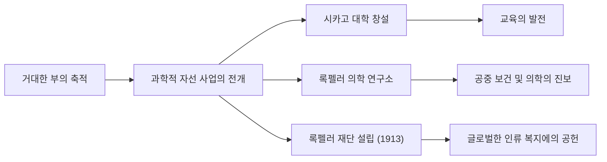

19세기 후반부터 20세기 초반에 걸쳐 미국뿐만 아니라 세계 경제에 지대한 영향을 미친 인물이 있습니다. 그의 이름은 존 데이비슨 록펠러(John Davison Rockefeller)입니다. 스탠다드 오일사를 창립하고 압도적인 독점을 통해 역사상 최고액이라고도 불리는 거대한 부를 축적한 "석유왕"으로 널리 알려져 있습니다. 그러나 그의 진정한 위대함은 단순한 부의 축적에 그치지 않고, 근대 자본주의 시스템의 확립과 후세에까지 영향을 미친 전례 없는 자선 사업의 체계화에 있었습니다. 본 기사에서는 그의 파란만장한 생애, 독자적인 비즈니스 철학, 그리고 그가 현대 사회에 남긴 위대한 유산에 대해 깊이 파헤쳐 보겠습니다.

## 젊은 시절의 가르침과 장부에 대한 집착

1839년 뉴욕주 리치포드에서 태어난 록펠러는 대조적인 부모 밑에서 자랐습니다. 아버지 윌리엄은 "피치 닥터"라고 불리는 순회 약장수로 종종 집을 비웠으며, 교활한 상술로 생계를 유지했습니다. 반대로 어머니 일라이자는 독실한 침례교도로, 근면과 절약, 그리고 자선의 정신을 아들에게 깊이 새겨주었습니다.

어린 시절 록펠러가 배운 가장 중요한 교훈 중 하나는 "숫자는 거짓말을 하지 않는다"는 것이었습니다. 그는 젊은 시절부터 "장부 A(Ledger A)"라고 불리는 작은 장부를 휴대하며 1센트 단위까지 수입과 지출, 그리고 기부금을 기록했습니다. 이 철저한 합리주의와 숫자에 기반한 객관적인 분석력이야말로 훗날 거대한 제국을 건설하는 기반이 됩니다. 16세에 클리블랜드의 농산물 도매상에 장부계로 취직한 그는 남다른 정확성과 근면함으로 금세 두각을 나타냈습니다.

## 스탠다드 오일의 창설과 "독점"의 완성

1859년, 펜실베이니아주에서 드레이크 유정이 성공을 거두며 미국에 석유 붐이 일어납니다. 당시 석유는 주로 조명용 등유로 이용되었지만, 정제 과정은 비효율적이고 품질도 불안정했습니다. 록펠러는 여기에 주목하여 1863년 정제 사업에 뛰어듭니다. 그는 채굴의 도박성에는 손대지 않고, 보다 안정적으로 이익을 창출하는 "정제"와 "운송" 과정을 지배하는 데 집중했습니다.

1870년, 그는 동생 윌리엄 록펠러 및 헨리 플래글러 등과 함께 "스탠다드 오일사"를 설립합니다. 사명인 "스탠다드(표준)"에는 품질이 일정하지 않던 당시 시장에서 항상 균일하고 안전한 제품을 제공하겠다는 신념이 담겨 있었습니다.

그의 비즈니스 모델은 극도로 가혹했습니다. 철도 회사와 비밀리에 리베이트 계약을 맺어 운송 비용을 극적으로 낮춤으로써 경쟁자를 압도했습니다. 경영 위기에 빠진 경쟁사를 차례로 인수하고(수평적 통합), 동시에 통 제조부터 파이프라인 건설까지 모든 것을 자체적으로 해결하는 체제(수직적 통합)를 구축했습니다. 1882년에는 "트러스트"라는 새로운 기업 형태를 고안하여 전미 석유 정제 능력의 90% 이상을 지배하는 전대미문의 독점 기업을 완성했습니다.

## 록펠러의 비즈니스 철학

록펠러의 성공을 뒷받침한 철학은 지극히 단순하고 냉철한 합리주의에 기반을 두고 있었습니다.

1. **낭비의 철저한 배제**: 그는 "기름 한 방울도 낭비하지 않는다"를 신조로 삼아 정제 과정에서 나오는 부산물(가솔린이나 타르 등)을 모두 제품화했습니다.
2. **경쟁의 부정**: 그는 "과당 경쟁은 악이며 낭비를 낳는다"고 확신했습니다. 독점이야말로 효율을 극대화하고 소비자에게 저렴하고 질 좋은 제품을 안정적으로 공급하는 유일한 길이라고 굳게 믿었습니다.
3. **냉정 침착한 감정 통제**: 어떠한 위기나 비난에 직면해도 그는 결코 동요하지 않았습니다. 침묵을 지키며 자신의 신념에 따라 묵묵히 사업을 추진했습니다.

그러나 그 강압적인 수법은 점차 사회의 반발을 불러일으켰습니다. 저널리스트 아이다 타벨 등의 고발 기사(머크레이커스)를 계기로 여론의 비판이 거세졌고, 1911년 미국 연방 대법원은 반트러스트법 위반으로 스탠다드 오일의 해체(34개사로 분할)를 명했습니다. 아이러니하게도 이 분할로 인해 각 회사의 주가가 폭등하여 록펠러의 자산은 더욱 부풀어 오르게 됩니다.

## 전례 없는 자선 사업과 후세에 남긴 유산

은퇴 후의 록펠러는 자신이 구축한 거대한 부를 사회에 환원하는 데 인생의 후반부를 바쳤습니다. 그는 비즈니스에서 배양한 조직적이고 합리적인 수법을 자선 사업에도 도입하여 "과학적 자선"이라는 새로운 개념을 확립했습니다.

그는 시카고 대학 창설에 막대한 자금을 투입하여 이 대학을 세계 최고 수준의 연구 기관으로 끌어올렸습니다. 또한 록펠러 의학 연구소(현재의 록펠러 대학)를 설립하여 황열병이나 구충병 등의 감염병 퇴치에 다대한 공헌을 했습니다. 나아가 1913년에는 록펠러 재단을 설립하여 "인류 복지 증진"을 목적으로 한 글로벌한 지원 활동을 전개했습니다.

존 D. 록펠러는 미국 자본주의의 빛과 그림자를 가장 잘 상징하는 인물입니다. 냉혹한 독점 자본가로 비판받는 한편, 세계 최대 규모의 자선가로서 셀 수 없이 많은 인명을 구하고 학문의 발전에 기여했습니다. "돈을 버는 것"과 "돈을 주는 것", 그 양쪽에서 극한을 추구한 그의 생애는 현대의 비즈니스 리더나 자선가들에게도 깊은 질문을 계속해서 던지고 있습니다. 그가 남긴 유산은 오늘날 우리가 누리고 있는 저렴한 에너지 인프라나 의학의 혜택 속에 확실히 숨 쉬고 있습니다.
