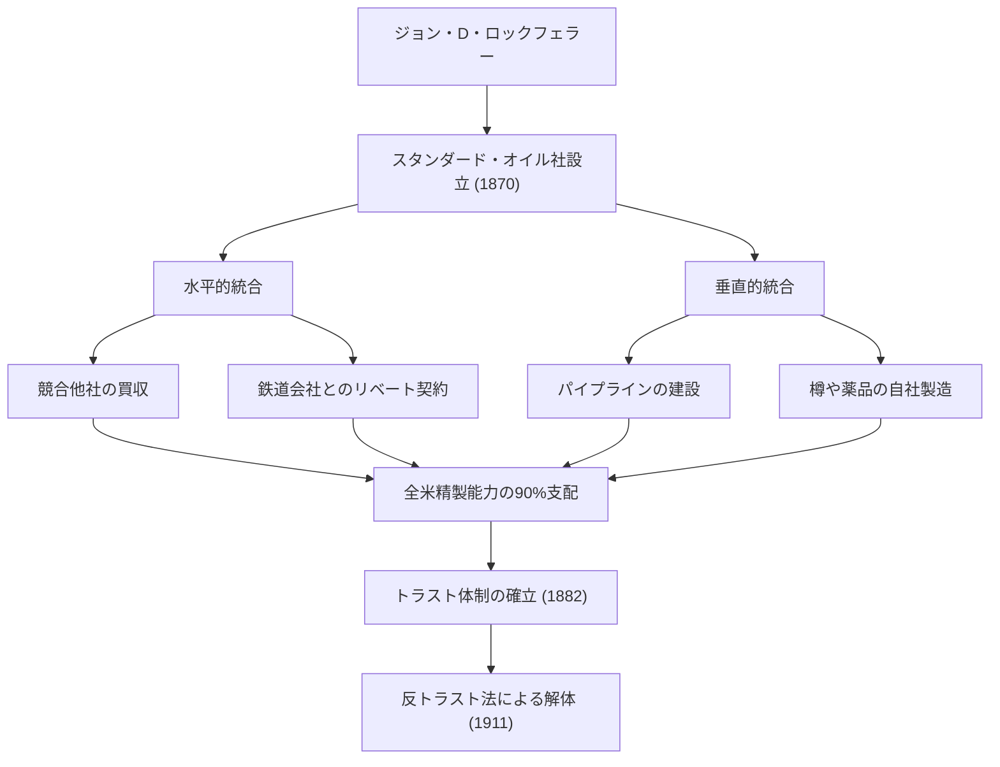
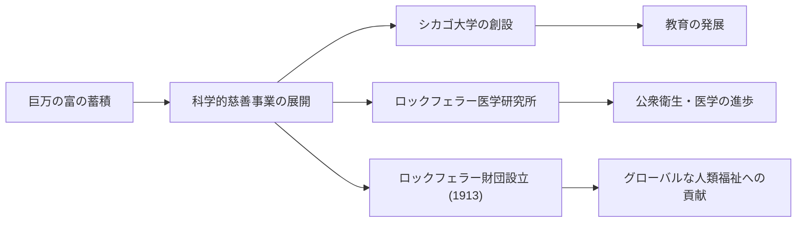

19世紀後半から20世紀初頭にかけて、アメリカ合衆国のみならず世界経済に多大な影響を与えた人物がいます。その名はジョン・デイビソン・ロックフェラー（John Davison Rockefeller）。スタンダード・オイル社を創設し、圧倒的な独占によって史上最高額とも言われる巨万の富を築き上げた「石油王」として広く知られています。しかし、彼の真の凄さは単なる富の蓄積にとどまらず、近代資本主義のシステムの確立や、後世にまで影響を及ぼす前代未聞の慈善事業の体系化にありました。本記事では、彼の波乱に満ちた生涯、独自のビジネス哲学、そして彼が現代社会に残した大いなる遺産について深く掘り下げていきます。

## 若き日の教えと帳簿への執着

1839年、ニューヨーク州リッチフォードで生まれたロックフェラーは、対照的な両親のもとで育ちました。父親ウィリアムは「ピッチ・ドクター」と呼ばれる巡回薬売りで、しばしば家を空け、狡猾な商法で生計を立てていました。対照的に、母親イライザは敬虔なバプテスト派の教徒であり、勤勉と節約、そして慈善の精神を息子に深く刻み込みました。

幼少期のロックフェラーが学んだ最も重要な教訓の一つは「数字は嘘をつかない」ということでした。彼は若い頃から「台帳Ａ（Ledger A）」と呼ばれる小さな帳簿を携帯し、1セント単位で収入と支出、そして寄付を記録していました。この徹底した合理主義と数字に基づく客観的な分析力こそが、後の巨大帝国を築き上げる基盤となります。16歳でクリーブランドの農産物問屋に簿記係として就職した彼は、並外れた正確さと勤勉さでたちまち頭角を現しました。

## スタンダード・オイルの創設と「独占」の完成

1859年、ペンシルベニア州でドレーク油井が成功を収め、アメリカに石油ブームが到来します。当時、石油は主に照明用の灯油として利用されていましたが、精製過程は非効率で品質も不安定でした。ロックフェラーはここに目をつけ、1863年に精製事業に参入します。彼は採掘のギャンブル性には手を出さず、より安定して利益を生む「精製」と「輸送」のプロセスを支配することに集中しました。

1870年、彼は弟のウィリアム・ロックフェラーやヘンリー・フラグラーらと共に「スタンダード・オイル社」を設立します。社名の「スタンダード（標準）」には、品質が一定しない当時の市場において、常に均一で安全な製品を提供するという信念が込められていました。

彼のビジネスモデルは苛烈を極めました。鉄道会社と秘密裏にリベート契約を結び、輸送コストを劇的に下げることで競争相手を圧倒。経営危機に陥った競合他社を次々と買収し（水平的統合）、同時に樽の製造からパイプラインの建設まで全てを自社で行う体制（垂直的統合）を作り上げました。1882年には「トラスト」という新たな企業形態を考案し、全米の石油精製能力の90%以上を支配する前代未聞の独占企業を完成させました。

## ロックフェラーのビジネス哲学

ロックフェラーの成功を支えた哲学は、極めてシンプルかつ冷徹な合理主義に基づいていました。

1. **無駄の徹底的排除**：彼は「1滴の油も無駄にしない」ことをモットーとし、精製過程で出る副産物（ガソリンやタールなど）を全て製品化しました。
2. **競争の否定**：彼は「過当競争は悪であり、無駄を生む」と確信していました。独占こそが効率を最大化し、消費者に安価で質の高い製品を安定供給する唯一の道だと信じて疑いませんでした。
3. **冷静沈着な感情統制**：いかなる危機や非難に直面しても、彼は決して取り乱すことはありませんでした。沈黙を守り、自らの信念に基づいて淡々と事業を進めました。

しかし、その強引な手法は次第に社会の反発を招きます。ジャーナリストのイーダ・ターベルらによる告発記事（マックレイカーズ）をきっかけに世論の批判が高まり、1911年、合衆国最高裁判所は反トラスト法違反でスタンダード・オイルの解体（34社への分割）を命じました。皮肉なことに、この分割によって各社の株価が高騰し、ロックフェラーの資産はさらに膨れ上がることになります。

## 前例のない慈善事業と後世への遺産

引退後のロックフェラーは、自らが築いた巨万の富を社会に還元することに人生の後半を捧げました。彼はビジネスで培った組織的・合理的な手法を慈善事業にも持ち込み、「科学的慈善」という新しい概念を確立しました。

彼はシカゴ大学の創設に莫大な資金を投じ、同校を世界トップクラスの研究機関へと押し上げました。また、ロックフェラー医学研究所（現在のロックフェラー大学）を設立し、黄熱病や鉤虫病などの感染症撲滅に多大な貢献をしました。さらに、1913年にはロックフェラー財団を設立し、「人類の福祉の増進」を目的としたグローバルな支援活動を展開しました。

ジョン・D・ロックフェラーは、アメリカ資本主義の光と影を最も象徴する人物です。冷酷な独占資本家として批判される一方で、世界最大規模の慈善家として数え切れないほどの人命を救い、学問の発展に寄与しました。「お金を稼ぐこと」と「お金を与えること」、その両方において極限を追求した彼の生涯は、現代のビジネスリーダーやフィランソロピストたちにも深い問いを投げかけ続けています。彼が残した遺産は、今日私たちが享受している安価なエネルギーインフラや医学の恩恵の中に、確かに息づいているのです。
